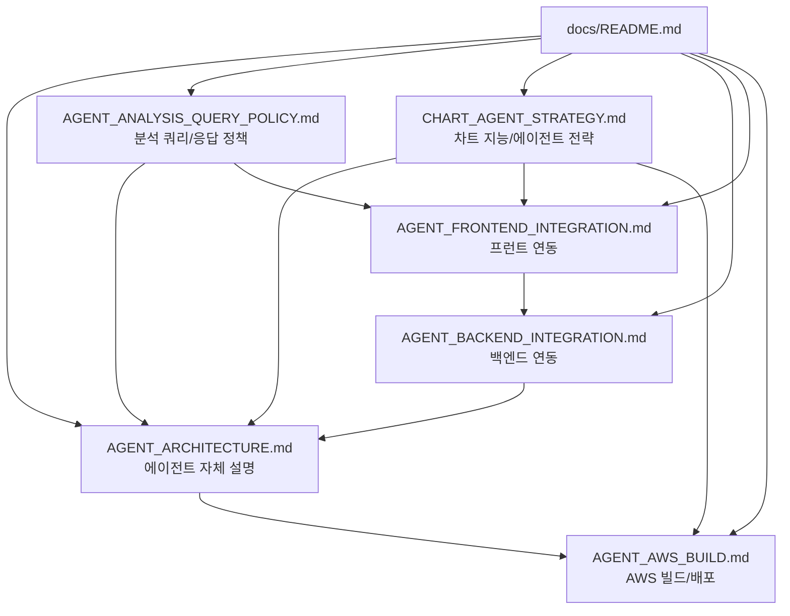

# GOPS Docs

Reference docs for future implementation. The root `README.md` stays short;
repo-wide Codex rules live in root `AGENTS.md`; deeper project docs live here.

| File | Purpose |
| --- | --- |
| `PRODUCT_CONTEXT.md` | Product direction and current/future scope boundary. |
| `CHART_DATA_ARCHITECTURE.md` | Current chart fact ownership, compute placement, query path, API/WS, order-flow, and S3 contracts. |
| `CHART_AGENT_STRATEGY.md` | 차트 지능의 투자적 역할, deterministic kernel, rule/LLM 경계, 작도 compiler, 데이터 사전 계산, orchestrator 통합, 단계별 구현 전략. |
| `CHART_DATA_OPERATIONS.md` | Validation, deployment observation, recovery, retention, Terraform ownership, and rollback runbook. |
| `STRUCTURE_GUIDE.md` | Folder placement rules for future code. |
| `ARCHITECTURE.md` | Current system, pod/job, and platform relationships. |
| `IMAGE_STRATEGY.md` | Docker image boundaries and naming rules. |
| `ENVIRONMENT.md` | Env, secret, and platform contracts. |
| `KAFKA_ARCHITECTURE.md` | Current EKS Kafka broker, partition, topic, producer, consumer-group, offset, and retention topology. |
| `LOCAL_EKS_DEPLOY.md` | One-command local deploy runbook for origin/dev to shared dev EKS. |
| `EKS_DATA_PRESERVING_REBUILD_PLAN.md` | Data-preserving EKS clean rebuild runbook for dedicated NodePools and restored PVCs. |
| `AGENT_ORCHESTRATION_IMPLEMENTATION.md` | Summary of the role-based multi-agent implementation and Docker validation. |
| `STOCK_RECOMMENDATION_PANEL.md` | 장중 매수 추천 패널 구현 흐름, 점수화 로직, API/DB/worker/프런트 계약. |
| `AGENT_ARCHITECTURE.md` | `AgentOrchestrator`, role agents, snapshots, synthesis, provider boundary, `EvidenceItem` 계약. |
| `AGENT_ANALYSIS_QUERY_POLICY.md` | 우선 처리할 분석 쿼리 종류, 결론 중심 답변 형식, 신뢰도 표시, 내부 GraphDB 사용 정책. |
| `AGENT_BACKEND_INTEGRATION.md` | Backend API, idempotency, Kafka async path, Redis report store, polling/SSE/WebSocket 계약. |
| `AGENT_FRONTEND_INTEGRATION.md` | 프런트 request shape, `analysisId`, polling/SSE, report rendering, layout/chart proposal 처리. |
| `AGENT_AWS_BUILD.md` | `gops-agent-orchestrator` image, ECR/EKS, Kafka, Redis/Valkey, ClickHouse, GraphDB, S3, secrets, smoke checks. |
| `../AGENTS.md` | Codex/contributor rules for this repo. |

Supplementary current documents include `ALERT_SYSTEM_DESIGN.md`, `ODC.md`,
`ONBOARDING_LOCAL_DOCKER.md`, `about_front.md`, and `cdc.md`. They explain a
narrow subsystem and do not override the source-of-truth documents in the table.

`docs/v2/` is retained as historical team-planning material. Its own README
marks it superseded; current code, `AGENTS.md`, this index, and the canonical
documents above win when the historical text conflicts. Keeping this status
explicit avoids treating an unindexed long-form document as an active contract.

For chart data work, start with `CHART_DATA_ARCHITECTURE.md`, then read the
relevant platform README and current code. Do not restore preset historical
preload, broad all-symbol tick/quote collection, raw S3 materialization, or
retired derived queues.
