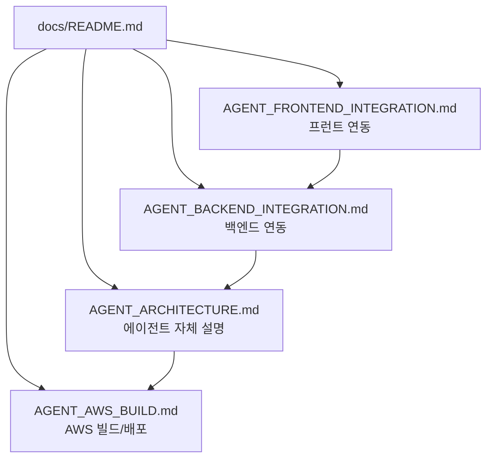

# GOPS Agent Docs

이 디렉터리는 에이전트 담당자를 위한 handoff 문서만 유지한다. repo-wide
contributor rules는 root `AGENTS.md`를 따른다.

| File | Purpose |
| --- | --- |
| `AGENT_ARCHITECTURE.md` | `AgentOrchestrator`, role agents, snapshots, synthesis, provider boundary, `EvidenceItem` 계약. |
| `AGENT_BACKEND_INTEGRATION.md` | Backend API, idempotency, Kafka async path, Redis report store, polling/SSE/WebSocket 계약. |
| `AGENT_FRONTEND_INTEGRATION.md` | 프런트 request shape, `analysisId`, polling/SSE, report rendering, layout/chart proposal 처리. |
| `AGENT_AWS_BUILD.md` | `gops-agent-orchestrator` image, ECR/EKS, Kafka, Redis/Valkey, ClickHouse, GraphDB, S3, secrets, smoke checks. |

새로운 장문 proposal이나 merge handoff 문서를 추가하지 말고, 필요한 내용은 위
네 문서 중 하나에 합친다.
