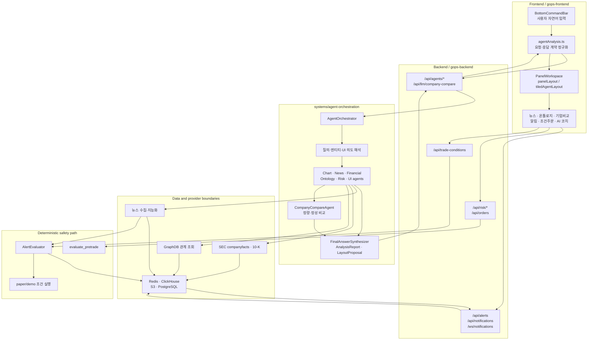
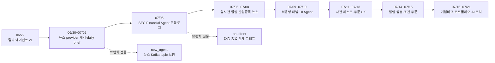

# Seunglee 구현 회고와 구조 정리

작성 기준일: 2026-08-05  
분석 기준 저장소: `KFJG-Team1/gops`  
작성자 판별 기준: `seunglee <seunglee10@users.noreply.github.com>`  
원격 `main` 분석 기준 커밋: `9e12e98e`

## 1. 문서 목적

이 문서는 기능 목록만 나열하는 문서가 아니다. GOPS를 만들면서 어떤 문제를
해결하려 했고, 어떤 개념과 경계를 고민했으며, 그 판단이 실제 코드와 런타임으로
어떻게 이어졌는지를 정리한다. 마지막에는 같은 작업을 다시 한다면 더 적은 비용과
더 높은 확신으로 구현하기 위한 개선안을 기록한다.

이 문서는 다음 세 가지를 구분한다.

- **당시 문제와 의도**: 왜 이 기능과 구조가 필요했는가.
- **실제 구현**: 요청 진입점, 코어 로직, 데이터, 저장소, 화면이 어떻게 연결됐는가.
- **회고와 개선안**: 맞았던 판단, 비효율, 다음 구현 순서.

브랜치와 커밋을 기준으로 확인한 결과, 원격 브랜치 전체에서 작성자 기준 비병합
커밋은 95개이고 그중 90개가 `main`에 포함되어 있다. `main`에 정확한 patch-id가
없는 작업은 `new_agent` 1개와 `ontofront` 4개다. 따라서 이 문서는 `main`에 남은
구조를 중심으로 설명하되, 브랜치 전용 실험은 별도로 표시한다.

## 2. 한 문장으로 정리한 구현 방향

GOPS에서 구현한 핵심은 **시장·뉴스·재무·온톨로지 데이터를 역할별로 해석하는
에이전트 시스템과, 그 결과를 알림·리스크 검사·조건 주문·적응형 패널 UI까지
연결하는 투자 의사결정 보조 플랫폼**이다.

중요한 점은 모든 것을 AI에 맡기지 않았다는 것이다.

- 자연어 이해, 근거 종합, 설명 생성은 에이전트가 담당한다.
- 가격 알림, 위험 한도, 재무 수치 계산은 결정론적 코드가 담당한다.
- PostgreSQL은 사용자 상태와 영속 데이터의 기준이 된다.
- Redis는 빠른 조회, projection, pub/sub, outbox를 담당한다.
- ClickHouse는 시장·뉴스·재무 분석용 대량 사실 저장소다.
- S3는 원본과 재생성 가능한 자료를 보존한다.
- GraphDB는 기업·테마·관계 질의를 담당한다.

## 3. 전체 구조

지금 다루는 과정은 사용자 입력을 분석 보고서와 UI 변화로 바꾸는 경로, 그리고
실시간 시장 이벤트를 안전한 알림과 주문 판단으로 바꾸는 경로다.



이 구조에서 API route는 어댑터이고, 실제 재사용 가능한 판단은 core/service 계층에
있다. 에이전트는 외부 시스템에 직접 결합하지 않고 provider 계약을 통해 데이터에
접근한다. 프런트는 보고서의 텍스트만 출력하지 않고 `LayoutProposal`과 패널별
구조화 데이터를 해석한다.

## 4. 구현이 확장된 순서



이 순서는 결과적으로 합리적이었다. 먼저 분석의 공통 계약을 만들고 데이터
provider를 붙인 뒤, 실시간 기능과 화면 상호작용으로 확장했다. 다만 각 단계의
범위가 빠르게 커지면서 브랜치 통합, 계약 중복, 대형 파일 문제가 생겼다.

## 5. 멀티 에이전트 오케스트레이션

### 5.1 해결하려던 문제

한 개의 거대한 프롬프트가 차트, 뉴스, 거시, 재무, 관계 정보, UI 명령을 모두
처리하면 다음 문제가 생긴다.

- 어떤 데이터가 결론에 사용됐는지 알기 어렵다.
- 데이터가 없을 때 모델이 빈 부분을 추측할 수 있다.
- 화면 변경 명령과 투자 분석이 섞인다.
- 기능을 추가할수록 프롬프트와 응답 스키마가 급격히 복잡해진다.
- 장애가 발생했을 때 provider, routing, synthesis 중 원인을 구분하기 어렵다.

그래서 역할별 agent와 공통 evidence/report 계약을 먼저 두는 방식을 선택했다.

### 5.2 고민한 개념

#### 논리적 agent와 실제 pod의 구분

초기 구현에서 `ChartAgent`, `NewsAgent`, `MacroAgent`, `OntologyAgent` 등은 각각
독립 pod가 아니라 `agent-orchestrator` 안에서 실행되는 논리적 역할이었다. 역할을
나눈다고 해서 배포 단위까지 무조건 나눌 필요는 없다고 판단했다.

반면 지속적으로 Kafka를 소비하는 `event-detector`와 알림을 전달하는
`notification-publisher`는 요청-응답 분석과 수명주기가 달라 별도 runtime으로
분리했다.

#### 근거 우선 계약

초기 핵심 데이터 모양은 다음과 같았다.

- `EvidenceItem`: 외부 데이터와 출처, 요약, 원본 payload.
- `AgentFinding`: 한 역할이 근거를 해석한 결과.
- `MarketEvent`: 가격·거래량·변동성 이벤트.
- `NotificationDecision`: 알림 수준과 이유.
- `LayoutProposal`: 화면에서 추가·강조할 패널.
- `AnalysisReport`: 위 결과를 묶는 최종 전송 계약.

데이터가 없으면 빈 결과를 숨기지 않고 no-data evidence로 표현했다. 이는 모델이
없는 데이터를 채우는 것보다 불완전함을 명시하는 편이 안전하다는 판단이다.

#### provider boundary

처음에는 `NewsProvider`, `MacroProvider`, `OntologyProvider`와 `Empty*Provider`로
시작했다. 이후 다음 구현으로 확장됐다.

- `ClickHouseNewsProvider`
- `GraphDBOntologyProvider`
- `ClickHouseFinancialProvider`
- `TenKProfileProvider`
- `RedisRiskEventsProvider`

에이전트가 Redis, ClickHouse, GraphDB의 구체적인 client 사용법을 직접 알지 않게
만든 것이 핵심이다.

### 5.3 실제 구현

초기 단일 파일형 `agents.py`, `providers.py`, `contracts.py`는 현재 다음 패키지로
분해되어 있다.

```text
systems/agent-orchestration/shared/gops_agents/
  contracts/              report, evidence, route dataclass
  query_understanding/     종목·테마·한국어 엔티티 해석
  intent_understanding/    분석 의도와 UI 의도 분리
  orchestration/           workflow, routing, cache, timing
  roles/                   logical role agents
  providers/               news, financial, ontology, risk adapter
  retrieval/               snapshot, graph expansion, cross signal
  synthesis/               최종 답변 생성과 검증
  runtime/                 queue, report store, worker, delivery
```

주요 실행 흐름은 다음과 같다.

1. `POST /api/agents/analyze`가 요청을 받는다.
2. 동기 모드에서는 `agent-orchestrator` HTTP endpoint로 전달한다.
3. 비동기 모드에서는 Kafka request envelope을 발행한다.
4. `AgentOrchestrator`가 요청 정규화와 query understanding을 수행한다.
5. route에 필요한 role agent만 선택한다.
6. provider snapshot을 읽고 `AgentFinding`과 `EvidenceItem`을 만든다.
7. `FinalAnswerSynthesizer`가 근거 기반 답변을 생성하고 숫자·인용을 검증한다.
8. `AnalysisReport`를 Redis report store와 result topic에 저장한다.
9. backend polling/SSE가 결과를 프런트에 전달한다.

관련 코드:

- `systems/agent-orchestration/shared/gops_agents/orchestration/workflow.py`
- `systems/agent-orchestration/shared/gops_agents/roles/__init__.py`
- `systems/agent-orchestration/shared/gops_agents/providers/__init__.py`
- `systems/agent-orchestration/shared/gops_agents/contracts/__init__.py`
- `systems/agent-orchestration/shared/gops_agents/synthesis/final_answer.py`
- `systems/api-server/pods/api-server/app/routes/agents.py`

### 5.4 잘한 판단

- 역할과 배포 단위를 별개로 판단했다.
- 외부 데이터 접근을 provider 계약으로 감쌌다.
- no-data를 정상적인 결과로 취급했다.
- 자동 주문을 agent runtime의 책임에서 제외했다.
- 보고서, 근거, 레이아웃 제안을 구조화된 계약으로 만들었다.

### 5.5 더 효율적으로 할 수 있었던 점

초기에는 빠른 검증을 위해 한 파일에 많은 역할을 넣었지만, 이후 분해 비용이 크게
들었다. 처음부터 아래 최소 경계를 만들었으면 이동과 import 수정이 줄었을 것이다.

```text
contracts.py
roles/
providers/
workflow.py
synthesis.py
```

또한 route, role, provider, report가 동시에 확장되면서 한 변경이 여러 계층을
건드렸다. 다음에는 한 번에 하나의 vertical slice를 완성하는 편이 낫다.

```text
뉴스 질문 1종
→ route 1개
→ provider 1개
→ evidence 1종
→ final answer 1종
→ frontend renderer
→ contract test
```

그 뒤 동일한 패턴으로 재무와 온톨로지를 추가하면 대규모 동시 리팩터링을 줄일 수
있다.

## 6. 뉴스와 온톨로지

### 6.1 해결하려던 문제

뉴스 API 응답을 사용자 요청 때마다 직접 가져오면 지연, 비용, rate limit, 결과
변동성이 커진다. 종목명만 일치하는 뉴스는 실제 관련성이 낮을 수 있고, 관련 기업과
테마 관계를 설명하려면 단순 문자열 검색만으로 부족하다.

### 6.2 고민한 개념

- 원본 수집과 분석용 지능화 데이터를 분리한다.
- hot path에서는 외부 뉴스 API를 직접 호출하지 않는다.
- symbol routing과 subject relevance를 별도로 판단한다.
- 최신 기사 목록과 일별 요약은 서로 다른 데이터 제품으로 본다.
- 기업 관계는 GraphDB, 빠른 반복 조회는 Redis/ClickHouse cache로 분담한다.
- 뉴스 요약은 impact direction과 source link를 구조화해 보존한다.

### 6.3 실제 구현

뉴스 파이프라인은 다음 계층으로 나뉜다.

1. `news-ingestor`가 provider 기사를 수집하고 raw event를 Kafka/S3에 보낸다.
2. `news-intelligence-worker`가 이벤트 유형, sentiment, 영향 방향, 관련성을 만든다.
3. 결과를 ClickHouse에 저장하고 Redis hot cache를 갱신한다.
4. daily dirty event가 발생하면 `news-daily-summary-worker`가 일별 요약을 갱신한다.
5. `ClickHouseNewsProvider`가 캐시된 근거만 agent에 제공한다.
6. 프런트의 `WatchlistNewsPanel`과 `NewsKeywordPanel`이 구조화된 결과를 표시한다.

온톨로지는 `GraphDBSparqlClient`와 `GraphDBOntologyProvider`가 기업-테마,
지배-피지배, 관련 기업 관계를 evidence로 변환한다. 프런트에서는
`OntologyForceGraph`가 관계를 force graph로 보여준다.

브랜치 전용 `ontofront`에서는 다중 종목 비교, 경로 캐시, 관계 패널을 빠르게
실험했다. 정확한 패치는 `main`에 병합되지 않았지만 이후 별도 구현으로 유사 개념이
정착했다.

관련 코드:

- `systems/market-data/pods/news-ingestor/main.py`
- `systems/market-data/pods/news-intelligence-worker/main.py`
- `systems/market-data/pods/news-daily-summary-worker/main.py`
- `systems/market-data/shared/market_data/storage/news_intelligence.py`
- `systems/market-data/shared/market_data/storage/news_daily_summary.py`
- `systems/market-data/shared/market_data/serving/news_hot_cache.py`
- `systems/agent-orchestration/shared/gops_agents/providers/__init__.py`
- `apps/gops-frontend/src/ontology/OntologyForceGraph.tsx`

### 6.4 잘한 판단

- 외부 API 호출을 agent hot path에서 제거했다.
- 원본, 지능화 row, hot cache, daily summary의 수명을 분리했다.
- 뉴스의 관련성과 중요도를 구분했다.
- 관계 정보를 표면적인 ticker 목록이 아니라 evidence로 변환했다.

### 6.5 더 효율적으로 할 수 있었던 점

뉴스 normalization, relevance, localization, cache key가 여러 파일과 시기에 걸쳐
확장됐다. 초기에 `NewsEvidenceV1` 스키마와 상태 전이를 고정했으면 변환 코드와
테스트 중복이 줄었을 것이다.

권장 상태 전이는 다음과 같다.

```text
raw_received
→ normalized
→ relevance_scored
→ localized
→ stored
→ daily_summary_dirty
→ summarized
```

각 단계에 `event_id`, `schema_version`, `source_time`, `processed_at`, `input_digest`를
공통으로 두면 재처리와 중복 방지가 쉬워진다. GraphDB 쪽도 query별 임의 캐시보다
`subject + relation_type + as_of + provider_revision`을 공통 키로 사용하는 편이
명확하다.

## 7. SEC 재무와 기업 비교

### 7.1 해결하려던 문제

재무 분석을 LLM에 바로 맡기면 XBRL concept 차이, 기간 선택, 단위, 누락값 때문에
숫자가 흔들릴 수 있다. 기업 비교 역시 숫자 비교와 사업 구조·위험 요인 설명을 같은
방식으로 처리하면 검증이 어렵다.

### 7.2 고민한 개념

- 재무 수치 선택과 파생 지표는 deterministic code가 담당한다.
- SEC 수집은 사용자 요청과 분리된 batch/job으로 실행한다.
- raw 원본, normalized fact, derived metric, runtime summary를 분리한다.
- 정량 비교와 정성 비교를 나누고 마지막에 하나의 화면에서 결합한다.
- 10-K 정성 정보는 출처가 되는 Item 1과 Item 1A를 S3에 보존한다.
- agent는 SEC API를 직접 호출하지 않고 Redis/ClickHouse snapshot을 읽는다.

### 7.3 실제 구현

`run_companyfacts_backfill`은 다음 일을 수행한다.

1. S&P 500 universe의 SEC companyfacts를 수집한다.
2. raw JSON을 안정적인 CIK별 S3 key에 저장한다.
3. concept 우선순위에 따라 `sec_financial_facts`를 만든다.
4. 성장률, 부채, 비율 등의 `sec_derived_metrics`를 계산한다.
5. 비교 가능한 SEC frame을 저장한다.
6. runtime용 Redis summary와 peer cache를 생성한다.

`run_ten_k_profile_backfill`은 최신 10-K를 찾아 Item 1/1A를 추출하고, strict schema로
사업 모델과 위험 요인을 한국어 profile card로 만든다. 원문 section은 S3, 작은 runtime
card는 Redis에 둔다.

기업 비교는 다음 계층으로 구성된다.

- `CompanyCompareAgent`: 여러 provider의 정량·정성 데이터를 조립한다.
- `build_quantitative_context`: 동일 기간과 metric을 맞춘다.
- `build_qualitative_context`: 10-K, 뉴스, 온톨로지 evidence를 묶는다.
- `CompanyCompareNarrativeSynthesizer`: 허용된 evidence만 사용해 설명을 만든다.
- `validate_narrative`: 근거 없는 숫자와 모호한 문장을 거른다.
- `CompanyComparePanelV2`: 정량 카드, trend, matrix, recent issue를 표시한다.

관련 코드:

- `systems/fundamentals/shared/fundamentals/backfill.py`
- `systems/fundamentals/shared/fundamentals/metrics.py`
- `systems/fundamentals/shared/fundamentals/sec_client.py`
- `systems/fundamentals/shared/fundamentals/ten_k_profiles.py`
- `systems/agent-orchestration/shared/gops_agents/company_compare/`
- `systems/api-server/pods/api-server/app/services/company_compare.py`
- `apps/gops-frontend/src/companyCompare/CompanyComparePanelV2.tsx`

### 7.4 잘한 판단

- 숫자 계산과 자연어 설명의 책임을 분리했다.
- SEC 원본과 runtime projection을 구분했다.
- 동일 accession은 다시 생성하지 않는 방식으로 비용을 제한했다.
- 정성 답변에도 evidence reference와 숫자 검증을 적용했다.
- 3개 비교에서 시작해 최대 10개까지 확장 가능한 선택 상태를 만들었다.

### 7.5 더 효율적으로 할 수 있었던 점

수집, 정규화, metric, peer frame, Redis projection이 한 backfill 모듈에서 빠르게
커졌다. 다음 경계로 먼저 분리했으면 테스트와 재실행이 쉬웠을 것이다.

```text
collector       SEC HTTP와 raw archive
normalizer      XBRL fact 선택
calculator      derived metric
writer          ClickHouse batch
projector       Redis summary와 peer cache
run_coordinator 실행 상태와 통계
```

또한 처음부터 각 metric에 `formula_version`, `source_concepts`, `period_key`,
`quality_reason`을 공통 필드로 두면 수치가 달라졌을 때 원인을 추적하기 쉽다.
기업비교는 요청 시 모든 데이터를 조립하기보다 주요 universe의 비교 fact pack을
미리 계산하고 digest가 바뀐 경우에만 narrative를 재생성하면 지연과 비용을 줄일 수
있다.

## 8. 실시간 알림과 알림함

### 8.1 해결하려던 문제

목표가나 급등락 알림은 틱마다 판단해야 하므로 LLM을 사용할 수 없다. 사용자가
접속 중이 아니어도 알림을 잃지 않아야 하고, pod 재시작이나 네트워크 장애에서도
같은 이벤트가 중복 저장되거나 사라지지 않아야 한다.

### 8.2 고민한 개념

- PostgreSQL을 사용자 알림 조건과 알림함의 source of truth로 둔다.
- Redis는 evaluator가 빠르게 조회하는 projection이다.
- WebSocket은 빠른 전달 경로이지 영속성의 기준이 아니다.
- tolerance band가 아니라 직전가와 현재가 사이의 crossing을 검사한다.
- 반복 알림은 시간 cooldown보다 false에서 true로 재진입했는지를 본다.
- 감지 hot loop와 영속 저장 사이에 Redis Stream outbox를 둔다.
- `event_id`를 멱등성 키로 사용한다.

### 8.3 실제 구현

구조화된 요청은 `POST /api/alerts`, 자연어 요청은
`POST /api/alerts/commands`로 들어온다. 서버는 현재가를 기준으로 `above` 또는
`below` 방향을 확정하고 PostgreSQL과 Redis projection을 동기화한다.

`AlertEvaluator`는 market trade와 closed candle을 받아 다음 조건을 평가한다.

- `price_cross`
- `price_change`
- `volume_absolute`
- `volume_relative`
- `rsi_threshold`

발화한 이벤트는 Redis Stream outbox에 기록한다. sender가 이를 소비해
PostgreSQL `notifications`에 저장하고 Redis pub/sub으로 전달한다. backend의
`/ws/notifications`가 접속 중인 브라우저에 push하며, 미접속 사용자는 나중에 REST
알림함을 읽는다.

프런트는 다음 계층으로 나뉜다.

- `alertApi.ts`: REST/WS payload 정규화.
- `notificationPreferences.tsx`: 사용자 설정과 threshold.
- `AlertToast`: 즉시 알림.
- `AlertMenu`, `HeaderNotificationMenu`: 영속 알림함과 unread 상태.
- `alertPresentation.ts`: 사용자 문구와 표시 규칙.

관련 코드:

- `systems/api-server/pods/api-server/app/alerts/routes.py`
- `systems/api-server/pods/api-server/app/alerts/repository.py`
- `systems/api-server/pods/api-server/app/alerts/projection.py`
- `systems/api-server/pods/api-server/app/alerts/evaluator.py`
- `systems/api-server/pods/api-server/app/alerts/notifications.py`
- `apps/gops-frontend/src/alerts/`

### 8.4 잘한 판단

- LLM을 실시간 감지 hot path에서 제외했다.
- DB 영속성과 WebSocket 속도를 별도 문제로 봤다.
- crossing 판정으로 gap 체결을 놓치지 않게 했다.
- projection이 사라져도 PostgreSQL에서 복원 가능한 구조로 만들었다.
- 자연어 명령도 최종적으로는 동일한 구조화 조건을 생성하게 했다.

### 8.5 더 효율적으로 할 수 있었던 점

알림 종류와 상태 전이가 여러 route, evaluator, frontend type에 중복 정의됐다.
공통 JSON Schema 또는 OpenAPI schema에서 Python과 TypeScript 타입을 생성했으면
필드명과 enum 불일치를 줄일 수 있었다.

다음 property-based test를 초기에 만들었으면 경계 조건 검증 비용도 줄었을 것이다.

- 어떤 가격 gap에서도 범위 안 목표가는 정확히 한 번 발화한다.
- 동일 `event_id`는 여러 번 전달돼도 알림함 row가 하나다.
- 비활성 알림은 projection에 남아 있어도 발화하지 않는다.
- 반복 알림은 true 상태가 유지되는 동안 다시 발화하지 않는다.
- Redis flush 후 PostgreSQL warmup 결과가 원래 projection과 같다.

## 9. 사전 리스크와 조건 주문

### 9.1 해결하려던 문제

사용자 주문은 API 형식이 맞는 것만으로 안전하지 않다. 일일 예산, 실수로 입력한 큰
수량, 손실 후 충동 주문, 한 종목·섹터 집중을 주문 전에 설명 가능한 규칙으로
검사해야 했다. 또한 “NVDA가 150달러 아래면 3주 매수” 같은 조건은 단순 알림과
주문 실행 사이에 명시적인 승인 가능한 객체가 필요했다.

### 9.2 고민한 개념

- 리스크 판정은 설명 가능한 deterministic rule로 만든다.
- 데이터 부족은 무조건 통과나 차단으로 숨기지 않고 skipped rule로 표현한다.
- verdict를 `allow`, `warn`, `block`으로 구분한다.
- 사용자 설정과 시스템 최대 한도를 분리한다.
- agent는 조건 주문 proposal만 만들고 직접 계좌를 제어하지 않는다.
- 조건 객체는 감지 규칙과 실행 정보를 함께 보존한다.
- v1에서 실계좌 자동 주문은 활성화하지 않는다.

### 9.3 실제 구현

`evaluate_pretrade`는 `RiskContext`와 주문을 받아 다음을 검사한다.

- 일일 매수 예산.
- fat-finger 수량·금액.
- 일일 손실 이후 cooldown.
- 단일 종목 비중.
- 섹터 집중도.

`/api/risk/settings`, `/api/risk/report`, `/api/risk/pretrade`가 설정·상태·사전 판정을
제공한다. 주문 route에서도 같은 엔진을 사용한다.

조건 주문은 `TradeConditionProposal`을 거쳐 `/api/trade-conditions`에 저장된다.
`resolve_trade_condition_command`는 자연어와 agent report의 proposal을 검증하고,
`process_trigger_event`는 발화 이벤트를 paper/demo 주문으로 변환한다.

관련 코드:

- `systems/order/shared/kis_trader/risk/config.py`
- `systems/order/shared/kis_trader/risk/context.py`
- `systems/order/shared/kis_trader/risk/engine.py`
- `systems/agent-orchestration/shared/gops_agents/risk/monitor.py`
- `systems/agent-orchestration/shared/gops_agents/orchestration/trade_condition_proposals.py`
- `systems/api-server/pods/api-server/app/trade_conditions/`
- `apps/gops-frontend/src/components/OrderTicket.tsx`
- `apps/gops-frontend/src/components/PriceConditionPanel.tsx`

### 9.4 잘한 판단

- 분석 agent와 주문 실행 권한을 분리했다.
- 판정 사유를 구조화해 UI에서 설명할 수 있게 했다.
- 주문 route와 별도 pretrade route가 같은 core engine을 사용한다.
- 조건 proposal과 실제 저장·실행을 분리했다.

### 9.5 더 효율적으로 할 수 있었던 점

규칙별 구현은 명확하지만 정책, 실행 순서, UI 문구가 여러 위치에 퍼질 수 있다.
처음부터 하나의 rule registry를 두고 다음 메타데이터를 함께 관리하는 편이 낫다.

```text
rule_id
severity
required_context
evaluate(context, order)
user_message_key
policy_version
```

이렇게 하면 rule 추가 시 backend, report, UI가 공유할 수 있고 누락된 context도
자동으로 진단할 수 있다. 실제 주문을 붙이기 전에는 historical order replay와
shadow evaluation으로 false block/warn 비율을 측정해야 한다.

## 10. 적응형 패널 UI와 UI Agent

### 10.1 해결하려던 문제

분석 결과가 텍스트 채팅에만 남으면 사용자는 관련 차트, 뉴스, 주문 패널을 직접
찾아 열어야 한다. 반대로 agent가 화면을 임의로 바꾸면 사용자가 작업하던 레이아웃을
잃을 수 있다. 따라서 AI가 제안하되 사용자의 공간과 고정 상태를 존중하는 레이아웃
계약이 필요했다.

### 10.2 고민한 개념

- panel content와 panel slot을 분리한다.
- 픽셀 좌표와 논리 grid 좌표를 구분한다.
- panel 종류별 최소·기본·최대 크기를 registry에서 관리한다.
- 이동과 resize 시 겹친 패널을 밀어낼 수 있어야 한다.
- 사용자가 고정한 패널은 agent가 함부로 바꾸지 않는다.
- 자동 배치가 애매하면 placement picker로 사용자 선택을 받는다.
- 빈 슬롯도 사용자 레이아웃의 일부로 보존한다.
- layout proposal과 실제 React 렌더링을 분리한다.

### 10.3 실제 구현

`panelLayout.ts`는 대부분 순수 함수로 구성된다.

- `createInitialTiledPanelState`
- `resolvePanelDropGridRect`
- `resolvePanelResizeWithYield`
- `resolvePanelMoveWithPush`
- `addPanelSlotAtGridRect`
- `movePanelSlotToGridRect`
- `serializeTiledPanelState`
- `restoreTiledPanelStateSnapshot`

`tiledAgentLayout.ts`의 `applyTiledAgentLayoutProposalWithResult`가 agent command를
구체적인 panel operation으로 바꾼다. `PanelWorkspace`는 drag, resize, preview,
editing mode 같은 브라우저 상호작용을 담당하고, `PanelContentRenderer`는 content
kind별 실제 컴포넌트를 lazy load한다.

프런트의 `agentAnalysis.ts`는 backend report를 그대로 신뢰하지 않고
`normalizeAgentAnalysisReport`, `normalizeLayoutProposal`,
`normalizeFinalAnswer`로 런타임 검증한다.

관련 코드:

- `apps/gops-frontend/src/layout/panelLayout.ts`
- `apps/gops-frontend/src/layout/panelRegistry.ts`
- `apps/gops-frontend/src/layout/tiledAgentLayout.ts`
- `apps/gops-frontend/src/layout/layoutPresets.ts`
- `apps/gops-frontend/src/components/PanelWorkspace.tsx`
- `apps/gops-frontend/src/components/PanelContentRenderer.tsx`
- `apps/gops-frontend/src/agents/agentAnalysis.ts`

### 10.4 잘한 판단

- geometry 계산을 React state와 최대한 분리했다.
- panel content identity와 화면 위치를 구분했다.
- 사용자 고정 상태와 agent 제안을 구별했다.
- preview와 placement picker로 파괴적인 자동 변경을 줄였다.
- layout 함수를 단위 테스트할 수 있게 만들었다.

### 10.5 더 효율적으로 할 수 있었던 점

`panelLayout.ts`, `PanelWorkspace.tsx`, `styles.css`가 매우 커졌다. 처음부터 다음처럼
나눴으면 변경 충돌과 인지 부담이 줄었을 것이다.

```text
layout/model.ts          state와 type
layout/grid.ts           좌표 변환
layout/collision.ts      overlap, push, yield
layout/persistence.ts    serialize, restore, migrate
layout/semantic-sync.ts  chart/company symbol 동기화
layout/agent-commands.ts proposal 적용
workspace/drag.ts        pointer interaction
workspace/resize.ts      resize interaction
```

레이아웃은 예제 기반 테스트보다 상태 공간이 크다. 임의 panel 조합을 생성해 다음
불변 조건을 검사하는 model-based/property test가 효과적이다.

- slot id와 content id가 중복되지 않는다.
- grid 밖으로 나간 panel이 없다.
- 허용하지 않은 overlap이 없다.
- serialize 후 restore 결과가 의미적으로 같다.
- pinned panel은 agent command로 이동하지 않는다.

CSS도 기능별 stylesheet 또는 CSS module과 design token으로 분리했으면 대형 병합
충돌을 줄일 수 있었다.

## 11. 배포와 운영 구조

### 11.1 해결하려던 문제

로컬에서 동작하는 agent나 worker가 실제 AWS/EKS에서 실행되지 않으면 기능은
완성된 것이 아니다. 각 worker에 필요한 Kafka topic, Redis, ClickHouse, GraphDB,
S3, secret, image가 일관되게 연결되어야 했다.

### 11.2 실제 구현

- `gops-agent-orchestrator` 공용 image.
- agent orchestrator, event detector, notification publisher deployment.
- news ingestor/intelligence/daily summary worker.
- alert evaluator, risk monitor, trade condition executor.
- SEC fundamentals와 10-K profile CronJob.
- Kafka agent/news topic 목록과 local topic 생성 script.
- AWS Secrets Manager를 ExternalSecret으로 연결.
- Redis, ClickHouse, GraphDB, S3 환경 변수와 health check.
- Docker command의 상대 경로 문제를 절대 경로로 수정.

### 11.3 잘한 판단

- 기능 코드와 배포 리소스를 같은 변경 단위로 다뤘다.
- secret 값을 저장소에 넣지 않고 참조 계약만 관리했다.
- batch, long-running consumer, request-response runtime을 구분했다.
- Docker 검증에서 실제 restart loop를 발견하고 entrypoint를 수정했다.

### 11.4 더 효율적으로 할 수 있었던 점

서비스가 빠르게 늘면서 Dockerfile, deployment, configmap, overlay에 같은 환경 변수가
반복됐다. Kustomize component 또는 공통 patch를 사용해 다음을 한 번만 정의하는
편이 낫다.

- 공용 image와 Python path.
- Kafka/Redis/ClickHouse endpoint.
- OpenAI secret reference.
- resource request/limit 기본값.
- readiness/liveness probe.
- 공통 label과 observability annotation.

`detect-changed-services.sh`와 image build 목록도 수동 목록 대신 서비스 manifest를
읽게 만들면 새 runtime 추가 시 누락을 줄일 수 있다.

## 12. 브랜치 운영 회고

### 12.1 확인된 상황

- `main`, `dev`, `backup`에는 작성자 커밋 90개가 누적되어 있다.
- `new_agent`의 Kafka topic 보정 1개는 정확한 패치가 `main`에 없다.
- `ontofront`의 다중 종목 관계·force graph·패널 연동 4개는 정확한 패치가
  `main`에 없다.
- 유사 기능이 다른 커밋으로 다시 구현된 경우가 있어 커밋 수와 실제 기능 중복을
  구분해야 한다.
- 여러 장기 브랜치가 같은 시점의 사용자 작업을 서로 다른 깊이로 포함한다.

### 12.2 비효율이 생긴 이유

- 기능 브랜치의 수명이 길어 공통 기반이 계속 달라졌다.
- 큰 기능을 여러 브랜치에서 병렬로 발전시켰다.
- merge와 cherry-pick이 혼재해 동일 아이디어가 다른 patch-id로 남았다.
- “실험”, “통합 후보”, “폐기 예정” 브랜치 상태가 이름만으로 명확하지 않았다.

### 12.3 다음에 사용할 방식

1. 기능을 1~3일 크기의 vertical slice로 나눈다.
2. 공통 계약 변경 PR을 먼저 병합한다.
3. 그 위에 provider, backend, frontend PR을 짧게 쌓는다.
4. 실험 기능은 feature flag 뒤에 두고 빠르게 `dev`에 통합한다.
5. 병합 전 `git cherry`, patch-id, contract test로 중복 구현을 검사한다.
6. 브랜치 설명에 owner, 목적, base SHA, 상태, 종료 조건을 기록한다.
7. 병합 후 원격 브랜치를 정리하고 handoff 문서는 canonical docs로 옮긴다.

권장 브랜치 메타데이터 예시:

```text
owner: seunglee
purpose: ontology multi-symbol comparison
base: origin/dev@<sha>
status: experiment | review | merged | abandoned
feature_flag: ONTOLOGY_MULTI_SYMBOL_V1
canonical_doc: docs/...
exit_criteria: contract tests + frontend smoke + AWS config validation
```

## 13. 전체적으로 잘한 설계 판단

1. **AI와 결정론적 로직의 경계를 나눴다.**
   설명·종합은 AI, 수치·알림·리스크는 코드가 담당한다.

2. **외부 데이터 접근을 provider로 감쌌다.**
   agent가 저장소나 API client에 직접 결합하지 않는다.

3. **원본과 runtime projection을 분리했다.**
   S3 원본, ClickHouse 분석 row, Redis hot snapshot의 목적이 다르다.

4. **영속성과 실시간 전달을 분리했다.**
   PostgreSQL 알림함과 WebSocket push를 별개로 설계했다.

5. **화면도 구조화된 결과의 소비자로 만들었다.**
   분석 텍스트뿐 아니라 layout, evidence, panel data를 해석한다.

6. **실주문 권한을 agent에 주지 않았다.**
   proposal, deterministic risk, execution adapter 사이에 경계를 뒀다.

7. **테스트 가능한 순수 로직을 만들었다.**
   재무 계산, 리스크 엔진, layout geometry, payload normalization을 분리했다.

## 14. 전체적으로 비효율적이었던 부분

1. **너무 많은 계층을 한 번에 확장했다.**
   agent, data, API, UI, infra를 동시에 바꿔 회귀 원인 추적이 어려웠다.

2. **초기 파일이 빠르게 비대해졌다.**
   `providers`, `roles`, `final_answer`, `panelLayout`, `styles.css`의 분해 시점이 늦었다.

3. **Python과 TypeScript 계약이 중복됐다.**
   enum과 response type을 양쪽에서 수동 정규화했다.

4. **브랜치가 장기화됐다.**
   동일 아이디어가 다른 commit으로 재구현되고 patch가 남았다.

5. **상태 전이와 버전 정보가 뒤늦게 명확해졌다.**
   news, alert, report, trade condition에 공통 state/version 원칙이 더 일찍 필요했다.

6. **운영 acceptance test가 기능 추가 속도를 따라가지 못했다.**
   unit test는 많았지만 전체 Kafka→worker→Redis→API→UI 흐름을 자동 검증하는
   시나리오를 더 일찍 만들 수 있었다.

## 15. 다시 구현한다면 사용할 순서

### Phase 1. 계약과 불변 조건

- `AnalysisRequest`, `EvidenceItem`, `AnalysisReport`, `LayoutProposal` JSON Schema.
- alert, risk, trade condition state machine.
- idempotency key와 schema version 규칙.
- 데이터 source-of-truth 표.
- OpenAPI에서 TypeScript client/type 생성.

### Phase 2. 한 개의 완전한 vertical slice

- NVDA 뉴스 질문 하나.
- cached news provider 하나.
- role 하나.
- final answer 하나.
- frontend panel 하나.
- unit, contract, end-to-end test 하나.

### Phase 3. 데이터 제품 확장

- SEC fact pack.
- ontology relationship snapshot.
- company comparison precomputed context.
- freshness SLO와 digest-based cache.

### Phase 4. 결정론적 실시간 기능

- alert state machine과 property tests.
- PostgreSQL/Redis projection rebuild test.
- risk rule registry와 historical replay.
- paper-only trade condition shadow execution.

### Phase 5. 적응형 UI

- layout model과 geometry solver.
- panel registry.
- persistence migration.
- agent command adapter.
- property/model-based layout tests.

### Phase 6. 운영 자동화

- 서비스 manifest 기반 image/deployment 생성.
- Kafka→worker→store→API acceptance test.
- trace id와 structured metric.
- canary와 rollback runbook.

이 순서라면 매 단계에서 사용자에게 보이는 결과가 하나씩 완성되고, 다음 기능이
이전 계층의 안정성을 깨는 범위도 작아진다.

## 16. 우선순위가 높은 개선 과제

### P0: 계약 단일화

- OpenAPI/JSON Schema에서 Python·TypeScript 타입 생성.
- report, alert, trade condition enum 중복 제거.
- `schema_version`과 migration 정책 확정.

### P0: 전체 흐름 acceptance test

- agent async round trip.
- alert trigger에서 알림함 저장과 WebSocket까지.
- trade condition trigger에서 paper order까지.
- SEC/news batch에서 runtime cache까지.

### P1: 대형 모듈 분해

- `panelLayout.ts`를 geometry, collision, persistence, semantic sync로 분리.
- provider package를 source별 모듈로 분리.
- synthesis를 query type별 strategy로 분리.
- `styles.css`를 기능별 stylesheet/token으로 분리.

### P1: 데이터 lineage와 freshness

- 모든 evidence에 provider revision, source time, collected time, digest를 기록.
- Redis snapshot에 freshness와 원본 ClickHouse revision을 포함.
- stale/no-data를 UI에서 명시적으로 구분.

### P1: 브랜치와 문서 정리

- `new_agent`, `ontofront` patch의 필요 여부를 현재 코드와 비교해 결정.
- historical handoff 문서와 canonical 문서를 구분.
- 병합 완료 브랜치 정리.

### P2: 성능 최적화

- 회사 비교 fact pack 사전 계산.
- provider fan-out bulkhead와 per-provider latency budget.
- alert evaluator symbol partition benchmark.
- layout 연산의 대규모 panel property benchmark.

## 17. 핵심 결론

구현의 가장 큰 강점은 다양한 기능을 단순히 붙인 것이 아니라 책임 경계를 계속
고민했다는 점이다. 에이전트와 provider, 설명과 수치, 영속성과 실시간 전달, 분석과
주문 실행, panel content와 layout을 분리하려는 방향은 일관됐다.

가장 큰 개선점은 **좋은 경계를 더 일찍, 더 작은 단위로 확정하는 것**이다. 구현
속도를 높이기 위해 큰 단위로 시작했지만, 결과적으로 대형 파일 분해, 계약 중복,
브랜치 재통합에 비용을 지불했다. 다음에는 공통 계약과 acceptance test를 먼저 만든
뒤 vertical slice를 짧게 반복하는 방식이 가장 효율적이다.

즉, 다음 단계의 목표는 기능을 더 많이 추가하는 것이 아니라 다음 세 가지다.

1. 계약을 한 곳에서 생성한다.
2. 데이터와 상태의 lineage를 보이게 만든다.
3. 작은 브랜치를 전체 흐름 테스트와 함께 빠르게 통합한다.

이 세 가지가 갖춰지면 현재 구현한 멀티 에이전트, 실시간 알림, 재무 분석, 적응형 UI를
더 안정적으로 확장할 수 있다.

## 부록 A. 브랜치별 작성자 커밋 누적

아래 숫자는 각 브랜치에서 도달 가능한 작성자 비병합 커밋 수다. 브랜치 고유 커밋
수와는 다르다.

| 누적 커밋 | 브랜치 |
| ---: | --- |
| 90 | `main`, `dev`, `backup` |
| 71 | `codex/eks-resource-rightsizing-pr` |
| 63 | `ABC`, `XYZ` |
| 61 | `codex/expand-chart-patterns` |
| 57 | `codex/chart-pattern-asset-drawings`, `iamnuked-gops-simulator`, `yoojin` |
| 56 | `codex/remote-dev-before-ce1d8a5-2468dd73`, `seunglee` |
| 29 | `codex/add-1h-4h-chart-intervals` |
| 22 | `kimheejun` |
| 21 | `ontofront` |
| 19 | `financialagent-dev-integration`, `helix/front-chart` |
| 18 | `new_agent` |
| 17 | `agent_orchestration`, `codex/provider-ontofront-integration`, `finalcialagent` |
| 15 | `codex/backend-chart-merge`, `deploy/iamnuked-tick`, `heejunjun`, `helix/front`, `iamnuked-tick` |
| 8 | `demulage` |
| 0 | `Brothers`, `Helix`, `yooseunglee` |

## 부록 B. `main`에 정확한 패치가 없는 작성자 커밋

| 브랜치 | 커밋 | 내용 |
| --- | --- | --- |
| `new_agent` | `71c24a4e` | 뉴스 Kafka topic을 canonical AWS/k8s 목록에 추가 |
| `ontofront` | `963cb024` | 온톨로지 다중 종목 비교, 경로 캐시, 관계 그래프 |
| `ontofront` | `d4b291d1` | 관계 패널을 force graph로 교체 |
| `ontofront` | `ca8a30bd` | 온톨로지 기업 관계 패널 연동 |
| `ontofront` | `dc502b67` | 온톨로지 전용 프런트 인계 정리 |

유사 개념이 `main`에 다른 커밋으로 구현된 경우가 있으므로, 이 표는 기능 부재가
아니라 정확한 patch-id의 미병합을 뜻한다.
