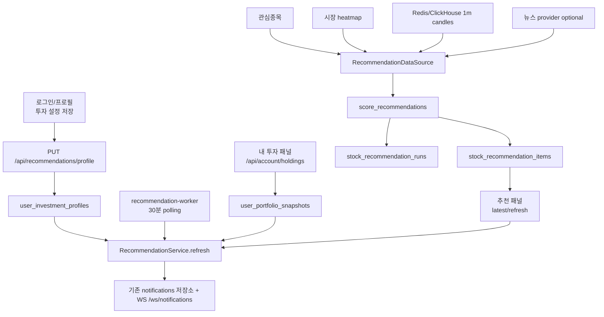

# 장중 매수 추천 패널 구현 문서

이 문서는 현재 구현된 장중 매수 추천 패널의 전체 흐름과 추천 로직을 설명한다.
목표는 나중에 다시 코드를 볼 때도 "어디서 시작해서 어떤 근거로 추천이 만들어지는지"를 빠르게 파악하는 것이다.

## 현재 범위

v1은 미국 정규장 장중 매수 추천만 다룬다.

- 대상 시간: 미국 동부시간 기준 평일 09:30 이상 16:00 미만
- 생성 슬롯: 09:45, 12:45, 15:45 ET
- 추천 종류: `buy` only
- 추천 수: 최대 5개
- 섹터 분산: 같은 섹터 최대 2개
- 자동 주문: 없음. 추천 행 클릭은 차트 종목 전환만 수행한다.
- 장 전/장 외 추천: 보류. 장 외에는 새 추천을 만들지 않고 `market_closed`를 반환한다.

추천은 LLM이 고르는 방식이 아니다. 현재 구현은 결정론적 점수화 로직으로 후보를 만들고, 필터를 통과한 종목만 점수와 근거를 붙여 저장한다. 관심종목, 보유종목, 현재 보고 있는 종목은 새 추천 대상이 아니라 사용자 맥락과 제외 조건으로만 쓴다.

## 사용자 설정

사용자는 하단 메뉴 `V: 로그인/프로필`에서 장중 추천 설정을 저장해야 한다.

저장되는 필드는 다음과 같다.

| 필드 | 설명 |
| --- | --- |
| `riskLevel` | `conservative`, `balanced`, `aggressive` |
| `horizon` | v1은 `intraday`만 허용 |
| `maxDrawdownPct` | 장중 변동폭 허용 기준. 1 초과 50 이하 |
| `preferredSectors` | 선호 섹터. 점수 가점이 아니라 후보 유니버스 anchor로 사용 |
| `excludedSectors` | 추천에서 제외할 섹터 |
| `excludedSymbols` | 추천에서 제외할 종목 |

프론트 설정 UI는 등록된 S&P500 유니버스에서만 값을 선택하게 한다. `preferredSectors`와 `excludedSectors`는 GICS 섹터 목록을 검색해 추가하고, 같은 섹터가 선호/제외에 동시에 들어가지 않도록 한쪽을 선택하면 반대쪽에서 제거한다. `excludedSymbols`도 검색어로 등록 종목 목록을 필터링한 뒤 선택하며, 임의 섹터명이나 티커 문자열은 저장하지 않는다.

프로필이 없으면 추천 API는 `profile_required`를 반환하고, 프론트 패널은 로그인/프로필에서 설정을 저장하라는 상태를 보여준다.

## 전체 구조



## 백엔드 파일 맵

| 파일 | 역할 |
| --- | --- |
| `systems/api-server/pods/api-server/gops-backend/app/recommendations/routes.py` | 추천 API route |
| `systems/api-server/pods/api-server/gops-backend/app/recommendations/service.py` | 추천 생성 흐름, 슬롯 멱등성, 알림 발행 |
| `systems/api-server/pods/api-server/gops-backend/app/recommendations/scoring.py` | 후보 생성, 필터, 점수화, 근거 생성 |
| `systems/api-server/pods/api-server/gops-backend/app/recommendations/repository.py` | Postgres/InMemory 저장소 |
| `systems/api-server/pods/api-server/gops-backend/app/recommendations/worker.py` | 장중 슬롯별 백그라운드 실행 |
| `systems/api-server/pods/api-server/gops-backend/app/routes/account.py` | 계좌 보유종목 응답을 포트폴리오 스냅샷으로 저장 |
| `systems/order/shared/kis_trader/migrations/0004_recommendations.sql` | 추천 관련 DB 테이블 |

## 프론트 파일 맵

| 파일 | 역할 |
| --- | --- |
| `apps/gops-frontend/src/recommendations/recommendationApi.ts` | 추천 API client와 응답 정규화 |
| `apps/gops-frontend/src/recommendations/InvestmentProfileForm.tsx` | 로그인/프로필 안의 필수 설정 폼 |
| `apps/gops-frontend/src/recommendations/StockRecommendationsPanel.tsx` | 장중 매수 추천 패널 |
| `apps/gops-frontend/src/components/BottomCommandBar.tsx` | `V` 패널에 설정 폼 연결 |
| `apps/gops-frontend/src/components/PanelContentRenderer.tsx` | `kind="recommendations"` 렌더링 |
| `apps/gops-frontend/src/layout/*` | 추천 패널 insert/layout kind 등록 |

## API 계약

### `GET /api/recommendations/profile`

현재 사용자의 추천 설정을 조회한다.

응답 예:

```json
{
  "status": "ready",
  "profile": {
    "riskLevel": "balanced",
    "horizon": "intraday",
    "maxDrawdownPct": 8,
    "preferredSectors": ["Technology"],
    "excludedSectors": [],
    "excludedSymbols": [],
    "updatedAt": "2026-07-07T10:00:00Z"
  }
}
```

### `PUT /api/recommendations/profile`

추천 필수 설정을 저장한다. `riskLevel`은 세 가지 값만 허용하고, `horizon`은 `intraday`만 허용한다.

### `GET /api/recommendations/stocks/latest`

마지막 추천 run을 반환한다. 프로필이 없으면 `profile_required`, 저장된 run이 없으면 `empty`를 반환한다.

### `POST /api/recommendations/stocks/refresh`

현재 슬롯의 추천을 생성하거나, 이미 생성된 run을 재사용한다.

요청:

```json
{
  "activeSymbol": "AAPL"
}
```

`activeSymbol`은 사용자가 현재 보고 있는 종목이다. 새 아이디어 추천에서는 해당 종목을 추천 대상에서 제외한다.

응답 핵심 필드:

| 필드 | 설명 |
| --- | --- |
| `status` | `completed`, `empty`, `profile_required`, `market_closed` |
| `runKey` | `{user}:{marketDate}:{slotStart}` |
| `slotStart` | 09:45/12:45/15:45 중 현재 슬롯 |
| `items` | 추천 종목 배열 |
| `idempotentReplay` | 같은 슬롯에서 이미 생성된 결과를 재사용했는지 |

## DB 테이블

| 테이블 | 역할 |
| --- | --- |
| `user_investment_profiles` | 사용자별 추천 설정 |
| `user_portfolio_snapshots` | 계좌 보유종목 API 응답 스냅샷 |
| `stock_recommendation_runs` | 추천 실행 단위. 사용자와 슬롯별로 unique |
| `stock_recommendation_items` | run 안의 추천 종목, 점수, 근거, 리스크 |

`stock_recommendation_runs`는 `(user_sub, run_key)` unique 제약을 가진다. 그래서 worker가 30분마다 데이터를 받아와도 같은 3시간 슬롯에서는 같은 추천을 다시 만들지 않는다.

## worker 동작

운영 배포 파일은 `infra/k8s/base/app/deployment-recommendation-worker.yaml`이다.

실행 명령:

```text
python -u -m app.recommendations.worker
```

동작 방식:

1. `RECOMMENDATION_WORKER_POLL_SECONDS` 간격으로 polling한다. 기본값은 1800초, 즉 30분이다.
2. 미국 정규장이 아니면 아무 것도 하지 않는다.
3. 09:45 ET 이전이면 아무 것도 하지 않는다.
4. 프로필이 저장된 사용자 목록을 가져온다.
5. 각 사용자에 대해 `RecommendationService.refresh()`를 호출한다.
6. 서비스의 `runKey` 멱등성 때문에 09:45, 12:45, 15:45 슬롯마다 사용자별 1회만 새 run이 저장된다.

즉 "3시간마다 실행"은 별도 cron이 아니라, worker는 30분마다 데이터를 받아오고 추천 생성은 슬롯 key가 제어한다.

## 추천 생성 흐름

`RecommendationService.refresh()`의 흐름은 다음과 같다.

1. 사용자 프로필을 조회한다.
2. 현재 시간으로 추천 슬롯을 계산한다.
3. 같은 `runKey`가 이미 있으면 기존 결과를 반환한다.
4. 정규장이 아니면 새 run을 만들지 않고 `market_closed`를 반환한다.
5. 데이터 소스에서 관심종목, 포트폴리오, 시장 후보, 캔들, 뉴스 optional 데이터를 모은다.
6. `score_recommendations()`로 후보를 필터링하고 점수화한다.
7. run과 item을 DB에 저장한다.
8. 상위 추천 변화가 의미 있으면 기존 notifications 경로로 알림을 만든다.

## 데이터 소스

| 데이터 | 사용처 |
| --- | --- |
| 관심종목 | 추천 제외 목록, 관련 섹터/산업군 anchor |
| 포트폴리오 positions | 추천 제외 목록, 섹터 과밀 리스크 |
| 선호 섹터 | 점수 가점이 아니라 후보 유니버스 anchor |
| heatmap market items | 시장 상위 거래대금/변동률 후보 |
| 1분봉 candles | 수익률, 상대강도, 거래량, 돌파, 변동성 계산 |
| SPY candles | 시장 대비 상대강도 계산 |
| 뉴스 optional | 뉴스/이벤트 근거와 가점 |

포트폴리오 스냅샷은 `GET /api/account/holdings`가 성공할 때 저장된다. 추천 worker는 API 서버와 다른 프로세스이므로 메모리가 아니라 DB의 `user_portfolio_snapshots`도 읽을 수 있게 되어 있다.

## 후보 생성 로직

후보는 최대 50개까지 만든다. 보유종목, 관심종목, 현재 보고 있는 종목, `SPY`는 추천 대상에서 제외한다.

우선순위:

1. 관심/보유 종목과 같은 섹터의 시장 상위 종목
2. 시장 heatmap 상위 거래대금 종목
3. 시장 heatmap 상위 변동률 종목

시장 후보는 두 축에서 가져온다.

- 거래대금 상위 30개
- 변동률 절대값 상위 20개

추가로 SPY는 상대강도 계산용으로 후보 목록에 포함된다.

## 하드 필터

아래 조건에 걸리면 추천 item을 만들지 않는다.

| 조건 | 의미 |
| --- | --- |
| 보유/관심/현재 조회 종목 | 이미 알고 있거나 보유한 종목은 새 매수 아이디어에서 제외 |
| excluded symbol/sector | 사용자가 제외한 종목 또는 섹터 |
| SPY | 상대강도 계산 기준으로만 사용 |
| candle 60개 미만 | 장중 판단에 필요한 최소 데이터 부족 |
| 세션 거래대금 1천만 달러 미만 | 유동성 부족 |
| 장중 변동폭 > `maxDrawdownPct * 1.5` | 사용자 손실 허용 대비 변동성 과다 |
| 후보 섹터 hard cap 초과 | 보수형 45%, 균형형 55%, 공격형 65% 이상이면 제외 |
| 보수형 + 최근 3시간 수익률 5% 초과 | 보수형에서 단기 급등 추격 방지 |

## 계산 지표

각 후보의 1분봉으로 다음 값을 계산한다.

| 지표 | 설명 |
| --- | --- |
| `return3hPct` | 입력 캔들 첫 close 대비 마지막 close 수익률 |
| `relativeStrength` | `return3hPct - SPY return` |
| `volumeRatio` | 최근 60분 거래량 / 직전 60분 거래량 |
| `breakout` | 최근 15개 캔들을 제외한 이전 고점 돌파 여부 |
| `intradayRangePct` | 세션 high-low 범위 / 세션 open |
| `sessionDollarVolume` | heatmap 거래대금 또는 candle 기반 추정 거래대금 |
| `candleCount` | 사용된 candle 수 |
| `dataFreshness` | 마지막 candle timestamp |

## 점수화 로직

최종 점수는 0~100으로 clamp한다.

```text
score =
  alpha_score
  + catalyst_score
  + execution_score
  - portfolio_risk_penalty
```

### Alpha score

| 조건 | 점수 |
| --- | --- |
| 3시간 수익률 양수 | 최대 18점 |
| SPY 대비 상대강도 양수 | 최대 18점 |
| 최근 60분 거래량이 직전 구간 대비 1.2배 이상 | 최대 12점 |
| 3시간 전고점 돌파 | 12점 |

### Catalyst score

| 조건 | 점수 |
| --- | --- |
| 뉴스 없음 | 0점 |
| 뉴스 있음 | 기본 8점 |
| 뉴스 + 거래량 1.5배 이상 | 추가 5점 |
| 부정/약세 뉴스가 아님 | 추가 2점 |
| 부정/약세 뉴스 | 5점 감점 |

### Execution score

| 조건 | 점수 |
| --- | --- |
| 장중 변동폭 4% 이하 | 8점 |
| 세션 거래대금 5천만 달러 이상 | 7점 |
| 데이터 freshness 있음 | 5점 |
| 3시간 수익률 6% 이하 | 5점 |

### Portfolio risk penalty

| 조건 | 감점 또는 제외 |
| --- | --- |
| 후보 섹터 비중이 soft cap 이상 | 최대 15점 감점 |
| 후보 섹터 비중이 hard cap 이상 | 추천 제외 |
| 균형형 + 3시간 수익률 8% 초과 | 5점 감점 |
| 공격형 + 3시간 수익률 10% 초과 | 4점 감점 |

섹터 cap은 보수형 `30/45`, 균형형 `40/55`, 공격형 `50/65`를 soft/hard cap으로 사용한다.

### 위험성향 보정

| 위험성향 | 보정 |
| --- | --- |
| 보수형 | alpha -10, execution +5 |
| 균형형 | 3시간 수익률 8% 초과면 risk penalty +5 및 추격 매수 리스크 |
| 공격형 | alpha +5. 3시간 수익률 10% 초과 시 risk penalty +4 |

## 추천 채택 기준

다음 조건을 모두 만족해야 패널에 보인다.

```text
score >= 75
confidence >= 0.7
reason count >= 2
```

신뢰도는 다음 기준으로 계산한다.

- 기본값 0.45
- candle 수가 60개를 초과할수록 최대 0.2 추가
- 세션 거래대금이 5천만 달러 이상이면 0.15, 아니면 0.08 추가
- 근거 개수에 따라 최대 0.2 추가
- 최종 최대값은 0.95

## 추천 근거와 리스크 표시

각 item은 다음 데이터를 가진다.

| 필드 | 설명 |
| --- | --- |
| `symbol` | 추천 종목 |
| `action` | 현재는 `buy` |
| `rank` | 1부터 시작 |
| `score` | 추천 점수 |
| `confidence` | 신뢰도 |
| `sector` | 섹터 |
| `reasons` | 사용자에게 보여줄 추천 근거 |
| `riskWarnings` | 리스크 문구 |
| `metricsSnapshot` | 추천 시점 지표, 섹터 비중, `excludedReason`, 점수 breakdown |

프론트는 상위 2개 근거와 첫 번째 리스크 경고를 추천 행에 표시한다.

## 알림 로직

추천 알림은 기존 alert notification 저장소와 websocket 브로커를 재사용한다. 새 알림 타입은 `recommendation.stock_buy`이다.

알림 조건:

- top 추천의 `score >= 80` 그리고 `confidence >= 0.75`
- 또는 이전 run 대비 top 종목이 변경됨
- 또는 같은 top 종목의 점수가 이전보다 15점 이상 상승

알림 payload에는 `symbol`, `score`, `confidence`, `reasonSummary`, `riskWarnings`가 들어간다.

## 에이전트/레이아웃 연동

에이전트 UI 패널 타입은 `stockRecommendations`로 등록했다.

관련 변경:

- `systems/agent-orchestration/config/ui-intent-lexicon.json`
- `systems/agent-orchestration/shared/gops_agents/intent_understanding/schema.py`
- `systems/agent-orchestration/shared/gops_agents/orchestration/ui_intent.py`
- `systems/agent-orchestration/shared/gops_agents/roles/__init__.py`
- `apps/gops-frontend/src/layout/agentLayoutTypes.ts`
- `apps/gops-frontend/src/layout/panelLayout.ts`
- `apps/gops-frontend/src/layout/tiledAgentLayout.ts`

사용자가 "종목 추천", "매수 추천", "추천 종목", "장중 추천" 같은 표현을 하면 이 패널을 열 수 있게 했다.

## 운영/배포

추가된 Kubernetes 리소스:

- `infra/k8s/base/app/deployment-recommendation-worker.yaml`
- `infra/k8s/base/app/kustomization.yaml`
- `infra/k8s/overlays/aws/configmap-aws-patch.yaml`

환경 변수:

| 변수 | 기본값 | 설명 |
| --- | --- | --- |
| `RECOMMENDATION_WORKER_POLL_SECONDS` | `1800` | worker polling 간격. 최소 10초로 보정 |

worker는 `gops-api-server` image를 사용한다. API 서버 코드와 같은 추천 service/repository를 재사용하기 때문이다.

## 검증한 내용

구현 당시 확인한 검증:

```text
.venv/bin/python -m compileall ...
npm run build
git diff --check
FastAPI TestClient smoke: 프로필 저장 -> worker 첫 tick 생성 -> 같은 슬롯 두 번째 tick 멱등 재사용 -> latest 추천 조회
```

주의: 현재 로컬 `.venv`에는 `pytest`가 설치되어 있지 않아 pytest suite는 실행하지 못했다.

## 현재 한계와 다음 확장 포인트

현재 구현은 v1 범위에 맞춰 의도적으로 제한되어 있다.

- 장 전 추천은 아직 만들지 않는다.
- 추천은 자동 주문과 연결하지 않는다.
- 뉴스 provider는 optional이다. 뉴스가 없으면 작은 기본 점수만 준다.
- 포트폴리오 sector 정보가 없으면 섹터 보완 점수는 `Unclassified` 기준으로 계산될 수 있다.
- 공휴일/반장 같은 미국 시장 캘린더 세부 예외는 아직 반영하지 않았다. 현재는 평일 09:30~16:00 ET 기준이다.
- 현금 사용 가능 여부는 현재 보수적으로 항상 true처럼 동작한다. 계좌 현금 필드가 안정화되면 실제 현금 조건으로 바꾸는 게 맞다.

다음 단계로 확장한다면 우선순위는 다음이 좋다.

1. 미국 시장 휴장/반장 calendar 반영
2. 포트폴리오 position에 sector enrichment 적용
3. 뉴스/이벤트 provider 실제 연결
4. 장 전 추천용 별도 모드 추가
5. 추천 성과 추적 테이블 추가
6. 추천 cutoff와 가중치를 config로 분리
