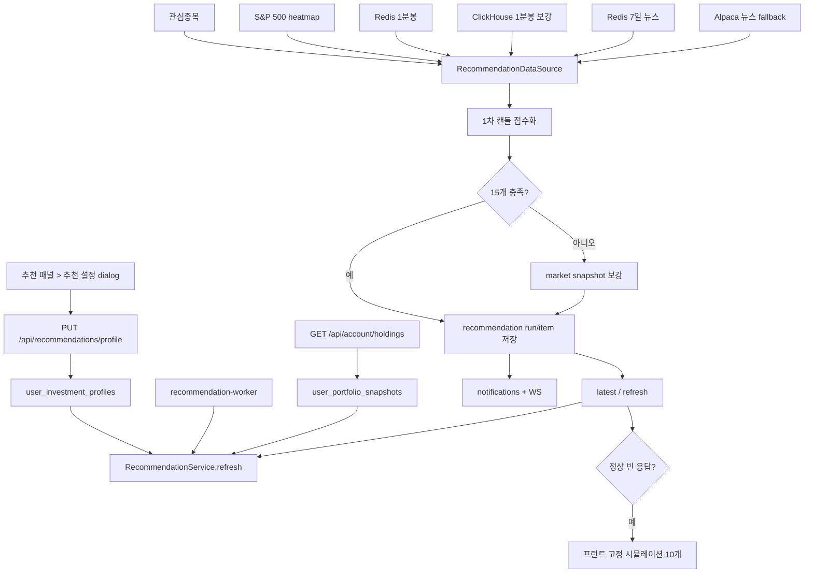

# 장중 매수 추천 패널: 현재 구현과 개선 계약

이 문서는 장중 매수 추천이 어디에서 시작되고, 어떤 데이터와 규칙을 거쳐 화면과 알림으로 전달되는지 설명한다.

문서의 내용은 세 가지 상태로 구분한다.

- **현재 구현**: 지금 소스 코드가 실제로 수행하는 동작
- **확인된 위험**: 현재 구현에서 추천 품질이나 사용자 신뢰를 해칠 수 있는 동작
- **목표 계약**: 이후 코드 변경이 만족해야 하는 개선 기준

`목표 계약`은 아직 구현됐다는 뜻이 아니다. 현재 코드와 목표가 다르면 현재 코드 설명과 위험을 먼저 적고, 목표 동작을 별도로 적는다.

## 한눈에 보는 현재 상태

| 항목 | 현재 구현 |
| --- | --- |
| 대상 시장 | 미국 주식 |
| 추천 세션 | `pre`, `regular` |
| 추천 방향 | `buy`만 지원 |
| 생성 주기 | 미국 동부시간 기준 30분 슬롯 |
| 최대 표시 수 | 15개 |
| 추천 방식 | LLM이 아닌 결정론적 규칙 점수화 |
| 자동 주문 | 없음 |
| 추천 클릭 | 차트 즉시 전환이 아니라 `recommendation.stock` Agent 참조 선택 |
| 사용자 설정 | 추천 패널 안의 `추천 설정` 버튼과 중앙 dialog |
| 운영상 중요 위험 | 캔들 필터 탈락 후보도 backend fallback으로 저장될 수 있음 |

추천 결과가 만들어지는 경로는 하나가 아니다.

1. **1차 캔들 점수화**: 캔들, SPY 상대강도, 거래량, 뉴스, 포트폴리오 위험을 계산한다.
2. **백엔드 market snapshot 보강**: 1차 결과가 15개보다 적으면 캔들 필터에서 탈락한 후보도 heatmap 값으로 다시 채운다.
3. **프런트 시뮬레이션 표시**: API가 정상 빈 응답을 주면 고정된 가상 추천 10개를 화면에 표시한다.

2번과 3번은 현재 코드에 존재하지만 운영 추천의 신뢰를 떨어뜨릴 수 있다. 아래의 `개선 후 목표 계약`에서는 두 경로를 운영 추천과 분리한다.

## 용어

- **Redis**: 최근 데이터에 빠르게 접근하기 위한 인메모리 저장소다. 추천에서는 최근 1분봉과 뉴스 캐시를 읽는다.
- **ClickHouse**: 대량 시계열 데이터를 조회하기 위한 컬럼형 데이터베이스다. Redis에 세션 캔들이 부족할 때 과거 1분봉을 보강한다.
- **Alpaca**: 미국 시장 데이터와 뉴스를 제공하는 외부 API다. Redis에 최근 뉴스가 없을 때 뉴스 fallback으로 사용한다.
- **fallback**: 주 데이터가 없거나 부족할 때 사용하는 대체 경로다.
- **멱등성**: 같은 30분 슬롯을 여러 번 요청해도 새 결과를 계속 만들지 않고 기존 결과를 재사용하는 성질이다.
- **hard filter**: 조건을 만족하지 못하면 점수를 계산하더라도 추천으로 채택하지 않는 필수 차단 규칙이다.

## 세션과 슬롯

미국 동부시간 `America/New_York`을 기준으로 평일 시간만 확인한다.

| 모드 | 시간 |
| --- | --- |
| `pre` | 04:00 이상 09:30 미만 |
| `regular` | 09:30 이상 16:00 미만 |

현재는 미국 공휴일과 반장 일정을 확인하지 않는다. 평일이면 위 시간표만으로 시장 세션을 판단한다.

슬롯은 현재 시각을 매시 `00분` 또는 `30분`으로 내린 30분 bucket이다. 현재 `runKey` 형식은 다음과 같다.

```text
{userSub}:{marketDate}:{sessionMode}:{slotStart}
```

`sessionMode`가 들어가므로 `pre`와 `regular` 실행 결과는 서로 덮어쓰지 않는다.

## 현재 사용자 흐름

1. 사용자가 추천 패널에 hover하거나 키보드 focus한다.
2. 패널 왼쪽 위의 `추천 설정` 버튼을 누른다.
3. 중앙 dialog에서 위험성향, 선호 섹터, 제외 섹터, 제외 종목을 저장한다.
4. 패널이 현재 세션의 최근 추천을 다시 조회한다.
5. 사용자가 추천 행을 선택하면 해당 종목이 Agent의 `recommendation.stock` 참조로 추가된다.
6. 선택한 추천은 `recommendationExplain` 패널의 점수·근거·위험·개인화 provenance와 동기화된다.

추천 행 선택만으로 차트 종목이 즉시 바뀌지는 않는다. 선택한 추천을 바탕으로 기업 상세 화면을 열어 달라는 Agent 명령이 들어오면 별도의 navigation 로직이 종목 화면 이동을 결정한다.

추천 카드와 추천 목록은 같은 `StockRecommendationsPanel`을 서로 다른 variant로 사용한다.
별도 `StockRecommendationExplainPanel`은 선택 또는 상위 추천을 5×4 기본 크기의
`recommendationExplain` layout kind로 설명한다. latest 응답만 사용하며 별도 API,
feedback control, tracking, 자동 주문 경로를 만들지 않는다.

## 사용자 설정

프로필이 없으면 추천 API는 `profile_required`를 반환한다. 이때 패널은 설정 저장 안내를 보여주며 `추천 설정` 버튼은 계속 사용할 수 있다.

| 필드 | 설명 |
| --- | --- |
| `riskLevel` | `conservative`, `balanced`, `aggressive` |
| `recommendationStyle` | `momentum`, `balanced`, `stable`. 전문 팩터 가중치 선택 |
| `horizon` | v1에서는 `intraday`만 허용 |
| `maxDrawdownPct` | 내부 호환 필드. UI 입력 없이 기본값 `6` 사용 |
| `preferredSectors` | 후보 유니버스의 섹터 anchor |
| `excludedSectors` | 추천 제외 섹터 |
| `excludedSymbols` | 추천 제외 종목 |

섹터는 GraphDB의 `gops:sector` literal과 맞춘 canonical GICS 11개 값을 사용한다. 예전 alias는 저장·계산 경계에서 다음처럼 정규화한다.

| 기존 alias | canonical 값 |
| --- | --- |
| `Technology` | `Information Technology` |
| `Healthcare` | `Health Care` |
| `Financial Services` | `Financials` |
| `Basic Materials` | `Materials` |

프런트는 등록된 섹터와 S&P 500 종목만 선택하게 한다. 한 섹터를 선호와 제외에 동시에 넣으면 반대쪽 선택을 제거한다. 다만 API 자체는 두 배열의 충돌을 차단하지 않으므로, API를 직접 호출하면 중복 값이 저장될 수 있다.

## 전체 구조



## 파일 맵

### 백엔드

| 파일 | 역할 |
| --- | --- |
| `systems/api-server/pods/api-server/gops-backend/app/recommendations/routes.py` | 프로필·latest·refresh API |
| `systems/api-server/pods/api-server/gops-backend/app/recommendations/service.py` | 데이터 수집, 슬롯 멱등성, 저장, 알림 |
| `systems/api-server/pods/api-server/gops-backend/app/recommendations/scoring.py` | 후보 생성, 1차 점수화, backend fallback |
| `systems/api-server/pods/api-server/gops-backend/app/recommendations/professional.py` | 전문 9팩터와 스타일 prior |
| `systems/api-server/pods/api-server/gops-backend/app/recommendations/professional_v2.py` | canonical fill 학습, 연속 선호, 위험예산, cutoff-safe 펀더멘털 overlay |
| `systems/api-server/pods/api-server/gops-backend/app/recommendations/repository.py` | PostgreSQL·메모리 저장소 |
| `systems/api-server/pods/api-server/gops-backend/app/recommendations/worker.py` | 프로필 사용자별 주기 실행 |
| `systems/api-server/pods/api-server/gops-backend/app/routes/account.py` | 보유종목 sector 보강과 snapshot 저장 |
| `systems/order/shared/kis_trader/migrations/0004_recommendations.sql` | 추천 프로필·run·item·portfolio snapshot 테이블 |
| `systems/order/shared/kis_trader/migrations/0011_personalized_recommendations.sql` | 스타일, 모델 registry, outcome, 개인화 provenance |
| `systems/order/shared/kis_trader/migrations/0012_continuous_recommendation_v2.sql` | continuous V2 선호·위험·펀더멘털 상태 |

### 프런트

| 파일 | 역할 |
| --- | --- |
| `apps/gops-frontend/src/recommendations/recommendationApi.ts` | API 호출과 응답 정규화 |
| `apps/gops-frontend/src/recommendations/InvestmentProfileForm.tsx` | 추천 설정 입력 폼 |
| `apps/gops-frontend/src/recommendations/RecommendationSettingsDialog.tsx` | dialog focus, Escape, 닫기 동작 |
| `apps/gops-frontend/src/recommendations/StockRecommendationsPanel.tsx` | 추천 카드·목록, 세션 toggle, fallback 조합 |
| `apps/gops-frontend/src/recommendations/StockRecommendationExplainPanel.tsx` | 선택 추천의 핵심 지표, 근거, 위험, 개인화 provenance |
| `apps/gops-frontend/src/recommendations/recommendationSimulationFallback.ts` | 고정 시뮬레이션 추천 10개 |
| `apps/gops-frontend/src/recommendations/recommendationNavigation.ts` | 선택 추천을 기업 화면 이동 의도로 해석 |
| `apps/gops-frontend/src/components/PanelContentRenderer.tsx` | `recommendations`, `recommendationsList`, `recommendationExplain` 렌더링 |
| `apps/gops-frontend/src/layout/panelRegistry.ts` | 추천 패널 kind와 기본 크기 등록 |

## API 계약

### `GET /api/recommendations/profile`

현재 사용자의 추천 설정을 반환한다.

```json
{
  "status": "ready",
  "profile": {
    "riskLevel": "balanced",
    "recommendationStyle": "balanced",
    "horizon": "intraday",
    "maxDrawdownPct": 6,
    "preferredSectors": ["Information Technology"],
    "excludedSectors": [],
    "excludedSymbols": [],
    "updatedAt": "2026-07-07T10:00:00Z"
  }
}
```

프로필이 없으면 `status="profile_required"`, `profile=null`을 반환한다.

### `PUT /api/recommendations/profile`

추천 설정을 생성하거나 갱신한다.

- `riskLevel`은 세 값만 허용한다.
- `recommendationStyle`은 `momentum`, `balanced`, `stable`만 허용하며 `riskLevel`과 독립적이다.
- `horizon`은 `intraday`만 허용한다.
- `maxDrawdownPct`를 생략하면 `6`을 사용한다.
- 섹터 배열은 최대 12개, 제외 종목은 최대 50개로 정리한다.

### `GET /api/recommendations/stocks/latest?sessionMode=pre|regular`

선택한 세션의 가장 최근 저장 run을 반환한다.

- 프로필 없음: `profile_required`
- 저장 run 없음: `empty`
- `sessionMode` 생략: `regular`

### `POST /api/recommendations/stocks/refresh`

```json
{
  "activeSymbol": "AAPL",
  "sessionMode": "regular"
}
```

| 필드 | 현재 의미 |
| --- | --- |
| `activeSymbol` | 새 run을 계산할 때 추천 제외 목록에 추가 |
| `sessionMode` | `pre` 또는 `regular`; 생략 시 `regular` |

중요한 현재 제약이 있다. 같은 슬롯 run이 이미 있으면 서비스가 `activeSymbol`을 적용하기 전에 기존 결과를 반환한다. 따라서 worker가 먼저 run을 만들었다면 `activeSymbol` 제외는 보장되지 않는다.

주요 응답 필드는 다음과 같다.

| 필드 | 설명 |
| --- | --- |
| `status` | `completed`, `empty`, `profile_required`, `market_closed` |
| `runKey` | 실행을 식별하는 슬롯 키 |
| `slotStart` | 30분 bucket 시작 시각 |
| `marketDate` | 미국 동부시간 기준 시장 날짜 |
| `items` | 추천 배열 |
| `idempotentReplay` | 기존 슬롯 결과 재사용 여부 |
| `summary.sessionMode` | 저장 run의 세션 |
| `summary.newsSource` | 현재 `redis_alpaca_fallback` |
| `summary.emptyReason` | 빈 결과 원인 |
| `retryable` | 데이터가 더 쌓이면 재계산할 수 있는 빈 결과인지 여부 |

DB migration이 없거나 DB 설정이 없으면 추천 API는 HTTP 503을 반환할 수 있다.

## DB 계약

| 테이블 | 역할 |
| --- | --- |
| `user_investment_profiles` | 사용자별 추천 설정 |
| `user_portfolio_snapshots` | 마지막 계좌 보유종목 응답 |
| `stock_recommendation_runs` | 사용자·세션·슬롯별 실행 결과 |
| `stock_recommendation_items` | run에 포함된 추천 종목과 근거 |
| `stock_recommendation_model_registry` | 학습 cutoff, 팩터 가중치, OOS 승인 metadata |
| `stock_recommendation_outcomes` | 다음 세션 SPY 초과수익 label |

`stock_recommendation_runs`에는 `(user_sub, run_key)` unique 제약이 있다. run에는 당시 프로필을 `profile_snapshot`으로 저장하지만, API 응답의 `profile` 필드는 현재 프로필을 사용한다. 같은 슬롯에서 프로필이 바뀌면 과거 설정으로 계산한 item과 새 프로필이 한 응답에 함께 보일 수 있다.

## worker 동작

배포 파일은 `infra/k8s/base/app/deployment-recommendation-worker.yaml`이다.

```text
python -u -m app.recommendations.worker
```

1. `RECOMMENDATION_WORKER_POLL_SECONDS` 간격으로 실행한다. 기본값은 1800초이며 최소 10초로 보정한다.
2. 현재 시간이 `pre`나 `regular`가 아니면 실행하지 않는다.
3. 프로필이 저장된 사용자 목록을 읽는다.
4. 각 사용자에 대해 현재 세션으로 `RecommendationService.refresh()`를 호출한다.
5. 같은 슬롯의 terminal run이 있으면 기존 결과를 재사용한다.

polling은 `00분`, `30분`에 맞춰 정렬하지 않는다. 예를 들어 worker가 `17분`에 시작하면 이후에도 대략 `17분`, `47분`에 실행될 수 있다.

## 데이터 소스

| 데이터 | 현재 사용처 |
| --- | --- |
| 관심종목 | 추천 제외, 관련 섹터 anchor |
| 포트폴리오 positions | 추천 제외, 종목·섹터 비중 계산 |
| 선호 섹터 | 관련 섹터 후보 anchor |
| S&P 500 heatmap | 거래대금·등락률 후보와 snapshot fallback |
| Redis 1분봉 | 최근 캔들 우선 조회 |
| ClickHouse 1분봉 | 세션 캔들이 부족할 때 보강 |
| SPY 1분봉 | 상대강도 기준 |
| Redis 최근 7일 뉴스 | 뉴스 근거와 catalyst 점수 |
| Alpaca 뉴스 | Redis miss 종목의 외부 fallback |

포트폴리오 snapshot은 `GET /api/account/holdings`가 성공할 때 저장된다. worker는 API 서버와 별도 프로세스이므로 메모리 snapshot이 없으면 DB의 `user_portfolio_snapshots`를 읽는다.

뉴스는 ClickHouse fallback을 사용하지 않는다. Redis에 최근 7일 뉴스가 없으면 Alpaca를 호출한다. Alpaca 원문 event에는 `sentiment`나 `impactDirection`이 없을 수 있는데, 현재 점수 로직은 명시적인 `negative` 또는 `bearish`가 아니면 비부정 뉴스 보너스를 준다.

## 후보 생성

현재 후보 생성 순서는 다음과 같다.

1. heatmap 거래대금 상위 30개를 추가한다.
2. 등락률 절대값 상위 20개를 추가한다.
3. 관심종목·보유종목·선호 섹터별 거래대금 상위 후보를 최대 3개씩 추가한다.
4. 중복을 제거한 뒤 삽입 순서 기준 최대 50개를 사용한다.

관심종목, 보유종목, `SPY`는 후보를 추가할 때 제외한다. `activeSymbol`과 프로필의 제외 목록은 점수화 단계에서 제외한다. `SPY`는 후보가 아니라 별도 캔들 기준 심볼로 추가된다.

관련 섹터 후보는 `source="related_sector"`로 표시되며 snapshot fallback에서 context 점수를 더 받는다. 다만 시장 후보가 먼저 삽입되므로 관련 섹터 후보가 실제 1순위로 보장되지는 않는다. 후보가 이미 50개면 뒤에서 추가된 관련 섹터 후보가 잘릴 수 있다.

## 1차 캔들 점수화

### hard filter

`score_candidate()`는 다음 조건에서 후보를 제외한다.

| 조건 | 현재 기준 |
| --- | --- |
| 관심·보유·현재 조회·제외 종목 | 후보 제외 |
| 제외 섹터 | 후보 제외 |
| `pre` 캔들 부족 | 10개 미만 |
| `regular` 캔들 부족 | 09:30~10:30에는 30개, 이후 60개 미만 |
| `pre` 거래대금 부족 | 50만 달러 미만 |
| `regular` 거래대금 부족 | 1천만 달러 미만 |
| `regular` 변동폭 과다 | `intradayRangePct > maxDrawdownPct × 1.5` |
| 후보 섹터 hard cap 이상 | 보수 45%, 균형 55%, 공격 65% |
| 보수형 `regular` 급등 | 계산 수익률 5% 초과 |

보유종목은 앞 단계에서 이미 제외되므로 종목별 최대 포트폴리오 비중 검사는 사실상 중복 안전장치다.

### 계산 지표

| 지표 | 실제 계산 |
| --- | --- |
| `return3hPct` | 전달된 세션 캔들의 첫 close 대비 마지막 close 수익률 |
| `relativeStrength` | 위 수익률에서 같은 방식의 SPY 수익률을 뺀 값 |
| `volumeRatio` | 최근 최대 60개 거래량 합 / 앞 구간 거래량 합 |
| `breakout` | 마지막 15개를 제외한 이전 고점 이상인지 여부 |
| `intradayRangePct` | 입력 세션 high-low 범위 / 첫 open |
| `sessionDollarVolume` | heatmap 거래대금 우선, 없으면 close×volume 합 |
| `candleCount` | 사용된 캔들 수 |
| `dataFreshness` | 마지막 캔들의 timestamp 문자열 |

`return3hPct`라는 이름과 달리 정확히 3시간으로 자르지 않는다. 데이터 소스가 최종 240개까지만 반환하므로 실제 구간은 세션 진행 시점과 데이터 수에 따라 달라질 수 있다.

### 현재 `volumeRatio` 계산 오류

캔들이 120개 미만이면 최근 구간과 비교 구간의 길이가 다르다. 거래량이 매분 똑같아도 다음처럼 계산된다.

| 캔들 수 | 현재 `volumeRatio` |
| --- | --- |
| 30 | 30.0 |
| 60 | 60.0 |
| 90 | 2.0 |
| 120 | 1.0 |

이 때문에 장 초반에는 거래량이 늘지 않았어도 거래량 alpha 최대 12점과 뉴스·거래량 결합 보너스를 받을 수 있다.

### 점수

```text
score = alpha + catalyst + execution - portfolioRiskPenalty
```

#### Alpha

| 조건 | 점수 |
| --- | --- |
| 계산 수익률 양수 | 최대 18 |
| SPY 대비 상대강도 양수 | 최대 18 |
| `volumeRatio >= 1.2` | 최대 12 |
| breakout | 12 |

#### Catalyst

| 조건 | `pre` | `regular` |
| --- | ---: | ---: |
| 최근 7일 뉴스 존재 | 12 | 8 |
| 뉴스와 `volumeRatio >= 1.5` | 6 | 5 |
| 명시적 부정·약세가 아님 | 3 | 2 |
| 명시적 부정·약세 | -5 | -5 |

뉴스 점수 합계는 최소 0으로 보정한다.

#### Execution

| 조건 | 점수 |
| --- | ---: |
| 장중 범위 4% 이하 | 8 |
| 강한 거래대금 기준 충족 | 7 |
| timestamp 문자열 존재 | 5 |
| 계산 수익률 6% 이하 | 5 |

현재 freshness 5점은 실제 최신성을 확인하지 않는다. 같은 시장 날짜의 오래된 timestamp라도 문자열이 있으면 점수를 받는다.

#### 포트폴리오 위험

| 위험성향 | soft/hard 섹터 cap |
| --- | --- |
| 보수형 | 30% / 45% |
| 균형형 | 40% / 55% |
| 공격형 | 50% / 65% |

soft cap부터 최대 15점을 감점하고 hard cap 이상은 1차 후보에서 제외한다. 균형형은 계산 수익률 8% 초과 시 5점, 공격형은 10% 초과 시 4점을 추가 감점한다. 보수형 `regular`은 alpha 10점을 줄이고 execution을 최대 5점 높인다.

### 채택과 신뢰도

현재 `recommendation_cutoffs()` 함수에는 다음 기준이 정의되어 있지만 실제 채택 과정에서는 사용하지 않는다.

| 세션 | score | confidence |
| --- | ---: | ---: |
| `pre` | 60 | 0.50 |
| `regular` 장 초반 | 65 | 0.55 |
| `regular` 60개 이상 | 75 | 0.70 |

1차 hard filter를 통과한 후보는 점수 cutoff 없이 정렬 대상이 된다.

신뢰도는 0.45에서 시작한다. 캔들 수, 거래대금, 근거 개수로 가산하며 최대 0.95다. freshness의 시간 차이나 캔들 연속성은 신뢰도에 반영하지 않는다.

## 백엔드 market snapshot 보강

이 경로는 현재 구현의 가장 중요한 주의점이다.

1차 점수화 결과가 15개보다 적으면 `score_recommendations()`는 아직 채택되지 않은 모든 후보를 `score_candidate_from_market_snapshot()`으로 다시 평가한다.

이 함수가 다시 확인하는 조건은 다음뿐이다.

- 관심·보유·현재 조회·제외 종목
- 제외 섹터
- 포트폴리오 섹터 hard cap

다음 1차 hard filter는 적용하지 않는다.

- 최소 캔들 수
- `pre`·`regular` 최소 거래대금
- `regular` 변동폭 제한
- 보수형 급등 제한
- 실제 데이터 freshness

따라서 캔들이 하나도 없는 후보도 heatmap의 `changePercent`, `sessionDollarVolume`, `lastPrice`만으로 `buy` item이 될 수 있다. 현재 테스트는 이 동작을 명시적으로 검증하며, 캔들이 없는 20개 후보에서 15개 `completed` 추천이 만들어질 것을 기대한다.

snapshot 보강 점수는 다음으로 구성된다.

| 요소 | 현재 계산 |
| --- | --- |
| 양수 등락률 | 최대 28 |
| 음수 등락률 | 절대값 기준 최대 12 |
| 거래대금 | 5~22 |
| 관련 섹터 context | 8 |
| 시장 rank context | 6 |
| 최근 뉴스 | `pre` 10, `regular` 8 |

음수 등락률도 “반등 감시 후보”라는 이유로 양의 점수를 받는다. `riskWarnings`는 빈 배열이다. `metricsSnapshot.fallback=true`와 `fallbackReason="session_candle_snapshot_fill"`은 저장되지만 화면에서 별도 경고로 표시하지 않는다.

이 결과는 1차 추천과 같은 `completed` run에 저장되고 알림 평가에도 들어간다. 그래서 현재 문서에서는 “hard filter를 통과한 후보만 저장한다”거나 “데이터 부족이면 항상 retryable empty로 남는다”고 설명하면 안 된다.

## 프런트 fallback

### `pre`에서 `regular` 결과 대체

사용자가 `pre`를 선택했고 응답 item이 비어 있으면, `profile_required`가 아닌 한 프런트가 `regular` latest를 한 번 더 조회한다. `regular` item이 있으면 그 payload를 화면에 사용하고 summary에 다음 값을 추가한다.

```text
fallbackFromSessionMode=pre
requestedSessionMode=pre
fallbackReason=...
```

현재 UI는 이 대체를 사용자에게 명확하게 표시하지 않는다. `pre` toggle이 선택된 상태에서 `regular` 추천이 보일 수 있다.

### 고정 시뮬레이션 추천

API가 `empty`, `ready`, `stale` 상태와 빈 item을 반환하면 프런트는 다음 고정 종목 10개를 표시한다.

```text
NVDA, AMD, MSFT, AAPL, AMZN, GOOGL, META, AVGO, TSLA, JPM
```

점수는 90부터 54까지, 신뢰도는 0.84부터 0.57까지 코드에 고정되어 있다. 각 item에는 다음 marker가 들어간다.

```json
{
  "source": "frontend-recommendation-fallback",
  "synthetic": true,
  "simulation": true
}
```

이 데이터는 DB에 저장되거나 backend 알림을 만들지는 않는다. 그러나 실제 추천과 같은 행 renderer와 `recommendation.stock` Agent 참조를 사용한다. 패널에 작은 `simulation` 배지가 보이지만, 현재는 시뮬레이터 모드일 때만 표시하도록 제한하지 않는다.

`profile_required`, `market_closed`, API 오류에서는 고정 시뮬레이션을 사용하지 않는다.

## 추천 item과 화면 표시

| 필드 | 설명 |
| --- | --- |
| `symbol` | 종목 심볼 |
| `action` | 현재 항상 `buy` |
| `rank` | 1부터 시작 |
| `score` | 0~100 점수 |
| `confidence` | 0~1 신뢰도 |
| `changePercent` | heatmap 기준 당일 등락률 |
| `sector` | canonical sector |
| `sectorLabelKo` | 한글 sector label |
| `reasons` | 점수 근거 |
| `riskWarnings` | 위험 문구 |
| `metricsSnapshot` | 계산 지표, 점수 breakdown, fallback marker |
| `algorithmVersion` | optional 알고리즘 identity. continuous V2는 `continuous-personalization-v2` |
| `effectiveWeights` | optional 사용자별 유효 가중치 |
| `preferenceConfidence` | optional 실제 매수 기반 선호 신뢰도 |
| `fundamentalStatus` / `fundamentalProvenance` | optional 펀더멘털 적용 또는 fallback 근거 |
| `riskBudget` / `observedRisk` | optional 위험예산과 관측 위험 비교 |

화면은 점수와 신뢰도를 상시 표시하지 않는다. 추천 행에는 심볼, 당일 등락률, 근거, 첫 번째 위험 경고, 한글 섹터를 표시한다. 선택한 추천은 흰색 계열 선택 상태로 표시되고 Agent 참조 chip과 연결된다.

## 알림

알림 타입은 `recommendation.stock_buy`다. 기존 notification 저장소와 `/ws/notifications` broker를 재사용한다.

현재 알림 조건은 OR 관계다.

- top score가 80 이상이고 confidence가 0.75 이상
- 이전 run과 top 종목이 다름
- 같은 top 종목의 점수가 15 이상 상승

두 번째와 세 번째 조건에는 최소 점수나 신뢰도 기준이 없다. 따라서 backend snapshot 보강으로 만든 낮은 품질의 top 종목도 이전 top과 달라졌다는 이유만으로 알림이 될 수 있다.

알림 저장이나 Redis publish 과정의 예외는 현재 서비스에서 조용히 무시한다.

## 에이전트와 layout

Agent UI panel type은 `stockRecommendations`다. 프런트 layout kind `recommendations`와 `recommendationsList`가 모두 이 타입에 연결된다.

사용자가 “종목 추천”, “매수 추천”, “추천 종목”, “장중 추천”처럼 말하면 Agent가 추천 패널을 열 수 있다.

추천을 클릭하면 다음 정보를 가진 `recommendation.stock` 참조가 만들어진다.

- symbol, rank, score, confidence
- 당일 등락률과 섹터
- reasons, riskWarnings
- metricsSnapshot

synthetic marker가 있는 프런트 시뮬레이션 item도 현재 같은 참조 계약을 사용한다.

## 전문 개인화

`professional-personalization-v1`은 momentum, balanced, stable이 같은 9개 시장 팩터를
사용하고 스타일별 prior 가중치만 바꾼다. `continuous-personalization-v2`는 canonical
fill에서 장기·세션 선호를 연속적으로 학습하고, 계좌 위험예산과 cutoff-safe
펀더멘털 overlay를 적용한다. 데이터가 부족하면 명시적인 9팩터 fallback과 provenance를
남긴다. 상세 수식, 제한, 검증 계약은
`PROFESSIONAL_PERSONALIZED_RECOMMENDATION_LOGIC.md`를 따른다.

## 운영 설정

| 환경 변수 | 기본값 | 설명 |
| --- | --- | --- |
| `RECOMMENDATION_WORKER_POLL_SECONDS` | `1800` | worker polling 주기, 최소 10초 |
| `RECOMMENDATION_ALPACA_NEWS_FALLBACK_LIMIT` | batch 기준 최대 `50` | Alpaca fallback article 수 |
| `RECOMMENDATION_ALPACA_NEWS_INCLUDE_CONTENT` | `false` | Alpaca 원문 content 포함 여부 |
| `RECOMMENDATION_PERSONALIZATION_ENABLED` | `false` | professional personalization 계산 활성화 |
| `RECOMMENDATION_PERSONALIZATION_SHADOW` | `true` | 기존 순서를 유지하고 개인화 점수만 저장 |
| `RECOMMENDATION_PROFESSIONAL_WEIGHTS_JSON` | 없음 | 승인된 스타일 가중치와 검증 metadata |

worker는 API 서버와 같은 추천 service와 repository를 사용하기 위해 `gops-api-server` image를 사용한다.

## 확인된 위험

| 우선순위 | 위험 | 영향 |
| --- | --- | --- |
| 높음 | backend snapshot 보강이 1차 hard filter를 우회 | 캔들 없는 종목도 운영 `buy`로 저장·알림 가능 |
| 높음 | 120개 미만 캔들의 `volumeRatio` 구간 길이 불일치 | 장 초반 거래량 점수 과대평가 |
| 높음 | 기존 run을 `activeSymbol`·새 프로필보다 먼저 재사용 | 현재 조회·새 제외 설정이 같은 슬롯에 미반영 |
| 높음 | frontend synthetic 추천이 live mode에서도 표시 가능 | 실제 추천과 가상 추천 혼동, Agent 참조 오염 |
| 높음 | top 변경 알림에 품질 하한 없음 | 낮은 품질 추천도 매수 알림 가능 |
| 중간 | `dataFreshness`가 timestamp 존재 여부만 확인 | 오래된 장중 데이터에 freshness 점수 부여 |
| 중간 | `pre` 빈 응답을 `regular`로 조용히 대체 | 세션이 다른 결과를 같은 toggle 아래 표시 |
| 중간 | 관련 섹터 후보를 뒤에서 추가 | 선호 섹터가 후보 우선순위로 보장되지 않음 |
| 중간 | Alpaca 원문 뉴스에 sentiment가 없어도 비부정 보너스 | 뉴스 방향을 확인하지 않은 catalyst 가점 |
| 낮음 | 미국 공휴일·반장 미반영 | 휴장일 또는 조기 폐장 시간 오판 |

## 개선 후 목표 계약

아래 내용은 이후 구현이 만족해야 하는 기준이다.

### 1. 운영 `buy`는 1차 hard filter를 반드시 통과한다

- `score_candidate_from_market_snapshot()` 결과를 운영 `buy` item으로 저장하지 않는다.
- 캔들 데이터가 부족하면 `status="empty"`, `retryable=true`를 반환하고 run을 고정 저장하지 않는다.
- heatmap만으로 보여줄 후보가 필요하면 `buy`가 아닌 `watch` 또는 `preview` 계약으로 분리한다.
- `watch/preview` 결과는 매수 알림과 Agent의 투자 근거에서 제외한다.
- hard filter는 1차와 어떤 보강 경로에서도 재사용할 수 있는 하나의 공통 함수로 만든다.

### 2. 점수와 신뢰도 cutoff를 실제 채택에 적용한다

우선 기존 `recommendation_cutoffs()` 값을 기본 기준으로 사용한다.

| 세션 | 최소 score | 최소 confidence |
| --- | ---: | ---: |
| `pre` | 60 | 0.50 |
| `regular` 장 초반 | 65 | 0.55 |
| `regular` 일반 | 75 | 0.70 |

cutoff 값은 이후 환경 변수나 config로 분리할 수 있지만, 기준을 끄더라도 명시적인 설정 없이는 모든 후보를 `buy`로 채우지 않는다.

### 3. 거래량은 같은 길이의 연속 구간만 비교한다

권장 계산은 다음과 같다.

```text
window = min(60, floor(candleCount / 2))
recent = 마지막 window개 거래량 합
previous = 그 직전 window개 거래량 합
volumeRatio = recent / previous
```

- 최소 두 개의 같은 길이 구간이 없으면 거래량 가점을 주지 않는다.
- 1분봉 누락이 많으면 분봉 개수 대신 실제 timestamp 범위를 함께 확인한다.
- 동일 거래량 입력의 `volumeRatio`는 캔들 수와 무관하게 1.0이어야 한다.

### 4. freshness를 시간 차이로 검증한다

`dataFreshness`는 문자열 존재 여부가 아니라 `now - lastCandleAt`으로 계산한다.

- 허용 최대 지연은 `pre`와 `regular`별 config로 둔다.
- 기준을 넘으면 freshness 점수를 주지 않고 위험 경고를 추가한다.
- 심각한 지연은 hard filter 또는 retryable empty로 처리한다.
- confidence에는 캔들 개수뿐 아니라 최신성, 연속성, SPY 기준 데이터 존재 여부를 반영한다.

### 5. 저장 run과 사용자 맥락을 분리한다

- worker가 만드는 저장 run은 사용자·세션·슬롯·프로필 revision을 기준으로 한다.
- 권장 `runKey`는 `{user}:{date}:{session}:{slot}:{profileRevision}` 형태다.
- 설정 저장 후에는 새 revision으로 현재 슬롯을 재계산하거나 이전 run을 stale 처리한다.
- `activeSymbol`은 저장 run의 정체성을 바꾸기보다 응답 단계에서 항상 제외한다.
- 응답의 `profile`과 item 계산에 사용한 `profileSnapshot`이 다르면 이를 명시한다.

### 6. 세션 결과를 섞지 않는다

- `pre` toggle에서는 `pre` 결과만 표시한다.
- 과거 `regular` 결과를 보여줄 필요가 있으면 사용자가 선택할 수 있는 별도 “이전 본장 결과” 상태로 노출한다.
- 세션 fallback을 유지한다면 세션 label과 생성 시각을 행 위에 명확히 표시한다.

### 7. synthetic 데이터는 simulator에서만 사용한다

- `recommendationSimulationFallbackItems`는 simulator mode 또는 명시적 demo flag에서만 활성화한다.
- live mode의 빈 응답은 빈 상태로 표시한다.
- synthetic item은 운영 Agent 분석 참조와 알림으로 전달하지 않는다.
- demo 데이터는 “실제 매수 추천 아님”을 행 단위에서도 확인할 수 있어야 한다.

### 8. 알림에는 공통 품질 하한을 둔다

알림 후보는 먼저 아래 기본 조건을 모두 만족해야 한다.

```text
source == primary
score >= 80
confidence >= 0.75
freshness valid
```

그 뒤 첫 고품질 추천, top 변경, 같은 종목 15점 상승 같은 변화 조건을 적용한다. fallback·synthetic·stale item은 알림 대상이 아니다.

### 9. 후보 우선순위를 코드로 보장한다

- 관련 섹터 후보를 먼저 삽입하거나 섹터별 최소 quota를 예약한다.
- 거래대금, 변동률, 관련 섹터 후보를 합친 뒤 명시적인 priority key로 정렬한다.
- 후보 50개 제한을 적용하기 전에 우선순위를 확정한다.

### 10. 뉴스 방향을 모르면 중립으로 처리한다

- `sentiment`와 `impactDirection`이 없으면 비부정 보너스를 주지 않는다.
- Alpaca 원문은 headline·summary 분류를 거치거나 `unknown`으로 둔다.
- 뉴스 존재 점수와 뉴스 방향 점수를 분리해 snapshot에 남긴다.

## 검증 기준

`pytest`는 파이썬 테스트를 작성하고 실행하는 도구다. 현재 저장소의 `.venv`에는 pytest가 설치되어 있다.

현재 확인 결과:

```text
.venv/bin/python -m pytest systems/api-server/tests/test_recommendation_routes.py -q
19 passed

apps/gops-frontend/scripts/run-chart-tests.mjs
chart runtime tests passed
```

주의할 점은 현재 테스트가 “캔들이 없어도 backend snapshot으로 15개를 completed 처리한다”는 기존 동작도 성공 조건으로 고정한다는 것이다. 개선 구현에서는 이 테스트를 목표 계약에 맞게 변경해야 한다.

필수 회귀 테스트는 다음과 같다.

1. 캔들이 없는 후보는 운영 `buy`로 저장되지 않는다.
2. 모든 저장 item이 동일한 hard filter를 통과한다.
3. 동일 거래량 30·60·90·120개 입력의 `volumeRatio`가 모두 1.0이다.
4. stale candle은 freshness 점수와 고신뢰도를 받지 않는다.
5. worker가 먼저 run을 만들어도 `activeSymbol`은 응답에서 제외된다.
6. 프로필 변경은 같은 슬롯에 즉시 반영된다.
7. `pre` 화면에 `regular` item이 조용히 표시되지 않는다.
8. live mode 빈 응답에 synthetic 추천이 나타나지 않는다.
9. cutoff 미달·fallback·stale top 변경은 알림을 만들지 않는다.
10. preferred sector 후보가 50개 제한 전에 예약된다.

문서나 코드를 변경한 뒤에는 최소한 다음을 실행한다.

```text
.venv/bin/python -m pytest systems/api-server/tests/test_recommendation_routes.py -q
npm run build
git diff --check
```

## 현재 의도적으로 남은 범위 제한

- 야간·장 외 추천은 만들지 않는다.
- 자동 주문과 연결하지 않는다.
- 현금 사용 가능 여부는 실제 계좌 현금 필드로 검증하지 않는다.
- 포트폴리오 sector를 매핑할 수 없으면 `Unclassified`가 될 수 있다.
- 미국 공휴일과 반장 calendar를 아직 반영하지 않는다.
- 추천 성과를 사후 추적하는 별도 테이블은 없다.

## 구현 우선순위

1. backend snapshot 결과의 운영 `buy` 저장·알림 차단
2. `volumeRatio` 동일 구간 계산과 회귀 테스트
3. freshness와 cutoff 적용
4. 프로필 revision·`activeSymbol` 반영 방식 수정
5. live synthetic·세션 fallback 제거 또는 명시적 분리
6. 알림 공통 품질 하한 적용
7. 미국 시장 calendar와 추천 성과 추적 추가

이 순서는 문서 표현보다 추천 안전성을 먼저 고친다. 코드가 바뀌면 `현재 구현`, `확인된 위험`, `목표 계약`을 같은 변경에서 함께 갱신한다.
