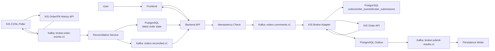
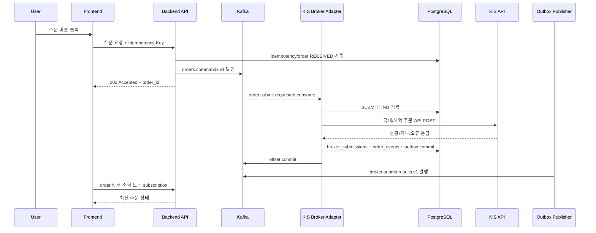
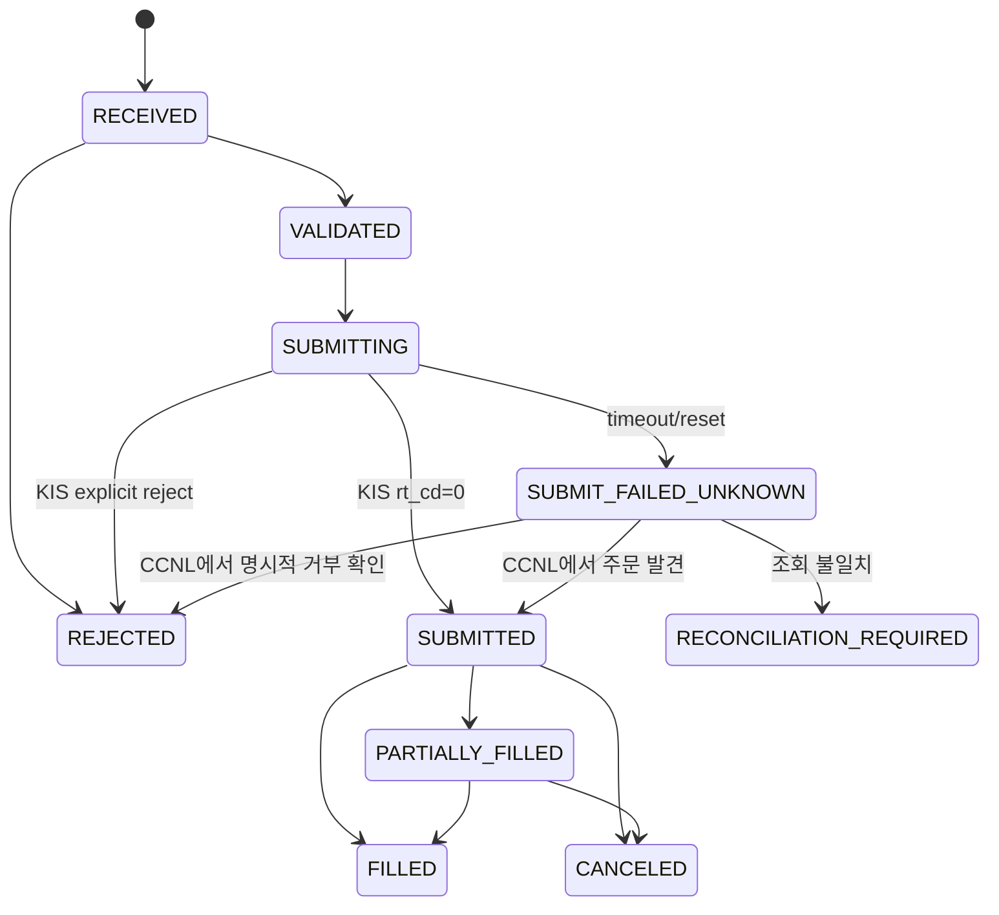
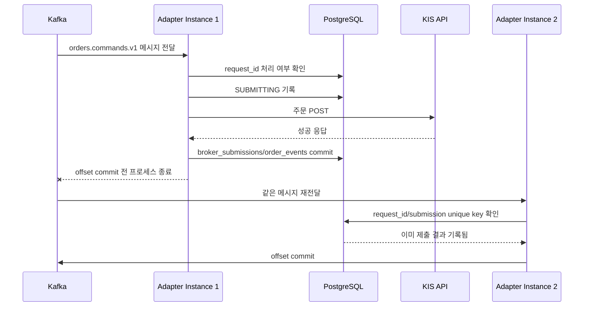

# KIS 주문처리 아키텍처

작성일: 2026-06-25 KST

이 문서는 사용자가 주문 버튼을 누른 뒤 주문 명령이 backend, Kafka, KIS Broker Adapter, KIS API, PostgreSQL, frontend 상태 조회까지 이동하는 전체 흐름을 설명한다. 세부 계약은 [기능 스펙](./spec.md), 실행 순서는 [구체적인 마일스톤](./milestone.md)을 따른다.

## 핵심 원칙

- frontend와 backend는 KIS secret을 알지 못한다.
- backend는 주문 의도를 검증하고 Kafka에 기록한다.
- KIS Broker Adapter만 KIS 주문 API를 호출한다.
- Kafka key는 `account_alias:symbol`로 고정해 필요한 범위의 순서를 보장한다.
- KIS timeout 후에는 같은 주문을 즉시 재POST하지 않는다.
- PostgreSQL commit 후 Kafka offset을 commit한다.
- DB와 후속 Kafka publish는 outbox 패턴으로 연결한다.
- frontend는 최종 체결을 즉시 가정하지 않고 `접수됨`, `제출중`, `제출됨`, `체결됨`, `대사필요` 같은 상태를 보여준다.

## 전체 컴포넌트

## 주문 제출 Sequence

이 흐름에서 frontend가 받는 첫 응답은 체결 완료가 아니라 주문 접수 결과다. 실제 제출/체결 상태는 Kafka와 DB projection을 통해 나중에 반영된다.

## Timeout과 대사 상태 전이

`SUBMIT_FAILED_UNKNOWN`은 실패가 확정된 상태가 아니다. KIS가 주문을 접수했을 가능성이 있으므로 재POST 대신 주문/체결내역 조회로 상태를 해소한다.

## Consumer Crash 후 재처리

이 케이스에서 핵심은 DB unique constraint와 상태 전이 검사다. Kafka는 같은 메시지를 다시 전달할 수 있으므로 consumer 처리는 at-least-once를 전제로 멱등해야 한다.

## 데이터 흐름

1. Backend가 주문 요청을 검증하고 `orders.commands.v1`에 command를 발행한다.
2. KIS Broker Adapter가 command를 읽고 PostgreSQL에 `SUBMITTING`을 기록한다.
3. Adapter가 `market`에 따라 국내/해외 KIS 주문 API를 호출한다.
4. Adapter가 제출 결과를 `broker_submissions`, `order_events`, `outbox_events`에 같은 transaction으로 저장한다.
5. Adapter는 DB commit이 끝난 뒤 Kafka offset을 commit한다.
6. Outbox Publisher가 `broker.submit-results.v1`을 발행한다.
7. Poller가 KIS 주문/체결내역을 조회하고 `broker.order-events.v1`을 발행한다.
8. Reconciliation Service가 내부 상태와 KIS 결과를 비교해 `orders.reconciled.v1`을 발행한다.
9. Backend는 PostgreSQL projection 또는 `orders.reconciled.v1` 구독 결과로 frontend에 최신 상태를 제공한다.

## 국내/해외 분리 지점

공통 처리:

- idempotency
- Kafka envelope
- 상태 모델
- PostgreSQL 저장
- offset commit 규칙
- outbox
- DLQ
- 대사 결과 반영

market별 처리:

- KIS endpoint
- TR ID
- KIS request body
- 주문/체결내역 조회 endpoint
- KIS 응답 필드 매핑

따라서 adapter 내부는 `market`별 변환기를 두되, 바깥 Kafka/DB 계약은 하나로 유지한다.

## 장애별 기대 결과

| 장애 | 기대 결과 |
| --- | --- |
| Backend가 Kafka 발행 전 죽음 | 주문 접수 실패로 사용자 재시도 가능 |
| Backend가 Kafka 발행 후 죽음 | Kafka command가 남아 Adapter가 처리 |
| Adapter가 KIS POST 전 죽음 | offset 미커밋으로 재처리 |
| Adapter가 KIS POST 후 timeout 수신 | `SUBMIT_FAILED_UNKNOWN`, 재POST 금지 |
| Adapter가 DB commit 후 offset commit 전 죽음 | 재처리되지만 unique key로 중복 방지 |
| Outbox Publisher가 죽음 | `outbox_events`에 미발행 이벤트가 남아 재발행 가능 |
| Poller가 죽음 | 다음 실행에서 KIS 조회 재개 |
| KIS와 내부 상태 불일치 | `RECONCILIATION_REQUIRED`와 운영 알림 |

## 운영 관측 지표

- `orders.commands.v1` consumer lag
- KIS POST latency p50/p95/p99
- KIS timeout count
- KIS reject count
- `SUBMIT_FAILED_UNKNOWN` count
- reconciliation mismatch count
- DLQ count
- outbox unpublished event count

이 지표들은 주문 경로의 신뢰성을 판단하는 최소 운영 신호다.
