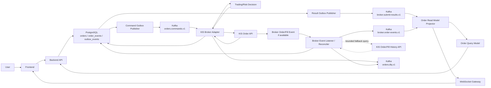
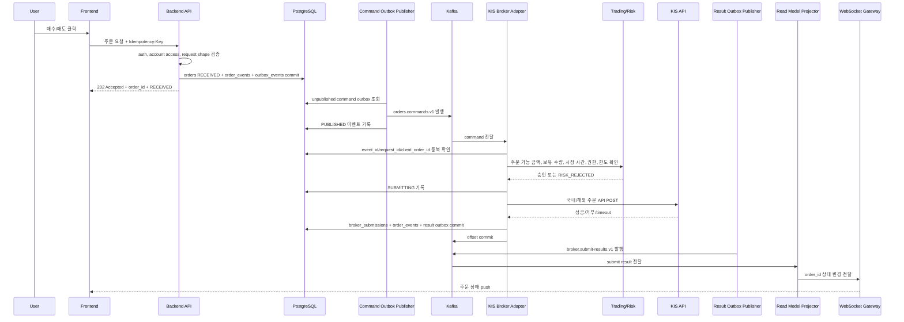
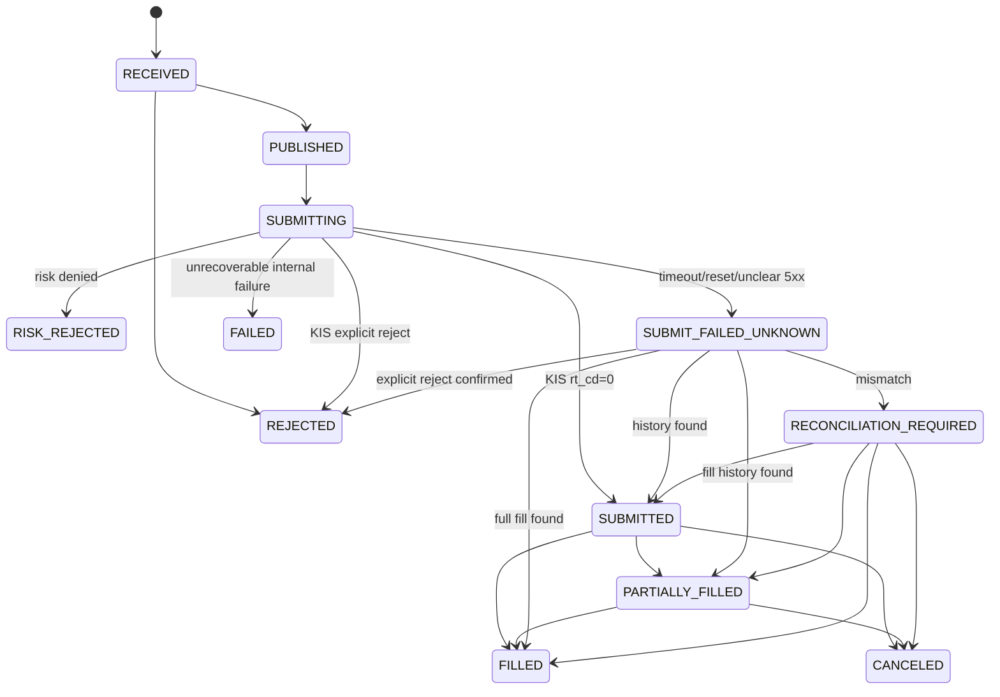
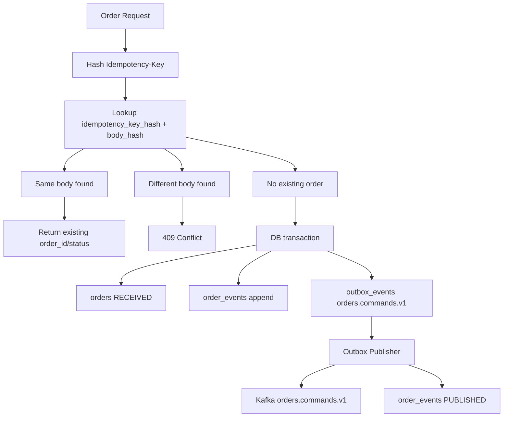
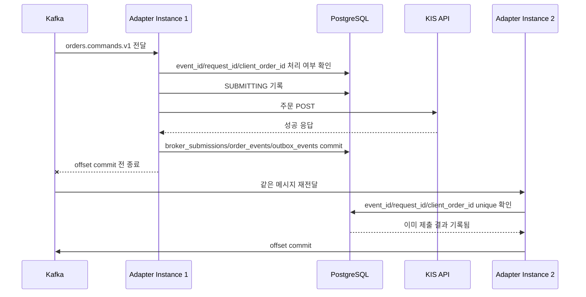
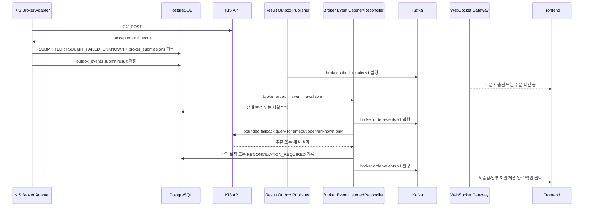

# 주문 신뢰성/보안 아키텍처

작성일: 2026-06-25 KST
최종 수정: 2026-06-27 KST

이 문서는 GOPS 주문 경로의 Kafka-first event spine, transaction boundary, 재처리, 장애 수렴 구조를 설명한다. 상세 상태, envelope, table 제약은 [주문 신뢰성/보안 상세 스펙](./spec.md)을 따른다.

관련 문서:

- [GOPS 통합 명세](./gops-integrated-spec.md)
- [주문 신뢰성/보안 상세 스펙](./spec.md)
- [주문 경로 보안/신뢰성 마일스톤](./security-reliability-milestones.md)

## 1. 아키텍처 원칙

- 주문 경로의 서비스 간 통합 기준은 Kafka topic이다.
- Backend API는 주문 의도를 접수하고 PostgreSQL transaction으로 idempotency, `orders`, `order_events`, `outbox_events`를 저장한다.
- Backend API는 KIS 주문 API를 직접 호출하지 않는다.
- KIS 주문 POST는 KIS Broker Adapter만 수행한다.
- PostgreSQL은 단일 주문의 transaction guard, append-only 원장, transactional outbox, 최신 projection을 담당한다.
- Kafka는 at-least-once 전달을 전제로 하고 DB unique constraint, inbox/outbox, 상태 전이 검사로 멱등 처리한다.
- `broker.submit-results.v1`, `broker.order-events.v1`는 주문 read model과 WebSocket 상태 push의 기준 이벤트다.
- KIS timeout 이후 같은 주문을 즉시 재POST하지 않고 broker event 또는 제한된 주문/체결내역 대사로 해소한다.
- 주문/체결 상태 수렴의 primary path는 broker event 수신이다. Polling은 event 누락, timeout, open/unknown 상태 보정을 위한 bounded fallback이다.

## 2. 주문 Event Spine



컴포넌트 책임:

| 컴포넌트 | 책임 | 금지/경계 |
| --- | --- | --- |
| Frontend | `Idempotency-Key` 생성, 주문 요청, `order_id` 상태 구독 | KIS secret, 계좌번호 원문 저장 금지 |
| Backend API | 인증/인가, 계좌 접근 확인, request shape/idempotency 선검증, DB/outbox 기록 | KIS 주문 POST 금지 |
| Command Outbox Publisher | `orders.commands.v1` 발행, `PUBLISHED` 반영 | 주문 body 임의 변경 금지 |
| KIS Broker Adapter | command 검증, risk/kill switch 확인, KIS 제출, 결과 원장 기록 | timeout 후 즉시 재POST 금지 |
| Result Outbox Publisher | `broker.submit-results.v1` 발행 | DB에 없는 결과 이벤트 임의 생성 금지 |
| Broker Event Listener / Reconciler | broker 주문/체결 event 수신, 누락/불명 상태 bounded 대사, 상태 보정 | 전체 주문 상시 polling 금지, 불명 상태를 실패로 단정 금지 |
| Order Read Model Projector | 결과 topic을 소비해 조회 API/WebSocket용 상태 반영 | Kafka event 없이 화면 상태 확정 금지 |
| WebSocket Gateway | 주문 상태 push, 재연결 후 최신 상태 제공 | 장기 연결 drain 없이 배포 금지 |
| PostgreSQL | transaction guard, append-only 원장, transactional outbox, projection, 대사 이력 | 시장 데이터 canonical log로 사용 금지 |
| Kafka | 주문 command와 결과 이벤트 전달, replay, fan-out | exactly-once 전달 가정 금지 |

## 3. 주문 생성 Sequence



Backend의 첫 응답은 체결 결과가 아니다. 사용자는 `order_id`로 상태를 추적하고, 실제 체결 상태는 KIS 제출 결과, broker event, 제한된 주문/체결내역 대사를 통해 이후 갱신된다.

## 4. 상태 전이 구조



`SUBMIT_FAILED_UNKNOWN`은 실패가 확정된 상태가 아니다. KIS가 주문을 접수했을 수 있으므로 재POST가 아니라 broker event 또는 제한된 KIS 주문/체결내역 조회로 상태를 해소한다.

## 5. Idempotency와 Outbox 데이터 흐름



Backend가 DB commit 후 죽어도 `outbox_events`가 남으면 command 발행을 재개할 수 있다. 같은 idempotency key 재요청은 새 주문 생성이 아니라 기존 `order_id` 조회로 수렴해야 한다.

Outbox는 Kafka-first와 충돌하는 별도 event bus가 아니다. 주문 접수 DB commit과 Kafka publish 사이의 실패 구간을 메우기 위한 발행 보증 장치이며, Kafka에 발행된 뒤의 서비스 간 공식 계약은 `orders.commands.v1`, `broker.submit-results.v1`, `broker.order-events.v1` topic이다.

## 6. Consumer Crash 후 재처리



Kafka 재전달은 예외가 아니라 정상 동작이다. Adapter는 `event_id`, `request_id`, `client_order_id`, 상태 전이 검사를 통해 같은 주문을 다시 KIS POST하지 않아야 한다.

## 7. Broker Event와 제한된 대사 흐름



Timeout 이후 사용자가 같은 주문을 다시 누르더라도 Backend idempotency는 기존 `order_id`를 반환해야 한다. 운영자는 `SUBMIT_FAILED_UNKNOWN` 장기 지속 알림을 보고 broker event 수신 장애, 대사 지연, KIS 조회 장애를 확인한다.

제한된 대사 원칙:

- broker가 주문/체결 push 또는 event channel을 제공하면 그것을 primary source로 둔다.
- polling은 `SUBMIT_FAILED_UNKNOWN`, `RECONCILIATION_REQUIRED`, open order, 장기 미종결 주문에만 수행한다.
- 계좌별 주문/체결내역 window 조회로 묶고, 주문별 무차별 조회를 피한다.
- 계좌/환경 단위 rate budget, adaptive backoff, jitter, circuit breaker를 둔다.
- `FILLED`, `CANCELED`, `REJECTED`, `FAILED`처럼 terminal 상태가 확정된 주문은 polling 대상에서 제외한다.

## 8. DLQ와 운영자 재처리

DLQ 메시지는 원본 event와 오류 metadata를 보존해야 한다.

```json
{
  "schema_version": 1,
  "event_type": "order.dlq.recorded",
  "event_id": "evt_dlq_01",
  "request_id": "req_01",
  "order_id": "ord_01",
  "account_alias": "demo-account",
  "occurred_at": "2026-06-25T00:00:00.000Z",
  "producer": "kis-broker-adapter",
  "env": "demo",
  "source": "orders.commands.v1",
  "payload": {
    "original_topic": "orders.commands.v1",
    "original_partition": 3,
    "original_offset": 42,
    "error_type": "schema_validation_failed",
    "retryable": false
  }
}
```

DLQ 재처리는 운영자 권한으로만 수행한다. 재처리 도구는 원본 message key, topic, partition, offset, error type, 처리 이력을 남겨야 하며, 주문 직접 생성 권한과 분리한다.

## 9. 장애별 기대 결과

| 장애 | 기대 결과 |
| --- | --- |
| Frontend server down | 이미 접수된 주문은 backend/Kafka 경로에서 계속 처리된다. |
| Backend가 DB 저장 전 down | 주문 접수 실패로 사용자 재시도 가능. |
| Backend가 DB 저장 후 응답 전 down | 같은 idempotency key 재요청 시 기존 `order_id`를 반환한다. |
| Command Outbox Publisher down | `outbox_events`에 command가 남아 재발행 가능하다. |
| Kafka broker 일부 장애 | producer retry 후 실패 시 명확한 접수 실패 또는 재시도 가능 상태를 반환한다. |
| Adapter가 KIS POST 전 down | offset 미커밋으로 command가 재전달된다. |
| Adapter가 KIS POST 후 timeout | `SUBMIT_FAILED_UNKNOWN`, 즉시 재POST 금지, 대사 진행. |
| Adapter가 DB commit 후 offset commit 전 down | 재처리되지만 unique key로 중복 제출을 막는다. |
| Result Outbox Publisher down | `outbox_events`에 미발행 결과 이벤트가 남아 재발행된다. |
| Broker Event Listener down | Kafka/result event와 broker event 재수신 또는 제한된 대사로 상태를 따라잡는다. |
| Read Model Projector down | Kafka 결과 topic replay로 조회 상태를 따라잡는다. |
| WebSocket 연결 끊김 | 재연결 후 `order_id` 기준 최신 상태를 다시 받는다. |
| KIS와 내부 상태 불일치 | `RECONCILIATION_REQUIRED`와 운영 알림으로 올린다. |

## 10. 관측성과 알림

필수 trace/log 필드:

- `request_id`
- `event_id`
- `order_id`
- `client_order_id`
- `account_alias`
- `symbol`

필수 metric:

- 주문 API p95/p99 latency
- idempotency conflict count
- `orders.commands.v1` publish latency
- `broker.submit-results.v1` publish latency
- `broker.order-events.v1` publish latency
- Kafka consumer lag by consumer group
- KIS POST latency p50/p95/p99
- KIS timeout count
- KIS reject count
- `SUBMIT_FAILED_UNKNOWN` count and age
- reconciliation mismatch count
- reconciliation query count and rate-limit throttle count
- `orders.dlq.v1` count
- outbox unpublished event count
- read model projection lag
- circuit breaker open count

필수 alert:

- `SUBMIT_FAILED_UNKNOWN` 장기 지속
- `RECONCILIATION_REQUIRED` 발생
- DLQ 급증
- outbox 미발행 누적
- consumer lag 급증
- read model projection lag 급증
- KIS timeout 급증
- KIS reject 급증
- account/user/symbol limit 초과 반복
- circuit breaker open

운영 로그와 감사 로그에는 KIS secret, token, 계좌번호 원문, raw idempotency key가 없어야 한다.
