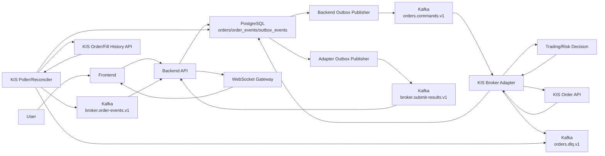
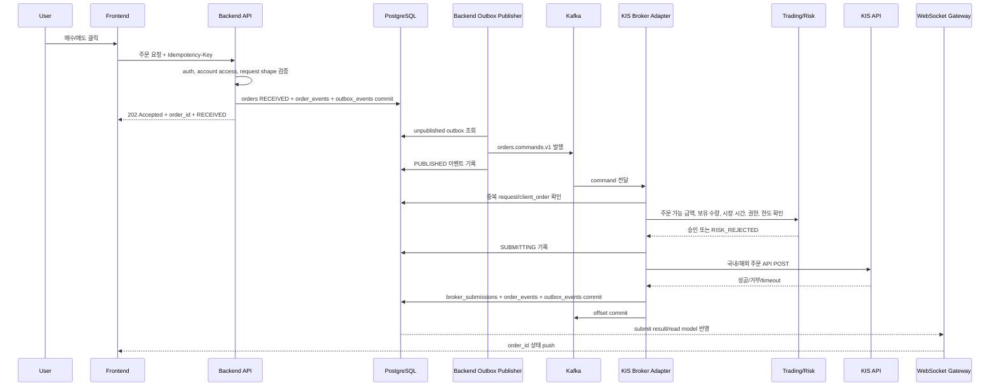
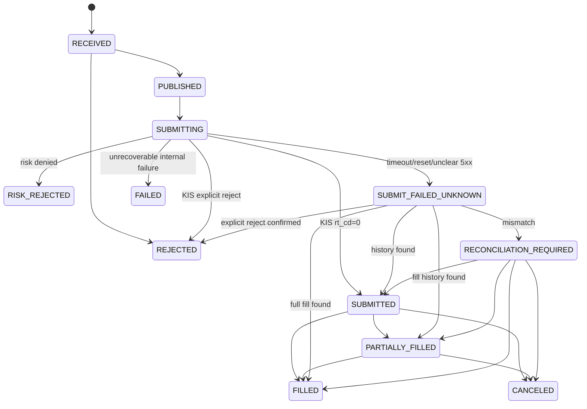
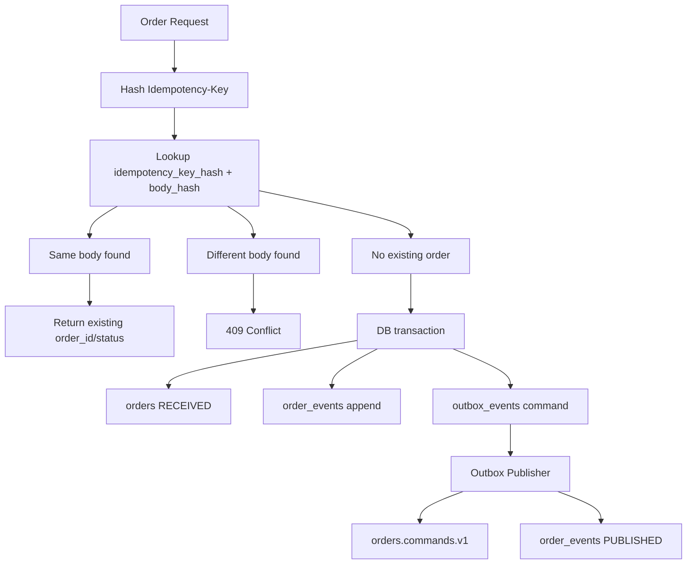
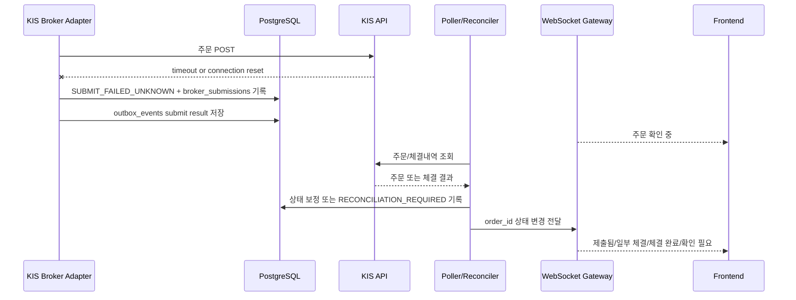

# 주문 신뢰성/보안 아키텍처

작성일: 2026-06-25 KST

이 문서는 `docs/gops-integrated-spec.md`의 통합 아키텍처 중 주문 신뢰성/보안 담당 범위를 상세화한다. 시장 데이터, 차트 렌더링, LLM proposal은 통합 스펙의 경계를 따르고, 이 문서는 주문 요청이 Backend API, PostgreSQL, Kafka, KIS Broker Adapter, KIS API, Poller/Reconciler, WebSocket Gateway를 거쳐 사용자 화면과 운영 알림으로 수렴하는 구조를 설명한다.

관련 문서:

- [GOPS 통합 명세](./gops-integrated-spec.md)
- [주문 신뢰성/보안 상세 스펙](./spec.md)
- [주문 경로 보안/신뢰성 마일스톤](./security-reliability-milestones.md)

## 1. 아키텍처 원칙

- Backend API는 주문 의도를 접수하고 DB/outbox에 기록하지만 KIS 주문 API를 직접 호출하지 않는다.
- KIS Broker Adapter만 KIS secret에 접근하고 KIS 주문 POST를 수행한다.
- PostgreSQL은 주문/체결 정합성의 기준 저장소다.
- Kafka는 at-least-once 전달을 전제로 하고 DB unique constraint와 상태 전이 검사로 멱등 처리한다.
- 모든 사용자 상태 변경은 `order_id` 기준 WebSocket push와 조회 API로 확인 가능해야 한다.
- `SUBMITTED`는 체결 완료가 아니며, `FILLED` 전까지 frontend는 체결 완료를 표시하지 않는다.
- KIS timeout 이후 같은 주문을 즉시 재POST하지 않고 KIS 주문/체결내역 대사로 해소한다.

## 2. 주문 경로 컴포넌트



컴포넌트 책임:

| 컴포넌트 | 책임 | 금지/경계 |
| --- | --- | --- |
| Frontend | `Idempotency-Key` 생성, 주문 요청, `order_id` 상태 구독 | KIS secret, 계좌번호 원문 저장 금지 |
| Backend API | 인증/인가, 계좌 접근 확인, request shape/idempotency 선검증, DB/outbox 기록 | KIS 주문 POST 금지 |
| Backend Outbox Publisher | `orders.commands.v1` 발행, `PUBLISHED` 반영 | 주문 body 임의 변경 금지 |
| KIS Broker Adapter | command 검증, risk/kill switch 확인, KIS 제출, 결과 원장 기록 | timeout 후 즉시 재POST 금지 |
| Poller/Reconciler | KIS 주문/체결내역 조회, 내부 상태와 대사, 상태 보정 | 불명 상태를 실패로 단정 금지 |
| WebSocket Gateway | 주문 상태 push, 재연결 후 최신 상태 제공 | 장기 연결 drain 없이 배포 금지 |
| PostgreSQL | 최신 projection, append-only 원장, outbox, 대사 이력 | 주문 원장을 Redis에 의존 금지 |
| Kafka | 주문 command와 결과 이벤트 전달 | exactly-once 가정 금지 |

## 3. 주문 생성 Sequence



Backend의 첫 응답은 체결 결과가 아니다. 사용자는 `order_id`로 상태를 추적하고, 실제 체결 상태는 KIS 제출 결과와 주문/체결내역 대사를 통해 이후 갱신된다.

## 4. 상태 전이 구조



`SUBMIT_FAILED_UNKNOWN`은 실패가 확정된 상태가 아니다. KIS가 주문을 접수했을 수 있으므로 재POST가 아니라 KIS 주문/체결내역 조회로 상태를 해소한다.

## 5. Idempotency와 Outbox 데이터 흐름



Backend가 DB commit 후 죽어도 `outbox_events`가 남으면 command 발행을 재개할 수 있다. 같은 idempotency key 재요청은 새 주문 생성이 아니라 기존 `order_id` 조회로 수렴해야 한다.

## 6. Consumer Crash 후 재처리


핵심은 Kafka 재전달을 정상 동작으로 보는 것이다. Adapter는 `event_id`, `request_id`, `client_order_id`, 상태 전이 검사를 통해 같은 주문을 다시 KIS POST하지 않아야 한다.

## 7. Timeout과 대사 흐름



Timeout 이후 사용자가 같은 주문을 다시 누르더라도 Backend idempotency는 기존 `order_id`를 반환해야 한다. 운영자는 `SUBMIT_FAILED_UNKNOWN` 장기 지속 알림을 보고 대사 지연이나 KIS 조회 장애를 확인한다.

## 8. DLQ와 운영자 재처리

DLQ 메시지는 원본 event와 오류 metadata를 보존해야 한다.

```json
{
  "schema_version": 1,
  "event_type": "order.dlq.recorded",
  "event_id": "evt_dlq_01",
  "request_id": "req_01",
  "order_id": "ord_01",
  "account_alias": "demo-account",
  "occurred_at": "2026-06-25T00:00:00.000Z",
  "producer": "kis-broker-adapter",
  "env": "demo",
  "source": "orders.commands.v1",
  "payload": {
    "original_topic": "orders.commands.v1",
    "original_partition": 3,
    "original_offset": 42,
    "error_type": "schema_validation_failed",
    "retryable": false
  }
}
```

DLQ 재처리는 운영자 권한으로만 수행한다. 재처리 도구는 원본 message key, topic, partition, offset, error type, 처리 이력을 남겨야 하며, 주문 직접 생성 권한과 분리한다.

## 9. 장애별 기대 결과

| 장애 | 기대 결과 |
| --- | --- |
| Frontend server down | 이미 접수된 주문은 backend/Kafka 경로에서 계속 처리된다. |
| Backend가 DB 저장 전 down | 주문 접수 실패로 사용자 재시도 가능. |
| Backend가 DB 저장 후 응답 전 down | 같은 idempotency key 재요청 시 기존 `order_id`를 반환한다. |
| Backend Outbox Publisher down | `outbox_events`에 command가 남아 재발행 가능하다. |
| Kafka broker 일부 장애 | producer retry 후 실패 시 명확한 접수 실패 또는 재시도 가능 상태를 반환한다. |
| Adapter가 KIS POST 전 down | offset 미커밋으로 command가 재전달된다. |
| Adapter가 KIS POST 후 timeout | `SUBMIT_FAILED_UNKNOWN`, 즉시 재POST 금지, 대사 진행. |
| Adapter가 DB commit 후 offset commit 전 down | 재처리되지만 unique key로 중복 제출을 막는다. |
| Poller down | 다음 실행에서 KIS 주문/체결내역 조회를 재개한다. |
| WebSocket 연결 끊김 | 재연결 후 `order_id` 기준 최신 상태를 다시 받는다. |
| KIS와 내부 상태 불일치 | `RECONCILIATION_REQUIRED`와 운영 알림으로 올린다. |

## 10. 관측성과 알림

필수 trace/log 필드:

- `request_id`
- `event_id`
- `order_id`
- `client_order_id`
- `account_alias`
- `symbol`

필수 metric:

- 주문 API p95/p99 latency
- idempotency conflict count
- `orders.commands.v1` publish latency
- KIS POST latency p50/p95/p99
- KIS timeout count
- KIS reject count
- `SUBMIT_FAILED_UNKNOWN` count and age
- reconciliation mismatch count
- `orders.dlq.v1` count
- outbox unpublished event count
- consumer lag
- circuit breaker open count

필수 alert:

- `SUBMIT_FAILED_UNKNOWN` 장기 지속
- `RECONCILIATION_REQUIRED` 발생
- DLQ 급증
- outbox 미발행 누적
- KIS timeout 급증
- KIS reject 급증
- account/user/symbol limit 초과 반복
- circuit breaker open

운영 로그와 감사 로그에는 KIS secret, token, 계좌번호 원문, raw idempotency key가 없어야 한다.
