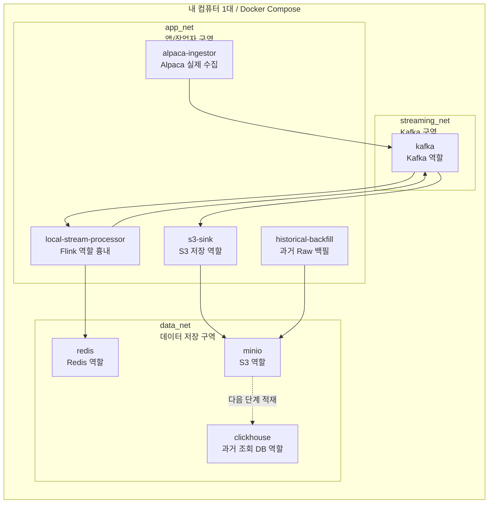
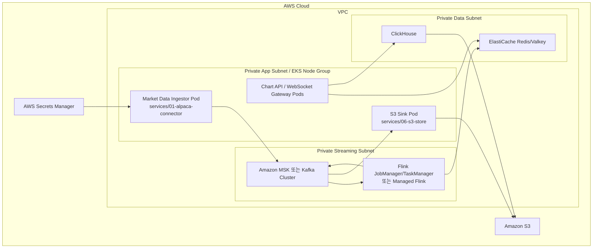

# 로컬 Docker와 운영 AWS/EKS는 다릅니다

## 결론

현재 `docker compose`는 운영 아키텍처가 아닙니다. 내 컴퓨터 한 대에서 Kafka, Redis, S3, ClickHouse, worker를 각각 컨테이너로 나눠 흉내 내는 로컬 검증 환경입니다.

운영에서는 Kafka, Flink, Redis, S3, ClickHouse가 같은 서버에 올라가지 않습니다. 각각 아래처럼 분리됩니다.

| 역할 | 로컬 Docker | 운영 AWS/EKS |
|---|---|---|
| Kafka | `kafka` 컨테이너 | Amazon MSK 또는 Kafka cluster |
| Flink | `local-stream-processor` Python 컨테이너 | Managed Flink 또는 Flink JobManager/TaskManager |
| Redis | `redis` 컨테이너 | ElastiCache Redis/Valkey |
| S3 | `minio` 컨테이너 | Amazon S3 |
| ClickHouse | `clickhouse` 컨테이너 | EC2 직접 설치 또는 ClickHouse Cloud |
| Alpaca 수집기 | `alpaca-ingestor` 컨테이너 | EKS Pod |
| S3 저장기 | `s3-sink` 컨테이너 | EKS Pod 또는 Flink sink |
| 과거 백필 | `historical-backfill` one-shot 컨테이너 | Batch job, CronJob, Airflow, 또는 수동 job |
| Chart API | placeholder | EKS Pod 또는 별도 API 서버 |
| WebSocket Gateway | placeholder | EKS Pod 또는 별도 realtime 서버 |
| Chart Engine | placeholder | 별도 frontend 배포 |

## 로컬 Docker Mermaid



## 로컬 Docker 네트워크 구역

`docker-compose.yml`은 아래 네트워크로 나뉩니다.

| Docker network | AWS에서 대응되는 느낌 | 붙는 컨테이너 |
|---|---|---|
| `app_net` | Private app subnet 흉내 | `alpaca-ingestor`, `local-stream-processor`, `s3-sink`, `historical-backfill` |
| `streaming_net` | Private streaming subnet 흉내 | `kafka`, `kafka-init`, `alpaca-ingestor`, `local-stream-processor`, `s3-sink` |
| `data_net` | Private data subnet 흉내 | `redis`, `minio`, `minio-init`, `clickhouse`, `local-stream-processor`, `s3-sink`, `historical-backfill` |

이 분리는 “각 서버 역할이 어느 구역에 있는지”를 이해하기 위한 로컬 모델입니다. 실제 AWS의 VPC subnet, security group, IAM 권한을 완전히 재현하는 것은 아닙니다.

## 운영 AWS/EKS Mermaid



## 왜 로컬은 한 환경에 올리나

로컬에서 Kafka, Flink, Redis, S3를 실제 AWS처럼 모두 분리 서버로 띄우면 비용과 설정이 커집니다. 그래서 로컬에서는 한 컴퓨터 안에서 컨테이너를 분리해 데이터 계약과 코드 흐름만 검증합니다.

검증할 것:

```text
Alpaca 형식 -> Kafka Raw Topic -> 처리 결과 Topic -> Redis key -> S3 path
```

검증하지 않는 것:

```text
MSK 운영 성능
Flink HA/checkpoint/savepoint
EKS autoscaling
VPC subnet/AZ 장애 전환
AWS IAM/IRSA 권한 전체
```
