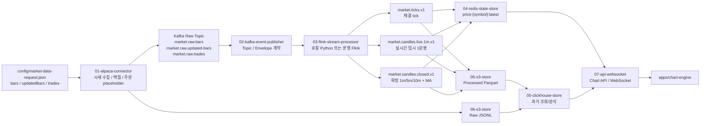

# 파일명과 역할

기준 명세: [market-data-pipeline-spec.md](/Users/heejunkim/Desktop/alfaka/docs/market-data-pipeline-spec.md)

## Pod 역할 기준 폴더 구조

```text
services/01-alpaca-connector/            Alpaca 시세/주문 외부 연동
services/02-kafka-event-publisher/        Kafka 이벤트 발행 계약
services/03-flink-stream-processor/       Kafka Raw -> Processed Kafka + Redis 처리
services/04-redis-state-store/            Redis 캐시/상태 저장 계약
services/05-clickhouse-store/             ClickHouse 저장/조회 계약
services/06-s3-store/                     S3 Raw/Processed 저장
services/07-api-websocket/                API 서버 / WebSocket 서버
apps/chart-engine/                       Chart Engine placeholder
```

## 실제 실행 파일

```text
services/01-alpaca-connector/market_stream.py          Alpaca WebSocket -> Kafka Raw
services/01-alpaca-connector/historical_backfill.py    Alpaca Historical REST -> S3 Raw
services/03-flink-stream-processor/local_main.py       로컬 Flink 대체 처리기
services/06-s3-store/processed_sink.py                 Processed Kafka -> S3
```

공통 로직:

```text
packages/alfaka/alpaca/       Alpaca 구독/수집/백필 코드
packages/alfaka/streaming/    정규화, live candle, 5m/10m, MA 계산
packages/alfaka/storage/      S3 저장 코드
packages/alfaka/common/       env, Kafka, S3, secret 공통 코드
```

## 데이터 흐름 Mermaid



## 사용자 기준 단계명

```text
알파카 송신/  -> services/01-alpaca-connector, packages/alfaka/alpaca/subscription.py
카프카 수신/  -> services/01-alpaca-connector, packages/alfaka/common/market_messages.py
카프카 송신/  -> services/02-kafka-event-publisher, services/03-flink-stream-processor
레디스 확인/  -> services/04-redis-state-store, scripts/local/check-redis.py
S3 확인/      -> services/06-s3-store, scripts/local/check-s3.py
프론트 화면/  -> apps/chart-engine placeholder
```

## 로컬과 운영 구분

`docker-compose.yml`의 `local-stream-processor`는 실제 Flink 서버가 아닙니다. 운영에서는 `flink-jobs/market-data-normalizer`를 기준으로 Managed Flink 또는 Flink on EKS로 분리합니다.
