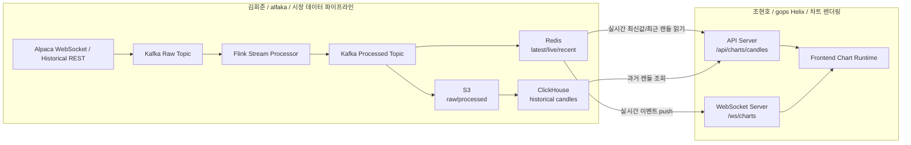
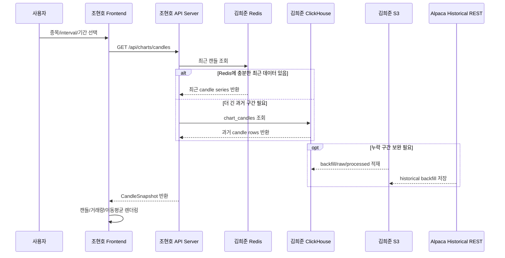
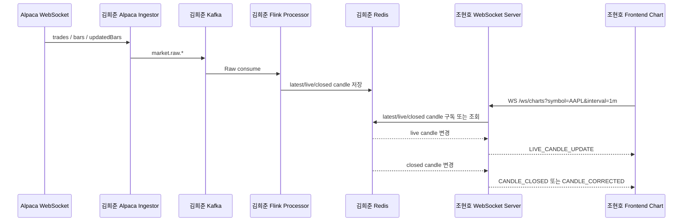

# GOPS Helix x Alfaka 병합 전 작업 보고서

작성일: 2026-06-26

검토 기준:

- 김희준 폴더: `/Users/heejunkim/Desktop/alfaka`
- 조현호 폴더: `https://github.com/KFJG-Team1/gops/tree/Helix`
- GOPS 기준 커밋: `ea0eaf4 feat: implement chart runtime foundation`

## 1. 결론

김희준 코드와 조현호 코드는 같은 차트 화면을 향하지만, 담당 계층은 명확히 다르다.

김희준 코드는 Alpaca에서 데이터를 받아 Kafka, Flink 역할 처리, Redis, S3, ClickHouse까지 보내는 시장 데이터 파이프라인이다.

조현호 코드는 Chart API, WebSocket, React Chart Runtime을 통해 사용자가 보는 차트 화면을 담당한다.

따라서 병합 방식은 코드를 서로 섞는 방식이 아니라, Redis와 ClickHouse를 기준으로 두 영역을 연결하는 방식이어야 한다.



## 2. 책임 경계

| 구분 | 김희준 책임 | 조현호 책임 |
|---|---|---|
| 외부 데이터 연결 | Alpaca WebSocket, Historical REST | 직접 호출하지 않음 |
| Kafka | Raw/Processed topic 계약 생성, producer/consumer 계약 | 직접 Raw topic에 의존하지 않음 |
| Flink | tick 정규화, live candle, closed candle, 5m/10m, MA 계산 | 계산 결과만 사용 |
| Redis | 최신 현재가, live candle, 최근 candle series 저장 | WebSocket/API에서 읽기 |
| S3 | raw/processed 장기 저장, backfill 저장 | 필요 시 운영 조회/검증만 |
| ClickHouse | schema, 적재 경로, 과거 캔들 저장 | Chart API에서 조회 |
| API Server | 데이터 저장 계약 제공 | `/api/charts/candles`, `/api/charts/symbols` 구현 |
| WebSocket | Redis/Kafka로 실시간 데이터 제공 | `/ws/charts`로 프론트에 push |
| Frontend Chart | 직접 수정하지 않음 | chart runtime, rendering, interaction 담당 |

## 3. 왜 GOPS 코드를 수정해야 하는가

GOPS `Helix`의 현재 차트 백엔드는 dummy generator를 사용한다.

현재 문제:

- `/api/charts/candles`가 `source: "dummy"`와 `feed: "synthetic-demo"`를 반환한다.
- `/ws/charts`가 Redis/Kafka를 읽지 않고 `asyncio.sleep`으로 가짜 live candle을 만든다.
- `backend/app/services/market_data.py`가 provider adapter가 아니라 dummy 생성 함수 모음이다.
- 프론트는 이미 실시간/과거 차트 계약을 가지고 있으므로, 백엔드만 실제 provider로 바꾸면 된다.

수정해야 하는 이유:

1. 김희준 파이프라인에서 실제 Alpaca 데이터가 들어오는데, GOPS가 dummy를 계속 만들면 화면의 데이터 출처가 두 개가 된다.
2. 실시간 데이터는 WebSocket만으로 소통하기로 했으므로 `/ws/charts`는 Redis 또는 Processed Topic 기반이어야 한다.
3. 과거 데이터는 API Server로 연결하기로 했으므로 `/api/charts/candles`는 ClickHouse와 Redis를 읽어야 한다.
4. 차트 담당자가 프론트를 수정하더라도 데이터 계약이 유지되어야 하므로, 백엔드에 DTO 변환층이 필요하다.

## 4. 조현호 코드 수정 범위

GOPS 쪽 수정 대상:

```text
backend/app/routes/charts.py
backend/app/routes/streams.py
backend/app/services/market_data.py
backend/app/core/config.py
frontend/src/chart/types.ts
frontend/src/chart/marketDataAdapter.ts
frontend/src/components/ChartPanel.tsx
```

수정 방향:

```text
backend/app/services/market_data.py
  -> backend/app/services/market_data/
       provider.py
       redis_provider.py
       clickhouse_provider.py
       dto.py
       symbols.py
```

필수 변경:

| 항목 | 현재 | 변경 |
|---|---|---|
| 과거 캔들 REST | dummy candle 생성 | Redis 최근값 + ClickHouse 과거 조회 |
| 실시간 WebSocket | dummy loop | Redis Pub/Sub 또는 Redis 최신값 기반 push |
| symbol 검증 | dummy symbol map | 김희준 `config/market-data-request.json` 또는 공통 symbol registry |
| 응답 DTO | dummy 내부 구조 | GOPS `CandleSnapshot`, `CandleEvent` 고정 |
| fallback | dummy 반환 | 연결 실패 시 503 또는 empty 상태 반환 |

조현호가 유지해야 하는 것:

- `frontend/src/chart/types.ts`의 `CandleData`, `CandleSnapshot`, `CandleEvent` 계약
- `frontend/src/components/ChartPanel.tsx`의 REST/WS 연결 흐름
- chart runtime, canvas renderer, interaction model

## 5. 김희준 코드 수정 범위

김희준 쪽 현재 구조는 서비스 단위로 이미 나뉘어 있다.

```text
services/01-alpaca-connector/
services/02-kafka-event-publisher/
services/03-flink-stream-processor/
services/04-redis-state-store/
services/05-clickhouse-store/
services/06-s3-store/
services/07-api-websocket/
packages/alfaka/
```

병합 전 보강해야 하는 부분:

| 항목 | 현재 상태 | 필요한 이유 |
|---|---|---|
| ClickHouse 적재 | Processed Kafka -> ClickHouse loader 추가 | 과거 데이터 API가 ClickHouse를 읽어야 함 |
| Backfill 검증 | 코드 있음, 실행 검증 필요 | Redis 이전 구간을 S3/ClickHouse로 채워야 함 |
| DTO 변환 샘플 | 내부 payload는 있음 | GOPS 응답 형식과 1:1 매핑 필요 |
| Contract test | 없음 | 조현호가 프론트를 수정해도 깨짐을 바로 확인해야 함 |
| Flink 운영 job | local Python 대체 | AWS/EKS에서는 실제 Flink 또는 Managed Flink 필요 |

김희준이 유지해야 하는 계약:

```text
Kafka Raw:
  market.raw.bars
  market.raw.updated-bars
  market.raw.trades

Kafka Processed:
  market.ticks.v1
  market.candles.live.1m.v1
  market.candles.closed.v1

Redis:
  price:{symbol}:latest
  candle:{symbol}:1m:live
  candle:{symbol}:{interval}:latest
  candles:{symbol}:{interval}

S3:
  market-data/raw/source=alpaca/channel={bars|trades}/symbol={symbol}/...
  market-data/processed/{trades|candles}/...

ClickHouse:
  market_data.trade_ticks
  market_data.chart_candles
```

## 6. 과거 데이터 흐름

과거 데이터는 API Server를 통해서만 차트로 간다.



과거 데이터 계약:

```http
GET /api/charts/candles?symbol=AAPL&interval=1m&ma=5,20,60&limit=160
```

응답 핵심:

```json
{
  "symbol": "AAPL",
  "interval": "1m",
  "source": "alpaca",
  "feed": "sip",
  "isSynthetic": false,
  "indicators": {
    "ma": [5, 20, 60],
    "volume": true
  },
  "candles": [
    {
      "timestamp": "2026-06-26T11:36:00.000Z",
      "open": 276.26,
      "high": 276.40,
      "low": 275.15,
      "close": 276.26,
      "volume": 1796,
      "isClosed": true,
      "ma5": 275.11,
      "ma20": 274.80,
      "ma60": 273.90
    }
  ]
}
```

## 7. 실시간 데이터 흐름

실시간 데이터는 WebSocket으로만 차트에 전달한다.



WebSocket event 계약:

```json
{
  "type": "LIVE_CANDLE_UPDATE",
  "symbol": "AAPL",
  "interval": "1m",
  "source": "alpaca",
  "feed": "sip",
  "isSynthetic": false,
  "data": {
    "timestamp": "2026-06-26T11:36:00.000Z",
    "open": 276.26,
    "high": 276.40,
    "low": 275.15,
    "close": 276.26,
    "volume": 1796,
    "isClosed": false,
    "ma5": 275.11
  }
}
```

## 8. 병합 후 권장 폴더 구조

```text
gops/
  frontend/                              조현호 책임
  backend/
    app/
      routes/
        charts.py                        조현호 책임, 김희준 data provider 사용
        streams.py                       조현호 책임, 김희준 Redis 계약 사용
      services/
        market_data/
          provider.py                    공동 계약
          redis_provider.py              조현호 구현, 김희준 Redis 계약 기반
          clickhouse_provider.py         조현호 구현, 김희준 ClickHouse 계약 기반
          dto.py                         공동 계약

  services/
    market-data-pipeline/                김희준 책임
      01-alpaca-connector/
      02-kafka-event-publisher/
      03-flink-stream-processor/
      04-redis-state-store/
      05-clickhouse-store/
      06-s3-store/

  packages/
    alfaka/                              김희준 책임

  infra/
    local/docker-compose.market-data.yml 김희준 책임
    clickhouse/                          김희준 책임
    k8s/                                 공동 운영
    aws/                                 공동 운영

  docs/
    spec/20-market-data/                 김희준 주도, 조현호 확인
    architecture/service-boundaries.md   조현호 주도, 김희준 확인
```

## 9. 두 사람이 지켜야 하는 작업 규칙

1. 김희준은 `frontend/src/chart/*` 렌더링 코드를 직접 수정하지 않는다.
2. 조현호는 `services/market-data-pipeline/*`의 수집/처리 로직을 직접 수정하지 않는다.
3. 둘 다 수정해야 하는 곳은 `backend/app/services/market_data/dto.py`와 contract 문서뿐이다.
4. API 응답과 WebSocket event는 먼저 문서에서 합의하고 코드에 반영한다.
5. dummy 데이터는 runtime에서 제거하고, 테스트 fixture로만 남긴다.
6. Redis key, Kafka topic, ClickHouse table 이름은 PR에서 임의 변경하지 않는다.
7. 변경이 필요하면 `docs/spec/20-market-data`의 계약을 먼저 바꾼다.

## 10. 병합 전 체크리스트

| 번호 | 작업 | 담당 | 완료 기준 |
|---:|---|---|---|
| 1 | GOPS dummy provider 제거 계획 확정 | 조현호 | runtime에서 `source: dummy` 제거 |
| 2 | Redis provider 구현 | 조현호 | `/api/charts/candles`가 Redis 최근 캔들 읽음 |
| 3 | ClickHouse provider 구현 | 조현호 | `/api/charts/candles`가 과거 캔들 읽음 |
| 4 | WebSocket provider 구현 | 조현호 | `/ws/charts`가 Redis 기반 event push |
| 5 | ClickHouse loader 검증 | 김희준 | `market_data.chart_candles` row count 증가 |
| 6 | Backfill 실행 검증 | 김희준 | S3 raw prefix에 historical data 저장 |
| 7 | DTO contract fixture 추가 | 공동 | sample response로 frontend/backend test 통과 |
| 8 | 통합 README 반영 | 공동 | 책임 경계와 실행 방법이 한 문서에 있음 |

## 11. 현재 확인된 상태

2026-06-26 기준 로컬 확인:

- Alpaca ingestor 실행 중
- Kafka topic 생성됨
- Raw trades/bars 수신 중
- local stream processor가 Processed topic 생성 중
- Redis에 `price:*`, `candle:*`, `candles:*` key 생성됨
- S3/MinIO에 processed JSONL 저장 중
- ClickHouse table은 생성됨
- ClickHouse loader 코드가 추가됨
- ClickHouse loader 실행 검증 완료
- 검증 시점 row count: `market_data.trade_ticks = 1996`, `market_data.chart_candles = 15`
- Historical backfill은 코드가 있으나 실행 검증 필요

따라서 지금 병합 전 가장 중요한 작업은 GOPS provider adapter를 조현호 backend에 적용하고, Historical backfill을 실행 검증하는 것이다.

## 12. 구현 반영 파일

계획서 기준으로 김희준 폴더에 다음 파일이 추가됐다.

```text
services/05-clickhouse-store/processed_loader.py
packages/alfaka/storage/clickhouse_loader.py
packages/alfaka/serving/dto.py
packages/alfaka/serving/redis_provider.py
packages/alfaka/serving/clickhouse_provider.py
packages/alfaka/serving/provider.py
services/07-api-websocket/chart-api/gops_provider_example.py
services/07-api-websocket/websocket-gateway/gops_stream_example.py
```

`packages/alfaka/streaming/processor.py`는 Redis key 저장뿐 아니라 `market.events`와 `market.events:{symbol}` Pub/Sub 채널로 GOPS WebSocket event 형식도 발행한다.
