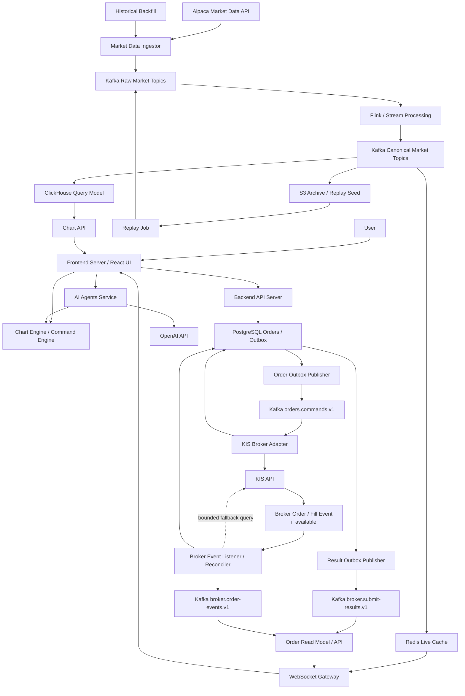

# GOPS 통합 명세

작성일: 2026-06-25 KST
최종 수정: 2026-06-27 KST

## 1. 문서 목적

이 문서는 GOPS의 제품 범위, Kappa Architecture, Kafka-first 원칙, canonical topic/status/security 기준을 고정하는 통합 기준 문서다. 하위 문서는 이 기준을 반복하지 않고 자기 역할에 맞는 상세만 다룬다.

관련 문서:

- [주문 신뢰성/보안 아키텍처](./architecture.md): 주문 경로의 event spine, sequence, 장애 흐름
- [주문 신뢰성/보안 상세 스펙](./spec.md): 주문 상태, Kafka envelope, idempotency, DB/outbox 계약
- [주문 경로 보안/신뢰성 마일스톤](./security-reliability-milestones.md): 구현 순서, 완료 기준, 장애 테스트

문서 간 충돌이 있으면 이 문서의 MVP 범위, topic, 주문 상태, 보안 원칙을 우선한다.

## 2. Kappa Architecture와 Kafka-first 원칙

GOPS의 기본 데이터 처리 모델은 Kappa Architecture다. 실시간 처리와 재처리를 같은 stream processing pipeline으로 수행하고, 별도의 batch serving path를 canonical 경로로 만들지 않는다.

Kafka-first는 Kafka-only가 아니다.

- Kafka는 서비스 간 이벤트 로그, 재처리, fan-out, 비동기 통합의 중심이다.
- PostgreSQL은 주문처럼 강한 트랜잭션이 필요한 경로에서 idempotency, unique constraint, transactional outbox, 최신 projection을 담당한다.
- Redis, ClickHouse, WebSocket read model은 Kafka 이벤트에서 파생되는 serving view다.
- S3는 raw/processed archive, replay seed, 장기 보존 저장소다. S3를 Kafka와 별개의 batch 정답 경로로 쓰지 않는다.
- 신규 consumer나 read model은 Kafka topic replay 또는 S3 archive 재주입으로 재생성 가능해야 한다.

영역별 기준:

| 영역 | Kafka-first 적용 방식 | 보조 저장소 책임 |
| --- | --- | --- |
| 시장 데이터/차트 | Alpaca 수집 이벤트를 Kafka에 먼저 기록하고 Flink/consumer가 정규화, 집계, serving view를 만든다. | Redis는 최신값/최근 시계열 cache, ClickHouse는 분석 read model, S3는 replay/archive |
| 주문 | Backend가 DB transaction으로 주문 의도와 transactional outbox를 저장한 뒤 Kafka command를 발행한다. 이후 제출 결과와 broker event/대사 결과는 Kafka 결과 topic으로 흐른다. | PostgreSQL은 주문 멱등성, append-only 원장, outbox, projection, 대사 이력 |
| 운영/감사 | 주요 상태 변경은 `event_id`, `request_id`, `order_id`, `account_alias`로 추적 가능한 이벤트로 남긴다. | 로그/메트릭/감사 저장소는 Kafka/DB 이벤트와 상호 추적 가능해야 함 |

## 3. 통합 제품 범위

GOPS는 실시간 금융 데이터를 수집하고, 차트로 렌더링하며, 사용자가 직접 편집하거나 LLM이 제안한 차트 변경을 승인할 수 있는 분석/거래 보조 시스템이다. 주문 기능은 차트 MVP와 분리된 별도 주문 경로로 다루며, 서버 멱등성, Kafka 기반 비동기 처리, KIS API 제출, broker event 수신과 제한된 대사를 통해 중복 주문과 주문 유실을 방지한다.

통합 MVP는 다음 세 흐름으로 나눈다.

| 흐름 | 포함 범위 | 1차 기준 |
| --- | --- | --- |
| 시장 데이터/차트 | Alpaca 실시간/과거 데이터 수집, Kafka/Flink 처리, Redis/ClickHouse/S3 파생 저장, Chart API/WebSocket, Chart Engine 렌더링 | 미국 주식 `1m`, `5m`, `10m` 캔들, 거래량, 이동평균선 |
| LLM 차트 제안 | 현재 차트 context와 market summary를 backend로 보내고, OpenAI API 응답을 검증한 뒤 proposal로 표시 | 승인 전 자동 적용 금지 |
| 주문 신뢰성/보안 | 주문 접수, 멱등성, Kafka command, KIS Broker Adapter, append-only 원장, broker event/체결 대사, 운영 가드레일 | MVP에서 KIS 모의투자 주문 가능. 실전 주문은 후속 단계 |

차트 문서에서 제외한 주문, 인증, 배포, 영속 저장소는 차트 엔진의 제외 범위로 해석한다. 전체 GOPS 플랫폼 관점에서는 주문, 인증, 배포, 저장소가 별도 명세의 포함 범위다.

## 4. 통합 아키텍처

## 5. 서비스 책임

| 서비스 | 책임 | 경계 |
| --- | --- | --- |
| Frontend Server | React UI 제공, 주문/차트 화면 표시, WebSocket 연결 시작 | KIS secret, Alpaca secret, OpenAI key를 알면 안 됨 |
| Chart Engine | 정규화된 차트 데이터 렌더링, Chart Document 관리, 사용자 command 적용, LLM proposal preview/승인 | Alpaca 원본 포맷과 provider 연결 방식을 알면 안 됨 |
| Backend API Server | 인증, 계좌 접근 확인, 차트 REST API, 주문 접수, idempotency 저장, outbox 생성 | KIS 주문 API를 직접 호출하지 않음 |
| WebSocket Gateway | 실시간 차트 업데이트와 주문 상태 업데이트 push | 장기 연결 drain과 인증 검증 필요 |
| Market Data Ingestor | Alpaca `bars`, `updatedBars`, `trades` 수집, raw market topic 발행 | 차트 렌더링 로직을 포함하지 않음 |
| Flink / Stream Processor | Raw 이벤트 정규화, 임시 캔들 갱신, 확정 캔들 생성, 5m/10m 집계, 이동평균선 계산 | 별도 batch 정답 경로를 만들지 않음 |
| Redis | 최신가, 실시간 임시 캔들, 최근 캔들 cache | 주문/체결의 원장 저장소로 사용하지 않음 |
| ClickHouse | 과거 차트 조회와 분석 query model | 원천 저장소가 아니라 Kafka/S3에서 재생성 가능한 read model |
| S3 | raw/processed archive, replay seed, Flink checkpoint, 백업 | serving API의 직접 정답 경로로 사용하지 않음 |
| RDS PostgreSQL | 사용자, 주문 최신 상태 projection, append-only 주문 이벤트, transactional outbox, 대사 이력 | 시장 데이터 canonical log로 사용하지 않음 |
| Trading/Risk Service | 주문 가능 금액, 보유 수량, 시장 시간, 권한, 한도 검증 | KIS API 호출과 secret 접근은 Adapter로 격리 |
| KIS Broker Adapter | KIS 주문 API 호출, timeout/거부/성공 결과 기록, broker submission 저장 | KIS secret 접근을 단일화 |
| Broker Event Listener / Reconciler | broker 주문/체결 event 수신, 누락/불명 상태에 대한 제한된 대사, 내부 상태 보정 | 전체 주문을 상시 polling하지 않고 timeout/open/unknown 상태만 제한적으로 조회 |
| AI Agents Service | OpenAI API 호출, insights/proposal 생성 | chart document를 직접 변경하지 않음 |

## 6. Kafka Topic 기준

Kafka topic은 서비스 간 공식 계약이다. 내부 저장소 table이나 cache key가 topic 계약을 대체하지 않는다.

| 분류 | Topic | 의미 |
| --- | --- | --- |
| 틱 데이터 | `market.ticks.v1` | Alpaca `trades` 기반 현재가/체결 tick |
| 분봉 | `market.candles.live.1m.v1` | `trades` 기반 진행 중인 임시 1분봉 |
| 확정분봉 | `market.candles.closed.v1` | `bars`, `updatedBars` 기반 확정 1m/5m/10m 캔들 |
| 사용자 주문 | `orders.commands.v1` | 사용자 주문/취소/정정 command |
| 사용자 주문에 대한 결과 | `broker.submit-results.v1`, `broker.order-events.v1` | KIS 제출 결과와 broker event/체결/상태 대사 결과 |
| DLQ | `orders.dlq.v1` | 주문 command/result/event 처리 실패와 운영자 재처리 대상 |

초기 topic 운영값은 다음 기준으로 둔다.

| Topic | Partition | Retention | Key | Schema versioning |
| --- | ---: | --- | --- | --- |
| `market.ticks.v1` | 12 | 3일 | `symbol` | envelope의 `schema_version` 필수 |
| `market.candles.live.1m.v1` | 12 | 3일 | `symbol` | envelope의 `schema_version` 필수 |
| `market.candles.closed.v1` | 12 | 30일 | `symbol:interval` | envelope의 `schema_version` 필수 |
| `orders.commands.v1` | 12 | 90일 | `account_alias:symbol` | envelope의 `schema_version` 필수 |
| `broker.submit-results.v1` | 12 | 90일 | `account_alias:symbol` | envelope의 `schema_version` 필수 |
| `broker.order-events.v1` | 12 | 90일 | `account_alias:symbol` | envelope의 `schema_version` 필수 |
| `orders.dlq.v1` | 6 | 180일 | 원본 message key | 원본 schema와 error metadata 보존 |

Kafka envelope에는 최소한 `schema_version`, `event_type`, `event_id`, `occurred_at`, `producer`, `env`, `source`, `payload`를 포함한다. 주문 관련 topic은 `request_id`, `order_id`, `client_order_id`, `account_alias`를 추가로 포함한다. Kafka 메시지와 문서 예시에는 KIS appkey, appsecret, access token, 계좌번호 원문, raw idempotency key를 남기지 않는다.

## 7. 시장 데이터와 차트 기준

MVP 시장 데이터 공급자는 Alpaca Market Data API로 둔다. 실시간 미국 주식 데이터는 SIP Feed 기준이며, MVP 구독 채널은 `bars`, `updatedBars`, `trades`다.

Alpaca는 시장 데이터 공급자로만 사용한다. Trading provider 후보로 두지 않으며, 실제 주문/거래는 KIS 등 별도 거래 API를 사용한다.

| 채널/API | 사용 목적 | MVP 포함 |
| --- | --- | --- |
| Historical Bars/Trades REST | 초기 백필 이벤트 생성 | 포함 |
| `bars` | 확정 1분봉 | 포함 |
| `updatedBars` | 확정 1분봉 보정 | 포함 |
| `trades` | 현재가, 체결 tick, 진행 중인 임시 캔들 | 포함 |
| `quotes` | 호가창 | 제외 |
| `dailyBars`, `statuses`, `lulds` | 일봉 실시간, 거래 상태, 가격 밴드 | 후순위 |

캔들 처리 기준:

- `trades`는 현재 진행 중인 1분봉을 갱신한다.
- `bars`가 도착하면 같은 timestamp의 임시 캔들을 확정 캔들로 교체한다.
- `updatedBars`는 같은 `symbol + interval + timestamp`의 기존 확정 캔들을 보정한다.
- 5분봉과 10분봉은 확정된 1분봉만 기준으로 집계한다.
- 임시 캔들은 화면의 실시간 움직임에만 사용하고, 확정 5분/10분 집계의 기준으로 쓰지 않는다.

저장소 기준:

| 저장소 | 저장 대상 | 기준 |
| --- | --- | --- |
| Redis | 현재가, 임시 캔들, 최신 확정 캔들, 최근 캔들 시리즈 | Kafka에서 파생된 live cache |
| S3 | Raw JSON Lines, Processed Parquet, Flink checkpoint, 백업 | archive와 replay seed |
| ClickHouse | 과거 캔들 조회와 분석 쿼리 | Kafka/S3에서 재생성 가능한 query model |

초기 차트는 REST API로 조회하고, 실시간 변경은 WebSocket 메시지로 받는다.

| 이벤트 | 의미 |
| --- | --- |
| `LIVE_CANDLE_UPDATE` | 진행 중인 1분봉 갱신 |
| `CANDLE_CLOSED` | 확정 캔들 추가 또는 교체 |
| `CANDLE_CORRECTED` | 기존 확정 캔들 보정 |
| `TRADE_TICK` | 현재가/체결 tick |

Chart Engine은 위 메시지를 정규화된 snapshot/live update contract로 받아 `ChartDocument`에 command 또는 data update로 반영한다. pan/zoom 같은 viewport 조작은 market subscription 또는 data state를 바꾸지 않는다.

## 8. Chart Document와 LLM 기준

차트 상태 변경의 단일 진입점은 Command Engine이다.

- `WorkspaceDocument`는 패널, 차트, LLM proposal, command journal을 관리한다.
- `ChartDocument`는 symbol, timeframe, viewport, pane, scale, layer, calculation graph를 관리한다.
- React component는 document를 직접 수정하지 않는다.
- 사용자 편집은 `actor: "user"` command로 실행한다.
- LLM 응답은 document를 직접 바꾸지 않고 proposal로 저장한다.
- proposal accept 시 child command를 grouped action으로 atomic 적용한다.
- 하나라도 실패하면 전체 proposal 적용을 취소한다.

공식 지표 값은 Flink/Backend가 계산해 내려주는 방향을 기본으로 한다. Chart Engine은 렌더링과 UI 보조 계산만 수행한다. 클라이언트 보조 계산 범위는 crosshair 값 표시, viewport 기준 min/max, comparison percent label, 화면 좌표 변환, proposal preview layer 표시로 제한한다.

MVP 구현 포함 지표:

- SMA
- EMA
- RSI
- MACD
- Bollinger Bands
- VWAP
- ATR
- Volume MA

LLM panel pin mode:

| Mode | 동작 |
| --- | --- |
| `locked` | LLM이 해당 차트의 편집을 제안하지 못한다. |
| `approval` | LLM 제안을 proposal로 보여주고 사용자가 승인해야 적용한다. |
| `auto` | 사용자 승인 없이 LLM 제안을 바로 적용한다. |

`auto`는 오동작 영향이 크므로 MVP 기본값은 `approval`로 둔다.

## 9. 주문 시스템 기준

주문 경로는 Kafka event spine과 PostgreSQL transaction guard를 함께 사용한다. Kafka는 주문 command와 결과 이벤트의 서비스 간 계약이고, PostgreSQL은 단일 주문의 멱등성, unique constraint, 상태 원장, transactional outbox, 최신 projection을 책임진다. Outbox는 Kafka-first와 충돌하는 별도 메시징 경로가 아니라 DB commit과 Kafka publish 사이의 원자성 간극을 메우는 발행 보증 장치다.

핵심 원칙:

- 주문 중복 방지는 프론트엔드 버튼 비활성화가 아니라 서버에서 보장한다.
- 모든 주문 요청은 `Idempotency-Key`를 포함한다.
- 같은 `Idempotency-Key`와 같은 주문 body는 기존 주문 결과를 반환한다.
- 같은 `Idempotency-Key`와 다른 주문 body는 `409 Conflict`로 거부한다.
- API 응답은 최종 체결 결과가 아니라 주문 접수 상태를 반환한다.
- KIS timeout과 connection reset은 실패 확정이 아니므로 즉시 재POST하지 않는다.
- Kafka는 at-least-once 처리를 전제로 하고, DB unique constraint와 append-only 이벤트로 멱등성을 보장한다.

주문 상태 기준:

| 상태 | 의미 | 사용자 표시 |
| --- | --- | --- |
| `RECEIVED` | API가 주문 요청을 접수함 | 주문 접수됨 |
| `PUBLISHED` | 주문 command가 Kafka에 발행됨 | 주문 접수됨 또는 처리 중 |
| `REJECTED` | 기본 검증 또는 KIS 명시적 거부 | 주문 거부됨 |
| `RISK_REJECTED` | 주문 가능 금액, 수량, 권한 등 risk 검증 실패 | 주문 거부됨 |
| `SUBMITTING` | KIS Broker Adapter가 KIS API 호출 중 | 제출 중 |
| `SUBMITTED` | KIS 주문 API가 정상 응답함 | 주문 제출됨 |
| `SUBMIT_FAILED_UNKNOWN` | KIS timeout/connection reset으로 접수 여부 불명 | 주문 확인 중 |
| `PARTIALLY_FILLED` | 일부 체결됨 | 일부 체결 |
| `FILLED` | 전량 체결됨 | 체결 완료 |
| `CANCELED` | 주문 취소됨 | 취소됨 |
| `RECONCILIATION_REQUIRED` | 내부 상태와 KIS 상태가 불일치하여 확인 필요 | 확인 중 또는 확인 필요 |
| `FAILED` | 재시도 불가능한 명확한 실패 | 실패 |

주문 처리 흐름:

1. Frontend가 주문 요청과 `Idempotency-Key`를 Backend API로 보낸다.
2. Backend API가 인증, 계좌 접근, 기본 request shape, idempotency 수준을 선검증한다.
3. Backend API가 `orders`, `order_events`, `outbox_events`를 같은 DB transaction으로 저장한다.
4. Outbox Publisher가 `orders.commands.v1`을 발행한다.
5. KIS Broker Adapter가 command를 consume하고 `SUBMITTING`을 기록한다.
6. Trading/Risk 단계가 금액, 수량, 시장 시간, 권한, 한도에 대한 authoritative decision을 내린다.
7. KIS Broker Adapter가 KIS POST 직전 kill switch와 승인 상태를 최종 재확인한다.
8. KIS 정상 응답은 `SUBMITTED`, 명시적 거부는 `REJECTED`, timeout은 `SUBMIT_FAILED_UNKNOWN`으로 저장한다.
9. Broker Event Listener/Reconciler가 broker event를 우선 반영하고, event 누락/timeout/open/unknown 주문만 제한적으로 조회하여 `PARTIALLY_FILLED`, `FILLED`, `CANCELED`, `RECONCILIATION_REQUIRED`로 수렴시킨다.
10. Frontend는 `order_id` 기준 상태 변경을 WebSocket으로 수신한다.

제한된 대사 기준:

- broker가 주문/체결 push 또는 event channel을 제공하면 그 경로를 primary path로 둔다.
- 조회는 `SUBMIT_FAILED_UNKNOWN`, `RECONCILIATION_REQUIRED`, open order, 장기 미종결 주문으로 제한한다.
- 완료, 취소, 거부, 실패가 확정된 terminal 주문은 조회 대상에서 제외한다.
- 계좌별 주문/체결내역 window 조회, adaptive backoff, jitter, rate budget, circuit breaker로 broker API 호출량을 제어한다.

주문 관련 PostgreSQL table 기준:

| 테이블 | 역할 |
| --- | --- |
| `orders` | 주문 최신 상태 projection |
| `order_events` | append-only 상태 변경 원장 |
| `broker_submissions` | KIS 주문 API 제출 시도와 redacted 응답 |
| `executions` | 체결 결과 projection |
| `outbox_events` | Kafka 발행 대상 이벤트 |
| `dlq_events` | 실패 메시지와 운영자 재처리 대상 |
| `reconciliation_runs` | 대사 실행 이력 |

## 10. 보안 요구사항

- Kafka payload, API response, frontend, 로그에 KIS appkey, appsecret, access token, 전체 계좌번호, raw idempotency key를 남기지 않는다.
- KIS secret은 KIS Broker Adapter만 접근한다.
- Alpaca/OpenAI/KIS/JWT secret은 AWS Secrets Manager에 저장하고 Kubernetes에는 External Secrets Operator 또는 Secrets Store CSI Driver로 주입한다.
- JWT role은 `user`, `trader`, `admin`으로 둔다.
- `user`는 조회 권한만 가진다.
- `trader`는 조회, 모의투자 주문, 허용된 실전 주문 권한을 가진다.
- `admin`은 운영/관리 권한을 가진다.
- 실전 주문은 `trader` role만으로 허용하지 않고 계좌별/사용자별 trading permission, kill switch, rate limit을 추가로 통과해야 한다.
- 실전 주문 kill switch와 account/user/symbol별 한도를 둔다.

## 11. 인프라와 운영 기준

| 영역 | 기준 |
| --- | --- |
| Region | AWS 서울 리전 `ap-northeast-2` |
| AZ 전략 | 2AZ active/passive |
| VPC CIDR | `10.20.0.0/16` |
| Frontend | EKS에서 서빙 |
| API 인증 | 자체 JWT |
| PostgreSQL | RDS PostgreSQL |
| Kafka | Amazon MSK |
| Redis | AWS ElastiCache Redis |
| ClickHouse | EC2 self-managed, Kafka/S3에서 재생성 가능한 분석 저장소 |
| GraphDB | EC2 self-managed Ontotext GraphDB + FIBO, MVP 제외 |
| 데이터 손실 목표 | 주문 경로는 RPO 0 우선 방향 |
| 이미지 | ECR 사용, `latest` 태그 금지, non-root 실행 |
| CI/CD | MVP에서는 자동 CI/CD 미적용. 수동 빌드/배포 절차로 시작 |

운영 기준:

- 일반 서비스는 Kubernetes Rolling Update를 기본으로 한다.
- WebSocket Gateway는 Rolling Update에 connection drain을 붙인다.
- Trading/KIS Adapter는 거래 중복과 중단 리스크 때문에 Blue/Green 또는 더 엄격한 배포 전략을 검토한다.
- Flink는 savepoint 기반 upgrade를 사용한다.
- DB migration은 앱 시작 시 자동 실행하지 않는다. 앱 배포와 분리된 승인 단계 또는 migration job으로 실행한다.
- DB schema 변경은 `expand -> deploy -> backfill -> contract` 순서를 따른다.
- 운영자 DLQ 처리는 안전한 재처리 workflow까지 만든다. 원본 topic, partition, offset, key, error type, error message를 보존하고 운영자 권한으로만 재처리한다.

필수 추적 필드:

- `request_id`
- `event_id`
- `order_id`
- `account_alias`
- `symbol`

필수 알림:

- API 5xx 증가
- API p95 latency 증가
- Pod CrashLoopBackOff
- DB connection 부족
- Redis memory 압박 또는 eviction
- Kafka consumer lag 증가
- Flink checkpoint 실패
- 외부 API 실패율 증가
- `SUBMIT_FAILED_UNKNOWN` 장기 지속
- `RECONCILIATION_REQUIRED` 발생
- DLQ 급증
- outbox 미발행 누적
- rate limit 초과 반복
- circuit breaker open

## 12. MVP 구현 순서

1. 제품 범위, Kappa/Kafka-first 원칙, canonical topic/status를 확정한다.
2. AWS 네트워크, EKS, ECR, RDS, MSK, Redis, S3 기본 인프라를 만든다.
3. Alpaca Market Data Ingestor가 `bars`, `updatedBars`, `trades`를 raw market topic에 발행한다.
4. Flink가 raw topic을 처리해 candle/trade canonical topic을 만든다.
5. Redis, ClickHouse, Chart API, WebSocket Gateway를 Kafka topic에서 파생된 serving view로 붙인다.
6. Chart Engine의 Command Engine, document model, Canvas 2D renderer를 구현한다.
7. LLM proposal은 승인 전 자동 적용하지 않는 원칙을 MVP 기준으로 둔다.
8. 주문 API는 idempotency와 outbox를 먼저 구현한다.
9. KIS Broker Adapter, Broker Event Listener/Reconciler, 주문 상태 WebSocket 전달을 붙인다.
10. timeout, 중복 클릭, Kafka 재처리, DB commit 후 offset commit 전 장애, kill switch 테스트를 자동화한다.
11. 운영 전 RDS PITR, MSK replay, ClickHouse 재생성, 주요 read model rebuild 리허설을 수행한다.

## 13. 완료 기준

- 시장 데이터는 Alpaca 원본에서 Kafka canonical topic으로 변환되고, 차트 serving view는 Kafka에서 파생된다.
- Kafka/S3 replay로 Redis/ClickHouse read model을 재생성할 수 있다.
- Chart Engine은 provider 원본 포맷을 몰라도 동작한다.
- 사용자 차트 편집과 LLM 제안은 모두 Command Engine을 통해 검증된다.
- LLM 제안은 승인 전 실제 `ChartDocument`를 변경하지 않는다.
- 같은 주문 요청 100회 재시도에도 DB 주문 row와 KIS 제출이 중복되지 않는다.
- KIS timeout 후 즉시 재POST하지 않고 broker event 또는 제한된 대사로 최종 상태를 확인한다.
- 주문/체결 상태는 append-only 원장, Kafka 결과 이벤트, 최신 projection으로 추적된다.
- Kafka 메시지와 로그에 secret, token, 전체 계좌번호, raw idempotency key가 없다.
- 주요 인프라와 운영 절차는 Terraform/Kubernetes manifest/runbook으로 재현 가능하다.

## 14. 미확정 항목

현재 MVP 범위에서 남은 미확정 항목은 없다.
