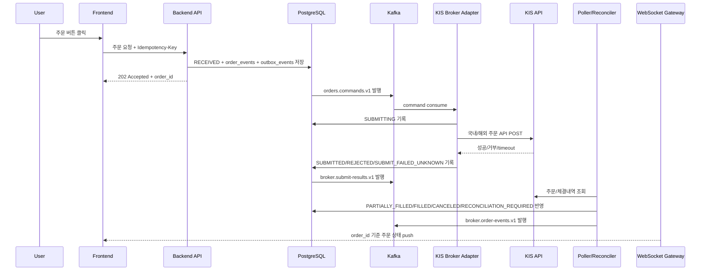

# 주문 경로 보안/신뢰성 마일스톤

작성일: 2026-06-25 KST

이 문서는 `docs/gops-integrated-spec.md`의 통합 기준을 바탕으로 주문 신뢰성/보안 담당자가 구현하고 검증할 일을 단계별로 정리한다. 목표는 MVP에서 KIS 모의투자 주문을 안전하게 수행하고, 실전 주문 전환 전에 중복 주문 방지, timeout 대사, 권한/한도, kill switch, 운영 알림을 검증하는 것이다.

관련 문서:

- [GOPS 통합 명세](./gops-integrated-spec.md)
- [주문 신뢰성/보안 상세 스펙](./spec.md)
- [주문 신뢰성/보안 아키텍처](./architecture.md)

## 1. 실행 기준

- 주문 문서는 통합 스펙의 상태, topic, MVP 범위, 보안 원칙을 따른다.
- MVP 주문 목표는 KIS 모의투자 주문까지다.
- 실전 주문은 kill switch, 한도, circuit breaker, 운영 알림, 장애 복구 리허설 이후 별도 전환한다.
- Kafka/DB 예시는 `account_alias`, `request_id`, `order_id`, `client_order_id`, `event_id` 중심으로 작성한다.
- KIS appkey, appsecret, access token, 계좌번호 원문, raw idempotency key는 예시와 로그에 남기지 않는다.
- Frontend는 `FILLED` 확정 전까지 `체결 완료`를 표시하지 않는다.

## 2. End-to-End 목표 흐름

## M0. 통합 기준 반영과 문서 계약 고정

### 목표

팀 통합 스펙과 주문 담당 문서의 기준을 맞추고, 이후 구현이 흔들리지 않도록 상태, topic, 책임 경계를 고정한다.

### 산출물

- 주문 상태는 `RECEIVED`, `PUBLISHED`, `REJECTED`, `RISK_REJECTED`, `SUBMITTING`, `SUBMITTED`, `SUBMIT_FAILED_UNKNOWN`, `PARTIALLY_FILLED`, `FILLED`, `CANCELED`, `RECONCILIATION_REQUIRED`, `FAILED`로 고정한다.
- 주문 topic은 `orders.commands.v1`, `broker.submit-results.v1`, `broker.order-events.v1`, `orders.dlq.v1`로 고정한다.
- Backend API, KIS Broker Adapter, Poller/Reconciler, WebSocket Gateway, PostgreSQL, Kafka의 책임을 문서화한다.
- MVP는 KIS 모의투자 주문, 실전 주문은 후속 전환이라는 범위를 명확히 둔다.

### 완료 기준

- 삭제된 별도 마일스톤 문서 링크가 남아 있지 않다.
- 주문 문서에 폐기된 이전 상태명이나 별도 확정 topic이 남아 있지 않다.
- 통합 스펙과 충돌하는 주문 상태, topic, WebSocket 기준이 없다.

## M1. Backend 주문 접수와 Idempotency

### 목표

사용자가 주문 버튼을 여러 번 누르거나 네트워크 재시도를 하더라도 같은 주문 의도가 여러 주문으로 접수되지 않게 한다.

### 구현 범위

- Frontend 주문 요청은 `Idempotency-Key`를 포함한다.
- Backend는 raw key를 저장하지 않고 `idempotency_key_hash`를 만든다.
- Backend는 `request_id`, `order_id`, `client_order_id`, `account_alias`, request body hash를 생성/저장한다.
- 같은 key와 같은 body는 기존 `order_id`와 상태를 반환한다.
- 같은 key와 다른 body는 `409 Conflict`로 거부한다.
- Backend는 `orders`, `order_events`, `outbox_events`를 같은 transaction으로 저장한다.
- API 응답은 `202 Accepted`, `order_id`, 현재 상태, 상태 구독 정보를 포함한다.

### 완료 기준

- 중복 클릭 100회가 같은 `order_id`로 수렴한다.
- raw idempotency key, 계좌번호 원문, token이 로그와 Kafka payload에 없다.
- Backend는 KIS 주문 API를 직접 호출하지 않는다.

### 장애 테스트

- DB 저장 전 Backend 종료.
- DB 저장 후 응답 전 Backend 종료.
- 같은 idempotency key 재요청.
- 같은 key와 다른 body 요청.

## M2. Backend Outbox와 Kafka Command 발행

### 목표

Backend가 주문 접수 DB commit과 Kafka command 발행 사이에서 죽어도 주문 command가 유실되지 않게 한다.

### 구현 범위

- `outbox_events`에 `orders.commands.v1` 발행 대상을 저장한다.
- Outbox Publisher는 미발행 row를 읽어 Kafka에 발행한다.
- Kafka key는 `account_alias:symbol`로 둔다.
- 발행 성공 후 `published_at`을 기록하고 주문 상태를 `PUBLISHED`로 반영한다.
- producer 설정은 `acks=all`, idempotent producer, 명시적 timeout을 기준으로 둔다.

### 완료 기준

- DB commit 후 publisher가 죽어도 미발행 이벤트가 남는다.
- 재시작 후 같은 command가 중복 발행되더라도 downstream에서 멱등 처리된다.
- Kafka command에는 secret, token, 계좌번호 원문, raw idempotency key가 없다.

### 장애 테스트

- Outbox Publisher 종료 후 재시작.
- Kafka produce timeout.
- Kafka broker 일부 장애.
- schema version 불일치.

## M3. KIS Broker Adapter 제출 안전성

### 목표

실제 KIS 주문 POST를 Adapter로 격리하고, 외부 API 불확실성을 내부 상태로 안전하게 흡수한다.

### 구현 범위

- `orders.commands.v1` consumer group은 `kis-broker-adapter`로 둔다.
- `enable.auto.commit=false`를 사용한다.
- Adapter는 `request_id`, `client_order_id`, `event_id` 중복 처리 여부를 DB에서 확인한다.
- Adapter는 KIS POST 전 Trading/Risk decision과 kill switch 상태를 확인한다.
- 국내/해외 KIS endpoint와 payload 변환은 adapter 내부에서 분리한다.
- KIS 응답 원문은 redaction 후 `broker_submissions`에 저장한다.
- token expired는 token refresh 후 최대 1회만 재시도한다.
- timeout, connection reset, 불명확한 5xx는 `SUBMIT_FAILED_UNKNOWN`으로 저장하고 즉시 재POST하지 않는다.

### 완료 기준

- 같은 command 재처리 시 이미 제출된 주문이면 KIS POST를 반복하지 않는다.
- KIS 명시적 거부는 `REJECTED`로 확정된다.
- risk 검증 실패는 `RISK_REJECTED`로 기록된다.
- Adapter만 KIS secret에 접근한다.

### 장애 테스트

- Adapter가 KIS POST 전 종료.
- Adapter가 KIS POST 후 DB 기록 전 종료.
- DB commit 후 Kafka offset commit 전 종료.
- KIS HTTP 429, 5xx, timeout, connection reset.

## M4. 제출 결과 원장과 결과 이벤트

### 목표

KIS 제출 결과와 후속 Kafka 이벤트를 PostgreSQL 원장에 남겨 DB와 Kafka 상태가 갈라져도 복구 가능하게 한다.

### 구현 범위

- `orders`: 최신 주문 상태 projection.
- `order_events`: append-only 상태 전이 원장.
- `broker_submissions`: KIS 제출 시도, HTTP status, redacted response.
- `outbox_events`: `broker.submit-results.v1` 발행 대상.
- `client_order_id`, `request_id`, `event_id`, `submission_id`에 unique constraint를 둔다.
- Outbox Publisher는 `broker.submit-results.v1` 발행 성공 후 `published_at`을 기록한다.

### 완료 기준

- 상태 변경과 outbox insert가 같은 transaction으로 commit된다.
- publisher가 죽어도 미발행 결과 이벤트가 DB에 남는다.
- 재처리 시 중복 row 또는 중복 KIS 제출이 발생하지 않는다.

### 장애 테스트

- DB commit 전 Adapter 종료.
- DB commit 후 Result Outbox Publisher 종료.
- result event 중복 발행.
- unique constraint 충돌.

## M5. KIS 주문/체결내역 Poller와 대사

### 목표

KIS 주문 제출 응답만 믿지 않고 KIS 주문/체결내역 조회로 최종 상태를 확인한다. 특히 `SUBMIT_FAILED_UNKNOWN`을 안전하게 해소한다.

### 구현 범위

- KIS 주문/체결내역 조회를 주기적으로 실행한다.
- 조회 결과를 `broker.order-events.v1`로 발행한다.
- 내부 `orders`, `broker_submissions`, KIS 조회 결과를 비교한다.
- 일부 체결은 `PARTIALLY_FILLED`, 전량 체결은 `FILLED`, 취소는 `CANCELED`로 반영한다.
- 내부 상태와 KIS 상태가 다르면 `RECONCILIATION_REQUIRED`와 운영 알림으로 올린다.
- 같은 KIS 결과가 반복 조회되어도 중복 체결 이벤트를 만들지 않는다.

### 완료 기준

- timeout 주문이 KIS 조회에서 발견되면 내부 상태가 보정된다.
- KIS에는 있는데 내부에 없는 주문은 운영 알림 대상이 된다.
- 내부에는 있는데 KIS에 없는 주문은 재조회 후에도 없을 때 수동 확인 상태로 남긴다.
- 대사 결과는 `order_id` 기준 WebSocket 상태 push로 이어진다.

### 장애 테스트

- Poller 종료 후 재시작.
- KIS 조회 API 지연 또는 실패.
- 부분 체결 후 전량 체결 이벤트 순차 반영.
- 내부 수량/가격과 KIS 조회 수량/가격 불일치.

## M6. Frontend 상태 반영과 사용자 안전 문구

### 목표

사용자가 주문 접수, 제출, 확인 중, 일부 체결, 체결 완료를 혼동하지 않게 상태를 표시한다.

### 구현 범위

- Frontend는 `order_id` 기준 WebSocket 상태 구독을 시작한다.
- 새로고침 후에도 Backend 조회 API로 최신 상태를 다시 가져온다.
- `SUBMIT_FAILED_UNKNOWN`과 `RECONCILIATION_REQUIRED`는 실패가 아니라 `주문 확인 중` 계열로 표시한다.
- `SUBMITTED`는 `주문 제출됨`으로 표시하고 `체결 완료`로 표시하지 않는다.
- 체결 수량, 평균 체결가, 잔량은 KIS 주문/체결내역 대사 결과 이후 갱신한다.

### 완료 기준

- 사용자는 `주문 접수됨 -> 제출 중 -> 주문 제출됨/거부됨/확인 중 -> 일부 체결/체결 완료` 흐름을 볼 수 있다.
- WebSocket 끊김 후 재연결해도 `order_id` 최신 상태가 보인다.
- frontend 로그와 analytics에 secret, token, 계좌번호 원문, raw idempotency key가 없다.

### 장애 테스트

- WebSocket 연결 끊김 후 재연결.
- Backend read API 재시작.
- read model 지연으로 stale 상태가 표시되는 경우.

## M7. 운영 관측성, 감사, 알림

### 목표

주문 하나를 frontend 요청부터 KIS 대사 결과까지 추적하고, 위험 상태가 운영 알림으로 이어지게 한다.

### 구현 범위

- 모든 로그에 `request_id`, `event_id`, `order_id`, `client_order_id`, `account_alias`, `symbol`을 포함한다.
- KIS secret, token, 계좌번호 원문은 redaction한다.
- metric: API latency, idempotency conflict count, Kafka publish latency, consumer lag, KIS timeout count, KIS reject count, DLQ count, outbox unpublished count, reconciliation mismatch count.
- alert: `SUBMIT_FAILED_UNKNOWN` 장기 지속, `RECONCILIATION_REQUIRED`, DLQ 급증, KIS timeout 급증, outbox 미발행 누적, circuit breaker open.
- audit log: 주문 생성, 거부, 제출, 체결, 취소, 수동 대사, DLQ 재처리, kill switch 변경.

### 완료 기준

- 주문 하나를 `request_id` 또는 `order_id`로 처음 요청부터 대사 결과까지 따라갈 수 있다.
- 대사 불일치가 1건 이상이면 운영 알림이 간다.
- 보안 감사 로그에는 민감정보가 없다.

### 장애 테스트

- 장기 `SUBMIT_FAILED_UNKNOWN` 누적.
- DLQ 급증.
- outbox unpublished event 누적.
- redaction 누락 테스트.

## M8. 실전 주문 전환 가드레일

### 목표

실전 주문에서 장애나 오동작이 감지되면 빠르게 주문 제출을 중단하고 피해 범위를 제한한다.

### 구현 범위

- 전체 실전 주문 kill switch.
- 계좌별, 사용자별, 종목별 kill switch.
- 일별 주문 금액 한도, 종목별 수량 한도, 분당 주문 횟수 한도.
- 반복 timeout, 반복 거부, 대사 불일치 발생 시 account 단위 circuit breaker.
- 실전 주문은 `trader` role만으로 허용하지 않고 trading permission, kill switch, rate limit을 모두 통과해야 한다.
- DLQ 재처리는 운영 권한으로 분리하고 주문 직접 생성 권한과 분리한다.

### 완료 기준

- kill switch 활성화 시 Adapter가 KIS POST를 수행하지 않는다.
- 한도 초과 주문은 `RISK_REJECTED` 또는 `REJECTED`로 기록되고 사유가 남는다.
- 운영자 action은 audit log로 남는다.
- 실전 주문 전환 체크리스트가 모의투자 smoke 결과와 함께 남는다.

### 장애 테스트

- 주문 제출 직전 kill switch on.
- 특정 계좌 circuit breaker on.
- 분당 주문 횟수 초과.
- DLQ 재처리 권한 없는 사용자 접근.

## M9. 서버 장애와 재시작 통합 테스트

### 목표

Frontend server, Backend API, Kafka, KIS Adapter, Poller/Reconciler, Outbox Publisher, PostgreSQL 중 일부가 죽어도 주문 상태가 유실되지 않고 최종적으로 수렴하는지 검증한다.

### 통합 시나리오

| 장애 지점 | 기대 결과 |
| --- | --- |
| Frontend server down | 이미 접수된 주문은 backend/Kafka 경로에서 계속 처리된다. |
| Backend DB 저장 전 down | 주문 접수 실패로 사용자 재시도 가능. |
| Backend DB 저장 후 응답 전 down | 같은 idempotency key 재요청 시 기존 `order_id`를 반환한다. |
| Backend Outbox Publisher down | `outbox_events`에 command가 남아 재발행 가능하다. |
| Kafka 일시 장애 | 접수 실패 또는 producer retry 후 명확한 상태를 반환한다. |
| Adapter KIS POST 전 down | offset 미커밋으로 재처리된다. |
| Adapter KIS POST 후 timeout | `SUBMIT_FAILED_UNKNOWN`, 즉시 재POST 금지, 대사 진행. |
| Adapter DB commit 후 offset commit 전 down | 재처리되지만 unique key로 중복 저장과 중복 제출을 막는다. |
| Result Outbox Publisher down | `outbox_events`에 미발행 결과 이벤트가 남아 재발행된다. |
| Poller down | 다음 실행에서 KIS 주문/체결내역 조회를 재개한다. |
| WebSocket Gateway down | 재연결 후 최신 상태를 다시 받는다. |
| DB failover | transaction 재시도와 unique constraint로 중복을 막는다. |

### 완료 기준

- 중복 클릭, timeout, 서버 재시작, Kafka 재처리 테스트를 통과한다.
- 같은 주문 요청 100회 재처리에도 KIS POST는 1회 이하로 유지된다.
- `SUBMIT_FAILED_UNKNOWN`은 대사로 해소되거나 `RECONCILIATION_REQUIRED`로 운영 알림이 간다.
- 복구 후 사용자 화면과 DB 최신 상태가 일치한다.

## 3. 권장 구현 순서

1. M0 문서 계약과 상태/topic 기준을 확정한다.
2. M1 Backend idempotency와 주문 접수 transaction을 구현한다.
3. M2 Backend outbox와 `orders.commands.v1` 발행을 구현한다.
4. M3 KIS Broker Adapter consumer와 KIS 제출 분류를 구현한다.
5. M4 제출 결과 원장과 `broker.submit-results.v1` outbox를 구현한다.
6. M5 KIS Poller/Reconciler와 `broker.order-events.v1` 발행을 구현한다.
7. M6 WebSocket 주문 상태 push와 안전 문구를 연결한다.
8. M7 관측성, 감사 로그, 운영 알림을 붙인다.
9. M9 서버 장애/재시작 통합 테스트를 자동화한다.
10. M8 실전 주문 전환 가드레일을 모의투자 smoke 결과와 함께 검증한다.

## 4. Definition of Done

- Frontend는 최종 체결 전 `체결 완료`를 표시하지 않는다.
- Backend는 idempotency key와 DB unique constraint로 중복 접수를 막는다.
- Kafka command와 결과 이벤트에는 secret, token, 계좌번호 원문, raw idempotency key가 없다.
- KIS Adapter는 timeout 후 즉시 재POST하지 않는다.
- DB commit 후 offset commit 전 장애가 발생해도 중복 주문 제출이 없다.
- KIS 주문/체결내역 대사로 `SUBMIT_FAILED_UNKNOWN`을 해소할 수 있다.
- Outbox Publisher 장애 후에도 command와 결과 이벤트가 유실되지 않는다.
- `RECONCILIATION_REQUIRED`, DLQ, timeout 급증은 운영 알림으로 이어진다.
- kill switch와 한도 정책이 실전 KIS POST를 실제로 차단한다.
- 주문 내역, 체결 내역, 보유 종목, 주문 가능 금액, 현금/잔고는 확정 상태에 맞게 갱신된다.
