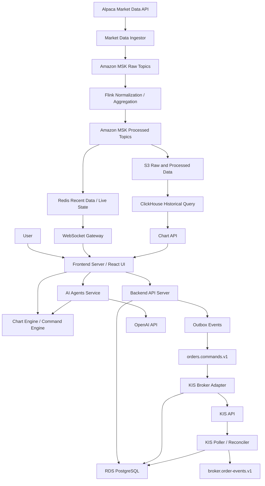

# GOPS 통합 명세 초안

작성일: 2026-06-25 KST

## 1. 문서 목적

이 문서는 `docs` 폴더에 작성된 팀원별 명세를 하나의 제품/기술 기준으로 종합한 초안이다. 공통으로 합의된 내용은 통합 기준으로 정리하고, 서로 다르게 쓰인 부분과 아직 결정되지 않은 부분은 문서 맨 마지막에 별도로 모았다.

대상 문서:

- `docs/GOPS_CHART_SPEC.md`
- `docs/market-data-pipeline-spec.md`
- `docs/order_system_reliability_security_spec.md`
- `docs/security-reliability-milestones.md`
- `docs/devops-architecture-spec.md`

## 2. 통합 제품 범위

GOPS는 실시간 금융 데이터를 수집하고, 차트로 렌더링하며, 사용자가 직접 편집하거나 LLM이 제안한 차트 변경을 전역 auto toggle 정책에 따라 검토 또는 적용할 수 있는 분석/거래 보조 시스템이다. 단, drawing/comparison 제안은 auto toggle과 무관하게 preview-first로 표시하고 사용자가 차트 패널에서 적용해야 editable object가 된다. 주문 기능은 차트 MVP와 분리된 별도 주문 경로로 다루며, 서버 멱등성, Kafka 기반 비동기 처리, KIS API 제출, 체결 대사를 통해 중복 주문과 주문 유실을 방지한다.

현재 프론트엔드 MVP 기준은 desktop Bento Grid workspace다. 모바일 전용 화면, 모바일 viewport 레이아웃, 하단 rail/overlay 전환은 아직 고려하지 않는다.

현재 차트 도구 구현 상태명은 `Chart Tool Runtime V1 core implementation baseline + validation hardening backlog`로 고정한다. 이는 차트 도구 core baseline이 동작한다는 뜻이며 Playwright/browser regression, multi-chart browser scenario, `/ref/references` behavior comparison, real provider 전환 정책은 아직 hardening backlog다.

통합 MVP는 다음 세 흐름으로 나눈다.

| 흐름 | 포함 범위 | 1차 기준 |
| --- | --- | --- |
| 시장 데이터/차트 | Alpaca 실시간/과거 데이터 수집, Kafka/Flink 처리, Redis/ClickHouse/S3 저장, Chart API/WebSocket, Chart Engine 렌더링 | 미국 주식 `1m`, `5m`, `10m` 캔들, 거래량, 이동평균선 |
| LLM 차트 제안 | 현재 차트 context와 market summary를 backend로 보내고, OpenAI API 응답을 검증한 뒤 전역 auto toggle 정책과 preview-first 정책에 따라 proposal 대기, preview 또는 grouped apply 처리 | auto off는 승인 필요, auto on은 즉시 적용 가능 command만 검증 후 적용. drawing/comparison은 항상 preview-first |
| 주문 신뢰성/보안 | 주문 접수, 멱등성, Kafka command, KIS Broker Adapter, append-only 원장, 체결 대사, 운영 가드레일 | MVP에서 KIS 모의투자 주문 가능. 실전 주문은 후속 단계 |

차트 문서에서 제외한 주문, 인증, 배포, 영속 저장소는 차트 엔진의 제외 범위로 해석한다. 전체 GOPS 플랫폼 관점에서는 주문, 인증, 배포, 저장소가 별도 명세의 포함 범위다.

## 3. 통합 아키텍처

## 4. 서비스 책임

| 서비스 | 책임                                                                          | 경계 |
| --- |-----------------------------------------------------------------------------| --- |
| Frontend Server | React UI 제공, 주문/차트 화면 표시, WebSocket 연결 시작                                   | KIS secret, Alpaca secret, OpenAI key를 알면 안 됨 |
| Chart Engine | 정규화된 차트 데이터 렌더링, Chart Document 관리, 사용자 command 적용, LLM proposal과 전역 auto toggle 정책 처리 | Alpaca 원본 포맷과 provider 연결 방식을 알면 안 됨 |
| Backend API Server | 인증, 계좌 접근 확인, 차트 REST API, 주문 접수, idempotency 저장, outbox 생성                 | KIS 주문 API를 직접 호출하지 않음 |
| WebSocket Gateway | 실시간 차트 업데이트와 주문 상태 업데이트 push                                                | 장기 연결 drain과 인증 검증 필요 |
| Market Data Ingestor | Alpaca `bars`, `updatedBars`, `trades` 수집, Raw Kafka/S3 저장                  | 차트 렌더링 로직을 포함하지 않음 |
| Flink | Raw 이벤트 정규화, 임시 캔들 갱신, 확정 캔들 생성, 5m/10m 집계, 이동평균선(MA)                       | 원천 이벤트는 Kafka/S3에 남겨 재처리 가능해야 함 |
| Redis | 최신가, 실시간 임시 캔들, 최근 캔들 캐시                                                    | 주문/체결의 원장 저장소로 사용하지 않음 |
| ClickHouse | 과거 차트 조회와 분석 쿼리                                                             | 원천 저장소가 아니라 S3/MSK에서 재생성 가능한 분석 저장소로 본다 |
| RDS PostgreSQL | 사용자, 주문 최신 상태, append-only 주문 이벤트, outbox, 대사 이력                            | 주문/체결 정합성의 기준 저장소 |
| Trading/Risk Service | 주문 가능 금액, 보유 수량, 시장 시간, 권한, 한도 검증                                           | KIS API 호출과 secret 접근은 Adapter로 격리 |
| KIS Broker Adapter | KIS 주문 API 호출, timeout/거부/성공 결과 기록, broker submission 저장                    | KIS secret 접근을 단일화 |
| Poller/Reconciler | KIS 주문/체결내역 조회, 내부 상태와 KIS 상태 대사                                            | timeout 주문을 실패로 단정하지 않음 |
| AI Agents Service | OpenAI API 호출, insights/proposal 생성                                         | chart document를 직접 변경하지 않음 |

## 5. 시장 데이터와 차트 명세

### 5.1 데이터 공급자

MVP 시장 데이터 공급자는 Alpaca Market Data API로 둔다. 실시간 미국 주식 데이터는 SIP Feed 기준이며, MVP 구독 채널은 `bars`, `updatedBars`, `trades`다.

Alpaca는 시장 데이터 공급자로만 사용한다. Trading provider 후보로 두지 않으며, 실제 주문/거래는 KIS 등 별도 거래 API를 사용한다.

| 채널/API | 사용 목적 | MVP 포함 |
| --- | --- | --- |
| Historical Bars/Trades REST | 초기 차트와 백필 | 포함 |
| `bars` | 확정 1분봉 | 포함 |
| `updatedBars` | 확정 1분봉 보정 | 포함 |
| `trades` | 현재가, 체결 tick, 진행 중인 임시 캔들 | 포함 |
| `quotes` | 호가창 | 제외 |
| `dailyBars`, `statuses`, `lulds` | 일봉 실시간, 거래 상태, 가격 밴드 | 후순위 |

### 5.2 Kafka Topic 기준

Kafka topic은 5개 canonical 데이터 분류를 기준으로 잡는다.

| 분류 | Topic | 의미 |
| --- | --- | --- |
| 틱 데이터 | `market.ticks.v1` | Alpaca `trades` 기반 현재가/체결 tick |
| 분봉 | `market.candles.live.1m.v1` | `trades` 기반 진행 중인 임시 1분봉 |
| 확정분봉 | `market.candles.closed.v1` | `bars`, `updatedBars` 기반 확정 1m/5m/10m 캔들 |
| 사용자 주문 | `orders.commands.v1` | 사용자 주문/취소/정정 command |
| 사용자 주문에 대한 결과 | `broker.submit-results.v1`, `broker.order-events.v1` | KIS 제출 결과와 체결/상태 대사 결과 |

초기 topic 운영값은 다음 기준으로 둔다.

| Topic | Partition | Retention | Key | Schema versioning |
| --- | ---: | --- | --- | --- |
| `market.ticks.v1` | 12 | 3일 | `symbol` | envelope의 `schema_version` 필수 |
| `market.candles.live.1m.v1` | 12 | 3일 | `symbol` | envelope의 `schema_version` 필수 |
| `market.candles.closed.v1` | 12 | 30일 | `symbol:interval` | envelope의 `schema_version` 필수 |
| `orders.commands.v1` | 12 | 90일 | `account_alias:symbol` | envelope의 `schema_version` 필수 |
| `broker.submit-results.v1` | 12 | 90일 | `account_alias:symbol` | envelope의 `schema_version` 필수 |
| `broker.order-events.v1` | 12 | 90일 | `account_alias:symbol` | envelope의 `schema_version` 필수 |
| `orders.dlq.v1` | 6 | 180일 | 원본 message key | 원본 schema와 error metadata 보존 |

Kafka envelope에는 최소한 `schema_version`, `event_type`, `event_id`, `occurred_at`, `producer`, `env`, `source`, `payload`를 포함한다. 주문 관련 topic은 `request_id`, `order_id`, `client_order_id`, `account_alias`를 추가로 포함한다. Raw topic은 장애 재처리와 디버깅을 위해 내부 보존용으로 둘 수 있지만, 서비스 간 공식 계약은 위 canonical topic을 우선한다.

### 5.3 캔들 처리 기준

- `trades`는 현재 진행 중인 1분봉을 갱신한다.
- `bars`가 도착하면 같은 timestamp의 임시 캔들을 확정 캔들로 교체한다.
- `updatedBars`는 같은 `symbol + interval + timestamp`의 기존 확정 캔들을 보정한다.
- 5분봉과 10분봉은 확정된 1분봉만 기준으로 집계한다.
- 임시 캔들은 화면의 실시간 움직임에만 사용하고, 확정 5분/10분 집계의 기준으로 쓰지 않는다.

### 5.4 저장소 기준

시장 데이터 저장은 MVP 범위에 포함한다.

| 저장소 | 저장 대상 | 기준 |
| --- | --- | --- |
| Redis | 현재가, 임시 캔들, 최신 확정 캔들, 최근 캔들 시리즈 | 최신값은 String JSON, 최근 캔들은 Sorted Set 기준 |
| S3 | Raw JSON Lines, Processed Parquet, Flink checkpoint, 백업, 로그 | 원천 데이터와 재처리 기준 |
| ClickHouse | 과거 캔들 조회와 분석 쿼리 | S3/MSK에서 재생성 가능해야 함 |

### 5.5 프론트엔드 전달 형식

초기 차트는 REST API로 조회하고, 실시간 변경은 WebSocket 메시지로 받는다.

| 이벤트 | 의미 |
| --- | --- |
| `LIVE_CANDLE_UPDATE` | 진행 중인 1분봉 갱신 |
| `CANDLE_CLOSED` | 확정 캔들 추가 또는 교체 |
| `CANDLE_CORRECTED` | 기존 확정 캔들 보정 |
| `TRADE_TICK` | 현재가/체결 tick |

Chart Engine은 위 메시지를 정규화된 snapshot/live update contract로 받아 `ChartDocument`에 command 또는 data update로 반영한다. pan/zoom 같은 viewport 조작은 market subscription 또는 data state를 바꾸지 않는다.

### 5.6 Chart Document와 Command Engine

차트 상태 변경의 단일 진입점은 Command Engine이다.

- `WorkspaceDocument`는 패널, 차트, LLM proposal, command journal을 관리한다.
- `ChartDocument`는 symbol, timeframe, viewport, pane, scale, layer, calculation graph를 관리한다.
- React component는 document를 직접 수정하지 않는다.
- 사용자 편집은 `actor: "user"` command로 실행한다.
- LLM 응답은 document를 직접 바꾸지 않고 proposal 또는 검증된 grouped command로 처리한다.
- 전역 auto toggle이 꺼져 있으면 LLM command를 proposal로 저장하고 사용자 승인 후 적용한다.
- 전역 auto toggle이 켜져 있으면 검증된 proposal의 child command를 grouped action으로 atomic 적용한다.
- 하나라도 실패하면 전체 proposal 적용을 취소한다.
- chart capability manifest는 LLM에 노출 가능한 chart command와 tool의 목적, payload schema, 요구 market context, preview 가능 여부, auto 적용 가능 여부, undo scope, 충돌/권장 조합 정보를 함께 제공한다.
- LLM은 명시적 사용자 요청뿐 아니라 market summary와 visible chart context를 바탕으로 여러 chart command를 조합할 수 있지만, 조합은 capability manifest와 command validation을 통과해야 하며 rationale을 포함해야 한다.
- shared canonical chart command schema는 runtime이 이해하는 전체 command set이고, backend OpenAI generation schema는 LLM이 직접 생성할 수 있는 안전 subset이다.
- 현재 scaffold에서는 Agent 01만 chart command chat/proposal 권한을 가진다. Agent 02~04와 multi-agent orchestration은 후속 권한 모델이 정해질 때까지 chart command 입력을 비활성으로 둔다.

### 5.7 차트 렌더링과 계산

렌더러는 `ChartDocument`, market data, calculation output에서 파생된 render scene만 사용한다. Canvas 2D 렌더링을 1차 기준으로 하며, WebGL은 MVP 제외다.

지표 계산은 Flink/Backend가 계산해 내려주는 방향을 기본으로 한다. Chart Engine은 계산 결과를 받아 렌더링하고, 이후 클라이언트에서 계산할 영역과 서버에서 계산할 영역을 추가로 나눈다.

Chart Engine은 지표의 authoritative calculation을 담당하지 않는다. SMA/EMA/RSI/MACD/Bollinger Bands/VWAP/ATR/Volume MA 같은 공식 지표 값은 Flink/Backend가 계산해 내려주고, Chart Engine은 렌더링과 UI 보조 계산만 수행한다. 클라이언트 보조 계산 범위는 crosshair 값 표시, viewport 기준 min/max, comparison percent label, 화면 좌표 변환, proposal preview layer 표시로 제한한다.

MVP 구현 포함 지표:

- SMA
- EMA
- RSI
- MACD
- Bollinger Bands
- VWAP
- ATR
- Volume MA

comparison percent label은 일반적인 차트 기준을 따른다. 즉, 비교 구간의 기준값 대비 변화율을 표시하고, 사용자가 어떤 기준으로 계산된 값인지 알 수 있게 UI에 드러낸다.

### 5.8 LLM 제안 모드

LLM 제안 적용 정책은 top app bar의 전역 auto toggle을 기준으로 한다.

| Mode | 동작 |
| --- | --- |
| auto off | LLM 차트 제안을 pending proposal로 보여주고 사용자가 승인해야 적용한다. |
| auto on | 검증된 LLM 차트 제안 중 즉시 적용 가능한 command를 grouped command로 적용한다. |

drawing/comparison 제안은 예외적으로 auto toggle과 무관하게 preview-first로 표시한다. preview는 차트 문서를 변경하지 않으며, 사용자가 chart panel에서 apply preview를 누를 때만 editable drawing/comparison object로 적용된다. hidden preview는 pending 상태로 남지만 apply할 수 없고, 다시 표시한 뒤 적용한다.

chart panel의 `layoutPinned`는 위치와 크기를 고정하는 레이아웃 정책이며, chart 내부 symbol, timeframe, viewport, layer 변경 정책이 아니다.

차트 패널 내부에는 chart state 전용 undo/redo를 둔다. LLM proposal 하나는 chart history에서 하나의 undo/redo 단위로 기록한다. top app bar undo/redo는 layout history 전용으로 유지한다.

전역 auto toggle은 layout/chart 분석 UI command에만 적용한다. 주문 생성, 주문 취소, 주문 정정, 계좌/잔고/체결 변경 같은 거래 command에는 적용하지 않는다.

### 5.9 MVP 제외 범위

뉴스, 온톨로지, GraphRAG, OpenAI 사용량/비용 최적화, LLM structured response schema 고도화, Ontotext GraphDB 세부 운영 스펙은 MVP에서 제외한다. DevOps 문서에 있는 Alpaca News, Ontology Service, GraphDB, AI Agents 확장 구조는 후속 단계에서 다룬다.

## 6. 주문 시스템 명세

### 6.1 핵심 원칙

- 주문 중복 방지는 프론트엔드 버튼 비활성화가 아니라 서버에서 보장한다.
- 모든 주문 요청은 `Idempotency-Key`를 포함한다.
- 같은 `Idempotency-Key`와 같은 주문 body는 기존 주문 결과를 반환한다.
- 같은 `Idempotency-Key`와 다른 주문 body는 `409 Conflict`로 거부한다.
- API 응답은 최종 체결 결과가 아니라 주문 접수 상태를 반환한다.
- KIS timeout과 connection reset은 실패 확정이 아니므로 즉시 재POST하지 않는다.
- Kafka는 at-least-once 처리를 전제로 하고, DB unique constraint와 append-only 이벤트로 멱등성을 보장한다.

### 6.2 식별자 기준

| 식별자 | 의미 | 노출 기준 |
| --- | --- | --- |
| `Idempotency-Key` | 클라이언트가 같은 주문 의도를 재시도할 때 사용하는 원문 key | raw 값은 로그/Kafka에 남기지 않음 |
| `idempotency_key_hash` | 서버가 저장하는 hash 값 | DB 저장 가능 |
| `request_id` | API 호출 단위의 로그/trace ID | 로그와 trace에 포함 |
| `order_id` | 사용자와 시스템이 조회하는 주문 ID | API 응답에 포함 |
| `client_order_id` | client/broker 호환용 주문 의도 ID | broker 제출과 중복 제출 방지에 사용 |
| `event_id` | Kafka 이벤트 단위의 고유 ID | unique constraint 적용 |
| `account_alias` | 계좌번호 원문 대신 쓰는 안전한 계좌 식별자 | Kafka/log/API에 사용 |

`idempotency_key_hash`는 backend 내부 재시도 방지 키로 분리한다. `order_id`, `request_id`, `client_order_id`, `idempotency_key_hash`는 같은 값으로 합치지 않는다.

### 6.3 주문 상태 기준

| 상태 | 의미 | 사용자 표시 |
| --- | --- | --- |
| `RECEIVED` | API가 주문 요청을 접수함 | 주문 접수됨 |
| `PUBLISHED` | 주문 command가 Kafka에 발행됨 | 주문 접수됨 또는 처리 중 |
| `REJECTED` | 기본 검증 또는 KIS 명시적 거부 | 주문 거부됨 |
| `RISK_REJECTED` | 주문 가능 금액, 수량, 권한 등 risk 검증 실패 | 주문 거부됨 |
| `SUBMITTING` | KIS Broker Adapter가 KIS API 호출 중 | 제출 중 |
| `SUBMITTED` | KIS 주문 API가 정상 응답함 | 주문 제출됨 |
| `SUBMIT_FAILED_UNKNOWN` | KIS timeout/connection reset으로 접수 여부 불명 | 주문 확인 중 |
| `PARTIALLY_FILLED` | 일부 체결됨 | 일부 체결 |
| `FILLED` | 전량 체결됨 | 체결 완료 |
| `CANCELED` | 주문 취소됨 | 취소됨 |
| `RECONCILIATION_REQUIRED` | 내부 상태와 KIS 상태가 불일치하여 확인 필요 | 확인 중 또는 확인 필요 |
| `FAILED` | 재시도 불가능한 명확한 실패 | 실패 |

`SUBMITTED`는 체결 완료가 아니다. 프론트엔드는 `FILLED` 확정 전까지 `체결 완료`를 표시하지 않는다.

### 6.4 주문 처리 흐름

1. Frontend가 주문 요청과 `Idempotency-Key`를 Backend API로 보낸다.
2. Backend API가 인증, 계좌 접근, 기본 request shape, idempotency 수준을 선검증한다.
3. Backend API가 `orders`, `order_events`, `outbox_events`를 같은 DB transaction으로 저장한다.
4. Outbox Publisher가 `orders.commands.v1`을 발행한다.
5. KIS Broker Adapter가 command를 consume하고 `SUBMITTING`을 기록한다.
6. Trading/Risk 단계가 금액, 수량, 시장 시간, 권한, 한도에 대한 authoritative decision을 내린다.
7. KIS Broker Adapter가 KIS POST 직전 kill switch와 승인 상태를 최종 재확인한다.
8. KIS 정상 응답은 `SUBMITTED`, 명시적 거부는 `REJECTED`, timeout은 `SUBMIT_FAILED_UNKNOWN`으로 저장한다.
9. Poller/Reconciler가 KIS 주문/체결내역을 조회하여 `PARTIALLY_FILLED`, `FILLED`, `CANCELED`, `RECONCILIATION_REQUIRED`로 수렴시킨다.
10. Frontend는 `order_id` 기준 상태 변경을 WebSocket으로 수신한다.

### 6.5 주문 Kafka Topic 기준

| Topic | Producer | Consumer | 의미 |
| --- | --- | --- | --- |
| `orders.commands.v1` | Backend Outbox Publisher | KIS Broker Adapter | 주문/취소/정정 command |
| `broker.submit-results.v1` | KIS Broker Adapter Outbox | API/Audit/WebSocket | KIS 제출 결과 |
| `broker.order-events.v1` | Poller/Reconciler | API/Audit/WebSocket | KIS 체결/상태 조회 결과 |
| `orders.dlq.v1` | Adapter/Flink/API 등 | 운영자 재처리 도구 | schema 오류, 권한 불일치, 알 수 없는 응답 |

메시지 key는 같은 계좌/종목의 순서를 보장하기 위해 `account_alias:symbol`로 둔다.

### 6.6 PostgreSQL 테이블 기준

| 테이블 | 역할 |
| --- | --- |
| `orders` | 주문 최신 상태 projection |
| `order_events` | append-only 상태 변경 원장 |
| `broker_submissions` | KIS 주문 API 제출 시도와 redacted 응답 |
| `executions` | 체결 결과 |
| `outbox_events` | Kafka 발행 대상 이벤트 |
| `dlq_events` | 실패 메시지와 운영자 재처리 대상 |
| `reconciliation_runs` | 대사 실행 이력 |

필수 제약조건:

- `orders`는 idempotency 기준 중복 접수를 막는 unique constraint를 가진다.
- `order_events.event_id`는 unique다.
- `executions.execution_id`는 unique다.
- `outbox_events.event_id`는 unique다.
- `broker_submissions`는 KIS 주문 제출 시도 단위의 append-only 기록으로 관리한다.
- 동일 주문의 중복 제출 방지를 위해 `client_order_id`, `request_id`에 unique constraint를 둔다.

KIS retry 정책:

- validation error 또는 명확한 주문 거부는 재시도하지 않는다.
- token expired는 토큰 갱신 후 최대 1회만 재시도한다.
- HTTP 429는 주문이 접수되지 않았다고 확실히 판단되는 경우에만 제한적으로 backoff 재시도한다.
- timeout, connection reset, 불명확한 5xx는 즉시 재POST하지 않고 `SUBMIT_FAILED_UNKNOWN`으로 저장한 뒤 주문체결내역 대사로 확인한다.
- 주문 API와 조회 API의 retry budget을 분리한다.
- rate limit 초과가 반복되면 계좌 또는 Adapter 단위 circuit breaker를 열고 신규 실전 주문 제출을 일시 중지한다.

Alpaca REST Market Data API는 Algo Trader Plus 기준 10,000 calls/min을 최대 기준으로 보고, 내부 안전 제한은 8,000 calls/min 이하로 둔다. REST API 재시도는 최대 5회까지만 수행한다. WebSocket은 무제한 재연결하되 최대 60초 대기 시간을 둔다. `trades` 누락은 완전 복구하지 않고, `bars` 누락은 Historical Bars API로 보완한다. 확정 캔들은 `bars`와 `updatedBars` 기준으로 정합성을 맞춘다.

### 6.7 보안 요구사항

- Kafka payload, API response, frontend, 로그에 KIS appkey, appsecret, access token, 전체 계좌번호, raw idempotency key를 남기지 않는다.
- KIS secret은 KIS Broker Adapter만 접근한다.
- Alpaca/OpenAI/KIS/JWT secret은 AWS Secrets Manager에 저장하고 Kubernetes에는 External Secrets Operator 또는 Secrets Store CSI Driver로 주입한다.
- JWT role은 `user`, `trader`, `admin`으로 둔다.
- `user`는 조회 권한만 가진다.
- `trader`는 조회, 모의투자 주문, 허용된 실전 주문 권한을 가진다.
- `admin`은 운영/관리 권한을 가진다.
- 실전 주문은 `trader` role만으로 허용하지 않고 계좌별/사용자별 trading permission, kill switch, rate limit을 추가로 통과해야 한다.
- 실전 주문 kill switch와 account/user/symbol별 한도를 둔다.

## 7. 인프라와 운영 기준

### 7.1 확정된 방향

| 영역 | 기준 |
| --- | --- |
| Region | AWS 서울 리전 `ap-northeast-2` |
| AZ 전략 | 2AZ active/passive |
| VPC CIDR | `10.20.0.0/16` |
| Frontend | EKS에서 서빙 |
| API 인증 | 자체 JWT |
| PostgreSQL | RDS PostgreSQL |
| Kafka | Amazon MSK |
| Redis | AWS ElastiCache Redis |
| ClickHouse | EC2 self-managed, S3/MSK/RDS에서 재생성 가능한 분석 저장소 |
| GraphDB | EC2 self-managed Ontotext GraphDB + FIBO |
| 데이터 손실 목표 | RPO 0 우선 방향 |
| 이미지 | ECR 사용, `latest` 태그 금지, non-root 실행 |
| CI/CD | MVP에서는 자동 CI/CD 미적용. 수동 빌드/배포 절차로 시작 |

### 7.2 네트워크 기준

- Public subnet에는 ALB와 NAT Gateway를 둔다.
- NAT Gateway는 개발 단계에서 AZ-a에만 배치하고, 시연 전 AZ-b에도 추가한다.
- Private app subnet에는 EKS Node Group을 둔다.
- Private data subnet에는 RDS, Redis, ClickHouse, GraphDB, Amazon MSK를 둔다.
- DB/Kafka/Redis/ClickHouse/GraphDB는 public 접근을 허용하지 않는다.
- S3, ECR, CloudWatch Logs, Secrets Manager, STS는 VPC Endpoint 사용을 우선한다.
- Route 53 host는 `app`, `api`, `ws`를 분리한다. 예시는 `app.gops.<보유도메인>`, `api.gops.<보유도메인>`, `ws.gops.<보유도메인>`이다. ACM 인증서는 Route 53 DNS validation으로 발급한다. 도메인 확보 전까지는 임시 ALB DNS를 사용한다.

### 7.3 EKS와 데이터 저장소 기준

- EKS endpoint는 Public 제한 + Private 활성화로 둔다.
- Node Group instance는 개발 단계 `t3.large`, 시연 전 `m7i.large`로 상향한다.
- ASG는 개발 단계에서 active general `min=1`, `desired=1`, `max=3`, data-processing `0/0/2`, standby `0/0/2`로 둔다.
- 시연 전 standby ASG는 `min=1`, `desired=1`, `max=3`으로 바꾼다.
- Redis는 개발/초기 MVP에서는 단일 노드 또는 작은 replication group으로 시작하고, 운영/시연 전에는 Multi-AZ replication group으로 전환한다.
- Redis TLS/auth는 가능하면 활성화한다. Redis snapshot은 캐시 성격상 필수로 보지 않되, 캐시 장애 영향 범위는 문서화한다.
- ClickHouse는 개발 단계에서 `t3.large`, gp3 100GiB, 일 1회 S3 백업, cold standby로 시작한다.
- ClickHouse는 시연 전 `r7i.large`, gp3 200GiB 이상, warm standby로 상향한다.

### 7.4 배포 기준

- 일반 서비스는 Kubernetes Rolling Update를 기본으로 한다.
- WebSocket Gateway는 Rolling Update에 connection drain을 붙인다.
- Trading/KIS Adapter는 거래 중복과 중단 리스크 때문에 Blue/Green 또는 더 엄격한 배포 전략을 검토한다.
- Flink는 savepoint 기반 upgrade를 사용한다.
- DB migration은 앱 시작 시 자동 실행하지 않는다. 앱 배포와 분리된 승인 단계 또는 migration job으로 실행한다.
- DB schema 변경은 `expand -> deploy -> backfill -> contract` 순서를 따른다.
- 자동 CI/CD pipeline은 MVP에서 적용하지 않는다. 이미지 빌드, ECR push, staging/prod 배포는 수동 runbook으로 시작한다.
- 운영자 DLQ 처리는 안전한 재처리 workflow까지 만든다. 원본 topic, partition, offset, key, error type, error message를 보존하고 운영자 권한으로만 재처리한다.

### 7.5 관측성과 알림

필수 추적 필드:

- `request_id`
- `event_id`
- `order_id`
- `account_alias`
- `symbol`

필수 알림:

- API 5xx 증가
- API p95 latency 증가
- Pod CrashLoopBackOff
- DB connection 부족
- Redis memory 압박 또는 eviction
- Kafka consumer lag 증가
- Flink checkpoint 실패
- 외부 API 실패율 증가
- `SUBMIT_FAILED_UNKNOWN` 장기 지속
- `RECONCILIATION_REQUIRED` 발생
- DLQ 급증
- outbox 미발행 누적
- rate limit 초과 반복
- circuit breaker open

MVP에서는 WAF보다 rate limit을 먼저 적용하고, 이후 WAF를 추가한다. Public API에는 IP 기준 rate limit을 적용하고, 로그인/주문 API에는 사용자 또는 계좌 기준 rate limit을 추가한다.

WebSocket Gateway의 ALB idle timeout은 300초를 기준으로 한다. Rolling update 중 connection drain을 구현하고, sticky session은 가능하면 피한다. scale-out은 Redis pub/sub 또는 shared state로 대응하며, 구현 시간이 부족하면 sticky session을 임시로 사용할 수 있다.

백업/복구 리허설은 검증 대상으로 둔다. 주요 릴리스 전 1회, 시연 1주 전 1회, 이후 월 1회 RDS/ClickHouse/GraphDB 복구 리허설을 수행한다.

## 8. MVP 구현 순서

1. 제품 범위와 용어를 확정한다.
2. AWS 네트워크, EKS, ECR, RDS, MSK, Redis, S3 기본 인프라를 만든다.
3. Alpaca Market Data Ingestor가 `bars`, `updatedBars`, `trades`를 Raw Kafka/S3에 저장한다.
4. Flink가 Raw topic을 처리해 candle/trade processed topic을 만든다.
5. Redis, ClickHouse, Chart API, WebSocket Gateway를 붙여 초기 차트와 실시간 차트를 표시한다.
6. Chart Engine의 Command Engine, document model, Canvas 2D renderer를 구현한다.
7. LLM proposal은 전역 auto toggle 정책에 따라 auto off에서는 승인 대기, auto on에서는 검증 후 grouped apply로 처리한다.
8. 주문 API는 idempotency와 outbox를 먼저 구현한다.
9. KIS Broker Adapter, Poller/Reconciler, 주문 상태 WebSocket 전달을 붙인다.
10. timeout, 중복 클릭, Kafka 재처리, DB commit 후 offset commit 전 장애, kill switch 테스트를 자동화한다.
11. 운영 전 warm standby, ClickHouse 복구, GraphDB 복구, RDS PITR, MSK replay 리허설을 수행한다.

## 9. 완료 기준

- 시장 데이터는 Alpaca 원본에서 정규화된 candle/live update contract로 변환되어 차트에 표시된다.
- Chart Engine은 provider 원본 포맷을 몰라도 동작한다.
- 사용자 차트 편집과 LLM 제안은 모두 Command Engine을 통해 검증된다.
- LLM 제안은 `ChartDocument`를 직접 변경하지 않고 proposal 또는 검증된 grouped command로 처리된다.
- 같은 주문 요청 100회 재시도에도 DB 주문 row와 KIS 제출이 중복되지 않는다.
- KIS timeout 후 즉시 재POST하지 않고 대사로 최종 상태를 확인한다.
- 주문/체결 상태는 append-only 원장과 최신 projection으로 추적된다.
- Kafka 메시지와 로그에 secret, token, 전체 계좌번호, raw idempotency key가 없다.
- 주요 인프라와 운영 절차는 Terraform/Kubernetes manifest/runbook으로 재현 가능하다.

## 마지막 정리: 안 맞은 부분

| 번호 | 상태 | 내용 |
| --- | --- | --- |
| 1 | 해소 | 실시간 전달 방식은 WebSocket으로 통일했다. |
| 2 | 해소 | Kafka topic은 틱 데이터, 분봉, 확정분봉, 사용자 주문, 사용자 주문 결과 기준으로 통일했다. |
| 3 | 해소 | Risk 검증의 authoritative decision은 Trading/Risk 단계에서 수행하고, API는 선검증만 수행한다. |
| 4 | 해소 | JWT role은 `user`, `trader`, `admin`으로 통일했다. |
| 5 | 해소 | Redis/S3/ClickHouse 저장은 시장 데이터 MVP 범위에 포함한다. |
| 6 | 해소 | 뉴스와 GraphRAG는 MVP 제외로 확정했다. |
| 7 | 해소 | 주문 이벤트 topic은 주문 reliability 문서 기준의 `orders.commands.v1`, `broker.submit-results.v1`, `broker.order-events.v1`로 확정했다. |
| 8 | 해소 | `broker_submissions`는 append-only 제출 시도 기록으로 두고 `client_order_id`, `request_id` unique constraint와 KIS 재시도 정책을 확정했다. |
| 9 | 해소 | MVP에서 시장 데이터/차트와 함께 KIS 모의투자 주문까지 가능하도록 확정했다. |
| 10 | 해소 | Chart Engine은 공식 지표 계산을 담당하지 않고 렌더링과 UI 보조 계산만 수행한다. |
| 11 | 해소 | JWT role과 거래 권한 매핑은 `user`, `trader`, `admin` 기준으로 확정했다. |

## 마지막 정리: 확정 안 된 부분

현재 MVP 범위에서 남은 미확정 항목은 없다.
