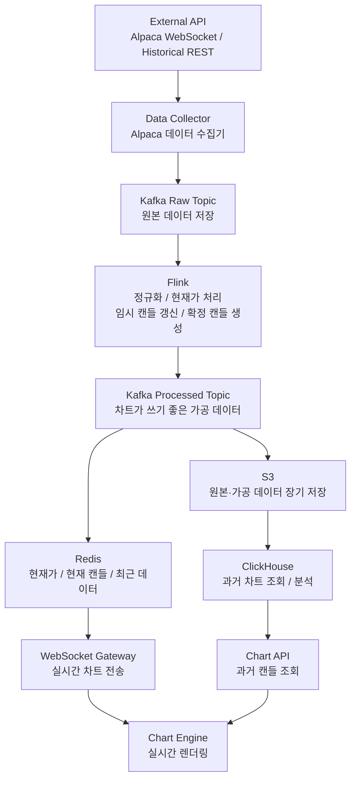
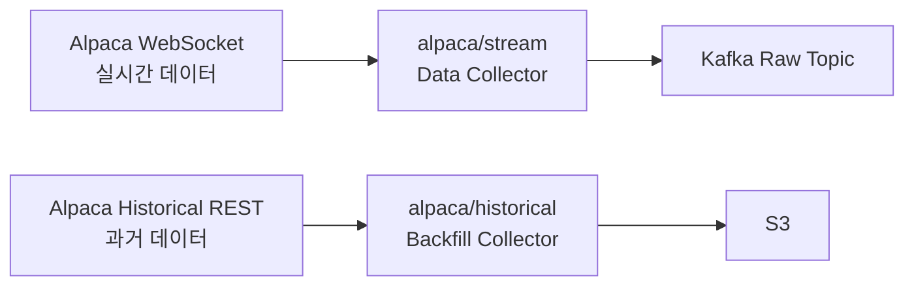
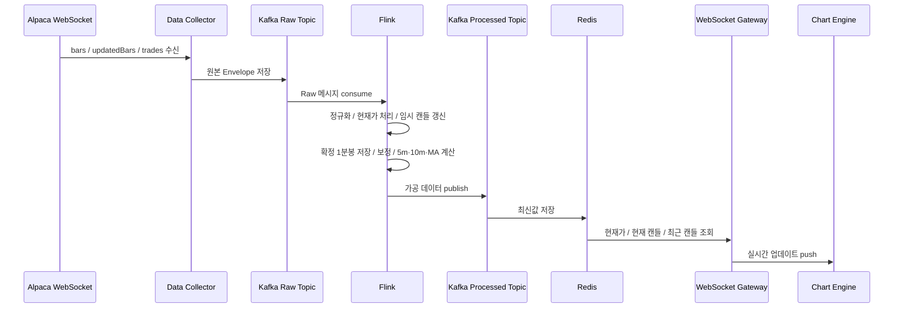
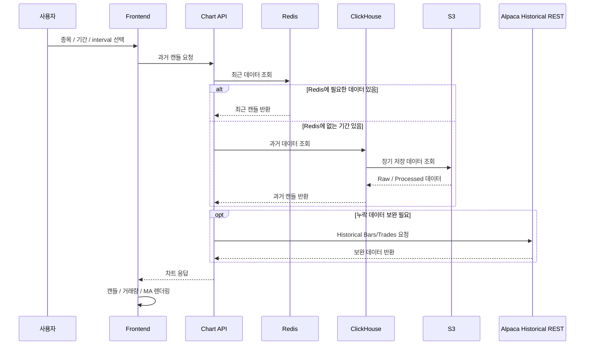
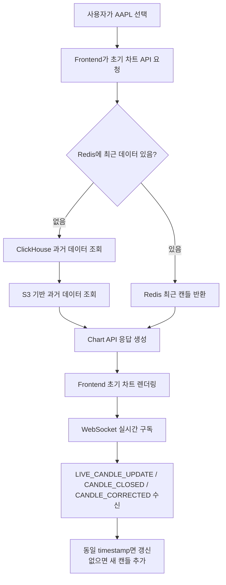

# 실시간 금융 데이터 처리 시스템 명세서

작성일: 2026-06-25  
대상 범위: Alpaca 데이터 수집, Kafka Raw 저장, Flink 처리, Redis/S3/ClickHouse 저장, WebSocket/Chart API 제공

---

## 1. 개요

본 시스템은 Alpaca Market Data API로부터 미국 주식 실시간 데이터를 수집하고, Kafka와 Flink 기반 스트리밍 파이프라인을 통해 차트 렌더링에 필요한 데이터로 가공한다.

MVP에서 제공할 차트 요소는 다음 3가지다.

- 캔들차트
- 거래량
- 이동평균선

Alpaca 유료 Market Data 플랜인 Algo Trader Plus를 사용하고, 실시간 미국 주식 데이터는 SIP Feed 기준으로 수신한다.

호가창은 MVP 범위가 아니므로 `quotes` 채널은 제외한다.

---

## 2. 전체 아키텍처



현재 구현 대상은 다음 두 영역이다.



---

## 3. 목표

- Alpaca SIP Feed에서 실시간 주식 데이터를 안정적으로 수집한다.
- Data Collector는 Alpaca WebSocket에서 `bars`, `updatedBars`, `trades`를 수신한다.
- 수신한 원본 데이터는 Flink 처리 전에 Kafka Raw Topic에 먼저 저장한다.
- Flink는 Kafka Raw Topic을 구독하여 데이터를 내부 표준 형식으로 정규화한다.
- `trades`는 현재가, 체결 흐름, 진행 중인 임시 캔들 갱신에 사용한다.
- `bars`는 Alpaca가 제공하는 확정 1분봉 기준 데이터로 사용한다.
- `updatedBars`는 이미 확정된 1분봉을 보정하는 데 사용한다.
- 5분봉과 10분봉은 확정된 1분봉 `bars` 데이터를 기준으로 생성한다.
- 이동평균선은 각 interval의 `close` 값을 기준으로 계산한다.
- 최신 데이터는 Redis에 저장하여 빠른 조회와 WebSocket 전송에 사용한다.
- 원본 및 가공 데이터는 S3에 저장하여 과거 조회와 재처리에 사용한다.
- 과거 데이터는 ClickHouse를 통해 조회하여 프론트엔드 차트에 제공한다.

---

## 4. 범위

### 포함 범위

- Alpaca SIP Feed 실시간 데이터 수집
- Alpaca Historical Bars/Trades API 기반 과거 데이터 백필
- WebSocket 기반 `bars`, `updatedBars`, `trades` 구독
- Kafka Raw Topic 원본 데이터 저장
- Flink 기반 데이터 정규화
- `trades` 기반 현재가 및 진행 중인 임시 캔들 처리
- `bars` 기반 확정 1분봉 처리
- `updatedBars` 기반 확정 1분봉 보정
- 확정 1분봉 기준 5분봉, 10분봉 생성
- 캔들차트, 거래량, 이동평균선 데이터 생성
- Redis 최신 데이터 저장
- S3 원본 및 가공 데이터 저장
- ClickHouse 기반 과거 데이터 조회
- WebSocket 실시간 데이터 전송
- 프론트엔드 차트 표시용 데이터 제공

### 제외 범위

- 시장 데이터 파이프라인 내부의 주식 매수/매도 주문 기능
- 사용자 포트폴리오 관리
- 투자 추천 기능
- 호가창 구현
- `quotes` 기반 호가 데이터 처리
- `dailyBars` 기반 일봉 실시간 처리
- 거래 정지/재개 상태 표시
- LULD 가격 밴드 표시
- 결제 기능

KIS 모의투자 주문은 시장 데이터 파이프라인이 아니라 별도 주문 시스템 MVP 범위에서 다룬다.

---

## 5. Alpaca 수신 데이터

MVP에서 실시간으로 수신하는 Alpaca 채널은 3개다.

| 목적 | Alpaca 채널/API | 필수 여부 | 사용 방식 |
|---|---|---:|---|
| 초기 과거 캔들 조회 | Historical Bars / Trades REST API | 필수 | 차트 초기 로딩, Redis 이전 구간 S3 저장 |
| 확정 1분봉 수신 | `bars` | 필수 | 1분 종료 후 확정 캔들 기준 데이터 |
| 수정 1분봉 수신 | `updatedBars` | 필수 | 기존 확정 1분봉 보정 |
| 실시간 체결 tick 수신 | `trades` | 필수 | 현재가, 실시간 임시 캔들 갱신 |
| 호가 데이터 수신 | `quotes` | 제외 | MVP 호가창 없음 |
| 일봉 데이터 수신 | `dailyBars` | 제외 | MVP에서는 직접 집계/조회로 처리 |
| 거래 상태 수신 | `statuses` | 제외 | 고도화 단계 |
| LULD 가격 밴드 수신 | `lulds` | 제외 | 고도화 단계 |

MVP WebSocket 구독 요청:

```json
{
  "action": "subscribe",
  "bars": ["AAPL", "TSLA", "NVDA"],
  "updatedBars": ["AAPL", "TSLA", "NVDA"],
  "trades": ["AAPL", "TSLA", "NVDA"]
}
```

WebSocket 주소:

```text
wss://stream.data.alpaca.markets/v2/sip
```

인증 요청:

```json
{
  "action": "auth",
  "key": "{ALPACA_API_KEY}",
  "secret": "{ALPACA_SECRET_KEY}"
}
```

---

## 6. 실시간 데이터 처리 흐름



처리 기준:

1. `trades`는 현재가와 현재 진행 중인 임시 1분봉 갱신에 사용한다.
2. `bars`는 1분 종료 후 들어오는 확정 1분봉으로 저장한다.
3. 동일 timestamp의 `trades` 기반 임시 캔들이 있으면 `bars` 기준 확정 캔들로 교체한다.
4. `updatedBars`는 동일 `symbol + interval + timestamp`의 기존 확정 캔들을 보정한다.
5. 5분봉과 10분봉은 확정된 1분봉을 기준으로 집계한다.
6. 이동평균선은 확정 캔들의 `close` 기준으로 계산한다.

---

## 7. 과거 데이터 처리 흐름



Redis는 최근 데이터 캐시, S3는 Redis 이전 구간의 장기 저장소로 사용한다.

---

## 8. Alpaca 데이터 형식

### 8.1 `bars`

```json
[
  {
    "T": "b",
    "S": "AAPL",
    "o": 195.10,
    "h": 195.40,
    "l": 195.00,
    "c": 195.23,
    "v": 49378,
    "n": 461,
    "vw": 195.22,
    "t": "2026-06-25T10:15:00Z"
  }
]
```

| Alpaca 필드 | 타입 | 설명 | 내부 필드명 |
|---|---|---|---|
| `T` | string | 메시지 타입. `b`는 bar | `eventType` |
| `S` | string | 종목 코드 | `symbol` |
| `o` | number | 시가 | `open` |
| `h` | number | 고가 | `high` |
| `l` | number | 저가 | `low` |
| `c` | number | 종가 | `close` |
| `v` | number | 거래량 | `volume` |
| `n` | number | 거래 횟수 | `tradeCount` |
| `vw` | number | 거래량 가중 평균가 | `vwap` |
| `t` | string | 캔들 기준 시간 | `timestamp` |

### 8.2 `updatedBars`

```json
[
  {
    "T": "u",
    "S": "AAPL",
    "o": 195.10,
    "h": 195.45,
    "l": 195.00,
    "c": 195.30,
    "v": 50120,
    "n": 470,
    "vw": 195.25,
    "t": "2026-06-25T10:15:00Z"
  }
]
```

`updatedBars`가 수신되면 동일 `symbol + interval + timestamp`의 기존 확정 캔들을 덮어쓴다. 해당 1분봉이 5분봉, 10분봉, 이동평균선에 영향을 주면 관련 집계도 재계산한다.

### 8.3 `trades`

```json
[
  {
    "T": "t",
    "i": 96921,
    "S": "AAPL",
    "x": "D",
    "p": 195.23,
    "s": 100,
    "t": "2026-06-25T10:15:20.100Z",
    "c": ["@"],
    "z": "C"
  }
]
```

| Alpaca 필드 | 타입 | 설명 | 내부 필드명 |
|---|---|---|---|
| `T` | string | 메시지 타입. `t`는 trade | `eventType` |
| `i` | number | 체결 ID | `tradeId` |
| `S` | string | 종목 코드 | `symbol` |
| `x` | string | 체결 거래소 코드 | `exchange` |
| `p` | number | 체결 가격 | `price` |
| `s` | number | 체결 수량 | `size` |
| `t` | string | 체결 발생 시간 | `timestamp` |
| `c` | string[] | 체결 조건 | `conditions` |
| `z` | string | Tape 구분 | `tape` |

임시 캔들 갱신 기준:

```text
open   = 해당 1분 구간의 첫 번째 trade price
high   = 해당 1분 구간의 trade price 중 최댓값
low    = 해당 1분 구간의 trade price 중 최솟값
close  = 가장 최근 trade price
volume = 해당 1분 구간의 trade size 합계
```

---

## 9. Kafka Raw Topic

Alpaca WebSocket에서 수신한 데이터는 Flink 처리 전에 Kafka Raw Topic에 저장한다. Raw Topic은 원본 보존, 장애 재처리, 디버깅을 위해 사용한다.

| Alpaca 채널 | Kafka Raw Topic | 설명 |
|---|---|---|
| `bars` | `market.raw.bars` | Alpaca 확정 1분봉 원본 |
| `updatedBars` | `market.raw.updated-bars` | Alpaca 수정 1분봉 원본 |
| `trades` | `market.raw.trades` | Alpaca 체결 tick 원본 |

공통 Envelope:

```json
{
  "source": "alpaca",
  "feed": "sip",
  "channel": "bars",
  "symbol": "AAPL",
  "eventTime": "2026-06-25T10:15:00Z",
  "receivedAt": "2026-06-25T10:16:01.120Z",
  "raw": {}
}
```

| 필드 | 타입 | 설명 |
|---|---|---|
| `source` | string | 데이터 출처. `alpaca` |
| `feed` | string | 데이터 feed. `sip` |
| `channel` | string | Alpaca 채널 |
| `symbol` | string | 종목 코드 |
| `eventTime` | string | Alpaca 데이터 발생 시간 |
| `receivedAt` | string | Data Collector 수신 시간 |
| `raw` | object | Alpaca 원본 메시지 |

---

## 10. Flink 처리 후 Processed Topic

Flink 입력 Topic:

```text
market.raw.bars
market.raw.updated-bars
market.raw.trades
```

Flink 출력 Topic:

| 출력 데이터 | Kafka Processed Topic | 설명 |
|---|---|---|
| 확정 1분봉/5분봉/10분봉 | `market.candles.closed.v1` | `bars` 기반 확정 캔들, `updatedBars` 보정 반영. interval 필드로 `1m`, `5m`, `10m` 구분 |
| 실시간 임시 1분봉 | `market.candles.live.1m.v1` | `trades` 기반 진행 중인 임시 1분봉 |
| 체결 tick / 현재가 | `market.ticks.v1` | `trades` 기반 현재가 및 체결 이벤트 |

이동평균선은 별도 Topic으로 분리하지 않고 각 candle 데이터 안에 포함한다.

확정 1분봉 예시:

```json
{
  "eventType": "CANDLE",
  "symbol": "AAPL",
  "interval": "1m",
  "timestamp": "2026-06-25T10:15:00Z",
  "open": 195.10,
  "high": 195.40,
  "low": 195.00,
  "close": 195.23,
  "volume": 49378,
  "tradeCount": 461,
  "vwap": 195.22,
  "ma": {
    "ma5": 195.12,
    "ma20": 194.87,
    "ma60": 193.91
  },
  "isClosed": true,
  "correctionType": "NONE",
  "source": "alpaca.bars",
  "feed": "sip",
  "createdAt": "2026-06-25T10:16:01.300Z"
}
```

실시간 임시 1분봉 예시:

```json
{
  "eventType": "LIVE_CANDLE",
  "symbol": "AAPL",
  "interval": "1m",
  "timestamp": "2026-06-25T10:15:00Z",
  "open": 195.10,
  "high": 195.42,
  "low": 195.00,
  "close": 195.28,
  "volume": 12000,
  "isClosed": false,
  "source": "alpaca.trades",
  "updatedAt": "2026-06-25T10:15:20.130Z"
}
```

체결 tick 예시:

```json
{
  "eventType": "TRADE",
  "symbol": "AAPL",
  "tradeId": 96921,
  "price": 195.23,
  "size": 100,
  "exchange": "D",
  "conditions": ["@"],
  "tape": "C",
  "timestamp": "2026-06-25T10:15:20.100Z",
  "source": "alpaca",
  "feed": "sip",
  "receivedAt": "2026-06-25T10:15:20.130Z"
}
```

---

## 11. Redis 저장 형식

Redis는 최신 데이터와 실시간 렌더링 데이터를 저장한다.

| 저장 대상 | 설명 |
|---|---|
| 현재가 | symbol별 최신 체결가 |
| 실시간 임시 1분봉 | `trades` 기반 현재 진행 중인 1분봉 |
| 확정 1분봉 | `bars` 기반 최신 확정 1분봉 |
| 확정 5분봉 | Flink 집계 결과 |
| 확정 10분봉 | Flink 집계 결과 |
| 이동평균선 | 각 interval의 최신 MA 값 |
| 최근 캔들 시리즈 | 프론트 초기 렌더링 보조용 최근 구간 |

권장 Key:

```text
price:{symbol}:latest
candle:{symbol}:1m:live
candle:{symbol}:1m:latest
candle:{symbol}:5m:latest
candle:{symbol}:10m:latest
candles:{symbol}:1m
candles:{symbol}:5m
candles:{symbol}:10m
```

TTL 정책:

| 데이터 | TTL |
|---|---|
| 현재가 | 1일 |
| 실시간 임시 캔들 | 1일 |
| 최신 확정 캔들 | 1일 |
| 최근 캔들 시리즈 | 1일~7일 |
| 이동평균선 최신값 | 1일 |

---

## 12. S3 저장 형식

S3는 장기 보관 및 과거 데이터 조회를 위한 저장소로 사용한다.

| 저장 대상 | 설명 |
|---|---|
| Raw bars | Alpaca 원본 확정 1분봉 |
| Raw updatedBars | Alpaca 원본 수정 1분봉 |
| Raw trades | Alpaca 원본 체결 tick |
| Processed candle 1m | 내부 표준 확정 1분봉 |
| Processed candle 5m | 내부 표준 5분봉 |
| Processed candle 10m | 내부 표준 10분봉 |
| Processed trade tick | 내부 표준 체결 이벤트 |

저장 포맷:

| 선택지 | 방식 | 장점 | 단점 | 추천 |
|---|---|---|---|---|
| A | JSON Lines | 구현 쉬움, 디버깅 쉬움 | 용량 큼, 분석 느림 | Raw 로그 저장용 |
| B | Parquet | 압축 좋음, 분석 빠름 | 구현 복잡 | Processed 데이터 추천 |

MVP 권장:

```text
Raw 데이터 = JSON Lines
Processed Candle 데이터 = Parquet
ClickHouse 조회 대상 = Parquet
```

Raw 데이터 경로:

```text
s3://market-data/raw/source=alpaca/channel=bars/symbol=AAPL/year=2026/month=06/day=25/hour=10/data.jsonl
s3://market-data/raw/source=alpaca/channel=updatedBars/symbol=AAPL/year=2026/month=06/day=25/hour=10/data.jsonl
s3://market-data/raw/source=alpaca/channel=trades/symbol=AAPL/year=2026/month=06/day=25/hour=10/data.jsonl
```

Processed 데이터 경로:

```text
s3://market-data/processed/candles/interval=1m/symbol=AAPL/year=2026/month=06/day=25/data.parquet
s3://market-data/processed/candles/interval=5m/symbol=AAPL/year=2026/month=06/day=25/data.parquet
s3://market-data/processed/candles/interval=10m/symbol=AAPL/year=2026/month=06/day=25/data.parquet
s3://market-data/processed/trades/symbol=AAPL/year=2026/month=06/day=25/hour=10/data.parquet
```

---

## 13. 프론트엔드 전달 데이터

렌더링 담당자는 Alpaca 원본 데이터나 Kafka Raw 데이터를 직접 사용하지 않는다. 프론트엔드는 REST API 응답과 WebSocket 메시지만 사용한다.

### 13.1 초기 차트 API

요청:

```text
GET /api/charts/candles?symbol=AAPL&interval=1m&startTime=2026-06-25T00:00:00Z&endTime=2026-06-25T23:59:59Z&ma=5,20,60
```

응답:

```json
{
  "symbol": "AAPL",
  "interval": "1m",
  "source": "clickhouse",
  "feed": "sip",
  "indicators": {
    "ma": [5, 20, 60],
    "volume": true
  },
  "candles": [
    {
      "timestamp": "2026-06-25T10:15:00Z",
      "open": 195.10,
      "high": 195.40,
      "low": 195.00,
      "close": 195.23,
      "volume": 49378,
      "ma5": 195.12,
      "ma20": 194.87,
      "ma60": 193.91,
      "isClosed": true
    }
  ]
}
```

### 13.2 WebSocket 메시지

실시간 임시 캔들:

```json
{
  "type": "LIVE_CANDLE_UPDATE",
  "symbol": "AAPL",
  "interval": "1m",
  "data": {
    "timestamp": "2026-06-25T10:15:00Z",
    "open": 195.10,
    "high": 195.42,
    "low": 195.00,
    "close": 195.28,
    "volume": 12000,
    "isClosed": false
  }
}
```

확정 캔들:

```json
{
  "type": "CANDLE_CLOSED",
  "symbol": "AAPL",
  "interval": "1m",
  "data": {
    "timestamp": "2026-06-25T10:15:00Z",
    "open": 195.10,
    "high": 195.40,
    "low": 195.00,
    "close": 195.23,
    "volume": 49378,
    "ma5": 195.12,
    "ma20": 194.87,
    "ma60": 193.91,
    "isClosed": true
  }
}
```

보정 캔들:

```json
{
  "type": "CANDLE_CORRECTED",
  "symbol": "AAPL",
  "interval": "1m",
  "data": {
    "timestamp": "2026-06-25T10:15:00Z",
    "open": 195.10,
    "high": 195.45,
    "low": 195.00,
    "close": 195.30,
    "volume": 50120,
    "ma5": 195.14,
    "ma20": 194.89,
    "ma60": 193.93,
    "isClosed": true
  }
}
```

현재가/체결:

```json
{
  "type": "TRADE_TICK",
  "symbol": "AAPL",
  "data": {
    "price": 195.23,
    "size": 100,
    "timestamp": "2026-06-25T10:15:20.100Z"
  }
}
```

---

## 14. 캔들 집계 및 이동평균선 기준

5분봉과 10분봉은 확정된 1분봉 `bars` 데이터를 기준으로 생성한다. `trades` 기반 임시 캔들은 실시간 화면 표시용이므로 5분봉/10분봉 확정 계산의 기준으로 사용하지 않는다.

5분봉:

```text
open   = 5개 확정 1분봉 중 첫 번째 open
high   = 5개 확정 1분봉 high 중 최댓값
low    = 5개 확정 1분봉 low 중 최솟값
close  = 5개 확정 1분봉 중 마지막 close
volume = 5개 확정 1분봉 volume 합계
```

10분봉:

```text
open   = 10개 확정 1분봉 중 첫 번째 open
high   = 10개 확정 1분봉 high 중 최댓값
low    = 10개 확정 1분봉 low 중 최솟값
close  = 10개 확정 1분봉 중 마지막 close
volume = 10개 확정 1분봉 volume 합계
```

이동평균선:

```text
MA(N) = 최근 N개 확정 캔들의 close 합계 / N
```

예시:

```text
1분봉 MA5  = 최근 5개 확정 1분봉 close 평균
5분봉 MA5  = 최근 5개 확정 5분봉 close 평균
10분봉 MA5 = 최근 5개 확정 10분봉 close 평균
```

---

## 15. 사용자 시나리오



---

## 16. 선택지와 MVP 결정

### Redis 저장 방식

| 선택지 | 방식 | 장점 | 단점 | 추천 |
|---|---|---|---|---|
| A | String JSON | 구현 쉬움 | 최근 N개 조회 불편 | 최신값 저장용 |
| B | Sorted Set | 최근 N개 캔들 조회 쉬움 | 구현 약간 복잡 | 최근 캔들 시리즈 |
| C | Redis Stream | 이벤트 순차 소비에 좋음 | 운영 복잡 | 고도화 단계 |

MVP 결정:

```text
최신값 = String JSON
최근 캔들 = Sorted Set
실시간 이벤트 = Kafka canonical topic 사용
Redis Stream = MVP 제외, 고도화 단계 검토
```

### 이동평균선 저장 방식

| 선택지 | 방식 | 장점 | 단점 | 추천 |
|---|---|---|---|---|
| A | Candle 데이터 안에 MA 포함 | 프론트 사용 쉬움 | 지표 추가 시 row 변경 | MVP |
| B | Indicator 별도 Topic/테이블 | 확장성 좋음 | 구현 복잡 | 고도화 단계 |

MVP 결정:

```text
ma5, ma20, ma60은 Candle 데이터 안에 포함한다.
```

---

## 17. 최종 정리

MVP 수신 데이터:

```text
1. bars
   - Alpaca 확정 1분봉
   - Kafka Raw Topic: market.raw.bars
   - Flink 처리 후: market.candles.closed.v1

2. updatedBars
   - Alpaca 수정 1분봉
   - Kafka Raw Topic: market.raw.updated-bars
   - Flink 처리 후: market.candles.closed.v1 보정 이벤트 및 관련 5m/10m/MA 재계산

3. trades
   - Alpaca 체결 tick
   - Kafka Raw Topic: market.raw.trades
   - Flink 처리 후: market.candles.live.1m.v1, market.ticks.v1 생성
```

Flink 처리 전 Kafka Raw Topic:

```text
market.raw.bars
market.raw.updated-bars
market.raw.trades
```

Flink 처리 후 기본 출력 데이터:

```text
market.ticks.v1
market.candles.live.1m.v1
market.candles.closed.v1
```

렌더링 담당자가 사용하는 데이터:

```text
초기 차트: REST candles 응답
현재 캔들 움직임: LIVE_CANDLE_UPDATE
확정 캔들: CANDLE_CLOSED
보정 캔들: CANDLE_CORRECTED
현재가/체결: TRADE_TICK
```

MVP 필수 차트 요소:

```text
캔들차트
거래량
이동평균선
```

MVP 제외:

```text
quotes 채널은 구독하지 않는다.
호가창은 구현하지 않는다.
```
