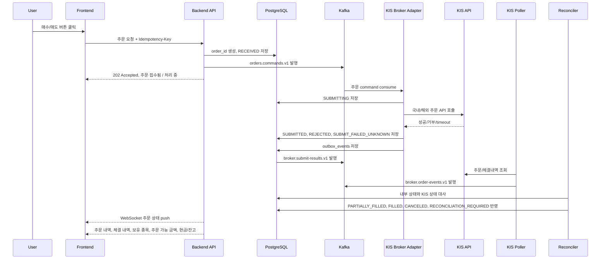

# 주문 경로 보안/신뢰성 마일스톤

작성일: 2026-06-25 KST

이 문서는 사용자가 매수/매도 버튼을 누른 순간부터 frontend, backend, Kafka, KIS Broker Adapter, KIS API, 주문/체결내역 대사, PostgreSQL 저장, frontend 상태 반영까지 이어지는 전체 주문 경로의 보안성과 신뢰성을 단계별로 보장하기 위한 실행 계획이다.

MVP에서는 KIS 모의투자 주문을 실제로 수행할 수 있게 한다. 실전 주문은 후속 단계로 분리하고, 실전 전환 전 kill switch, 한도, circuit breaker, 운영 알림을 다시 검증한다.

관련 문서:

- [기능 스펙](./spec.md)
- [주문처리 아키텍처](./architecture.md)
- [KIS 주문 처리 구체적인 마일스톤](./milestone.md)

## 핵심 원칙

- frontend는 `Idempotency-Key`를 만들되 raw key를 로그나 Kafka 메시지에 남기지 않는다.
- backend는 내부 주문 ID와 `request_id`를 먼저 만들고 DB에 `RECEIVED`를 저장한 뒤 Kafka command를 발행한다.
- backend와 frontend는 KIS secret, access token, 계좌번호 원문을 알지 않는다.
- KIS 주문 POST는 KIS Broker Adapter만 수행한다.
- KIS timeout은 실패 확정이 아니다. `SUBMIT_FAILED_UNKNOWN` 또는 사용자 표시용 `확인 중`으로 둔다.
- timeout 후 같은 주문을 즉시 재POST하지 않는다.
- 중복 방지는 idempotency key, DB unique constraint, Kafka 재처리 멱등성, KIS 주문/체결내역 대사를 함께 사용한다.
- 국내/해외 주문은 공통 파이프라인으로 처리하고 KIS payload 차이는 adapter 책임으로 분리한다.
- 모든 상태 전이는 append-only 이벤트와 최신 projection으로 남긴다.
- 사용자 화면은 체결 확인 전까지 `체결 완료`를 표시하지 않는다.

## End-to-End 주문 흐름

## 사용자 표시 상태

| 내부 상태 | 사용자 표시 | 중요한 보안/신뢰성 기준 |
| --- | --- | --- |
| `RECEIVED` | 주문 접수됨 | 내부 주문 ID와 `request_id`가 생성되어 재조회 가능해야 한다. |
| `SUBMITTING` | 제출 중 | 같은 `request_id` 재처리 시 KIS POST가 중복되면 안 된다. |
| `SUBMITTED` | 주문 제출됨 | 체결 완료가 아니다. KIS 주문 접수 성공만 의미한다. |
| `REJECTED` | 주문 거부됨 | 거부 사유는 민감정보를 제거한 메시지로 표시한다. |
| `SUBMIT_FAILED_UNKNOWN` | 주문 확인 중 | timeout 이후 즉시 재주문하지 않고 KIS 조회로 확인한다. |
| `PARTIALLY_FILLED` | 부분 체결 | 체결 수량, 잔량, 평균 체결가를 계속 갱신한다. |
| `FILLED` | 체결 완료 | KIS 체결내역 또는 대사 결과로 확정된 뒤에만 표시한다. |
| `CANCELED` | 취소됨 | 취소 확인 이벤트와 잔량 반영이 함께 있어야 한다. |
| `RECONCILIATION_REQUIRED` | 확인 중 | 운영 알림을 보내고 사용자에게 실패로 단정하지 않는다. |

## M0. 상태 모델과 책임 경계 확정

### 목표

주문 경로에서 어떤 서비스가 무엇을 책임지는지 먼저 고정한다. 특히 frontend/backend가 KIS 주문 API를 직접 호출하지 않도록 경계를 명확히 한다.

### 범위

- 주문 상태 전이를 `RECEIVED -> PUBLISHED -> SUBMITTING -> SUBMITTED/REJECTED/RISK_REJECTED/SUBMIT_FAILED_UNKNOWN/FAILED -> PARTIALLY_FILLED/FILLED/CANCELED/RECONCILIATION_REQUIRED`로 문서화한다.
- frontend 표시 문구를 내부 상태와 매핑한다.
- KIS secret 접근 권한은 KIS Broker Adapter로 제한한다.
- Kafka 메시지와 DB 예시는 `account_alias`, `request_id`, `event_id` 중심으로 작성한다.

### 완료 기준

- `체결 완료`는 `FILLED` 확정 전에는 표시하지 않는다는 기준이 정해져 있다.
- timeout 상태는 `실패`가 아니라 `확인 중`으로 처리한다.
- backend, adapter, poller, reconciler, outbox publisher의 책임이 분리되어 있다.

## M1. Frontend 주문 요청 안전장치

### 목표

중복 클릭, 새로고침, 네트워크 재시도 상황에서도 같은 주문 의도가 여러 주문으로 제출되지 않게 한다.

### 범위

- 주문 버튼 클릭 시 frontend가 요청마다 `Idempotency-Key`를 생성한다.
- 제출 중인 같은 주문 UI는 중복 클릭을 막거나 같은 idempotency key로 재조회한다.
- frontend 로그와 analytics에는 raw idempotency key, 계좌번호 원문, token을 남기지 않는다.
- 첫 응답 문구는 `주문 접수됨 / 처리 중`으로 제한한다.

### 완료 기준

- 사용자가 버튼을 빠르게 여러 번 눌러도 backend에는 같은 주문 의도로 묶여 들어간다.
- `202 Accepted` 응답을 받으면 주문 상세 화면에서 WebSocket 상태 구독을 시작한다.
- frontend는 `SUBMITTED`를 `FILLED`처럼 표시하지 않는다.

### 장애 테스트

- 모바일 네트워크 끊김 후 같은 요청 재전송.
- 사용자가 중복 클릭 100회 수행.
- frontend 서버 재시작 중 정적 자산 또는 API 라우팅 실패.

## M2. Backend 접수, 검증, DB 기록

### 목표

backend가 주문 의도를 접수한 순간부터 내부 주문 ID와 감사 가능한 기록을 만든다. Kafka 발행 전후 장애가 나도 주문 상태가 모호하게 사라지지 않게 한다.

### 범위

- 인증/인가, 계좌 접근 권한, request shape, idempotency, market, symbol, qty, price 형식을 선검증한다.
- 주문 가능 금액, 보유 수량, 시장 시간, 한도 같은 risk 검증의 authoritative decision은 Trading/Risk 단계에서 수행한다.
- raw idempotency key는 hash로 저장한다.
- `orders`에 `RECEIVED`를 저장하고 `order_events`에 접수 이벤트를 append한다.
- `request_id`, `order_id`, `account_alias`, request body hash에 unique constraint를 둔다.
- Kafka command 발행은 `orders.commands.v1`로 통일한다.

### 완료 기준

- 같은 idempotency key와 같은 body는 같은 주문 접수 결과를 반환한다.
- 같은 idempotency key와 다른 body는 거부한다.
- backend 응답은 `order_id`, 현재 상태, 조회 URL 또는 subscription 정보를 포함한다.
- KIS appkey, appsecret, access token, 계좌번호 원문이 API 응답, 로그, Kafka payload에 없다.

### 장애 테스트

- DB 저장 전 backend kill.
- DB 저장 후 Kafka 발행 전 backend kill.
- Kafka 발행 후 응답 전 backend kill.
- DB transaction deadlock 또는 timeout.

## M3. Kafka Command 발행 신뢰성

### 목표

backend와 KIS Broker Adapter 사이를 durable command log로 분리한다. 주문 요청이 Kafka에 들어간 뒤에는 backend 장애와 무관하게 adapter가 처리할 수 있어야 한다.

### 범위

- topic: `orders.commands.v1`.
- key: `account_alias:symbol`.
- envelope 필드: `schema_version`, `event_type`, `event_id`, `request_id`, `occurred_at`, `producer`, `env`, `account_alias`, `payload`.
- producer 설정은 `acks=all`, idempotent producer, 명시적 delivery timeout을 기준으로 한다.
- schema 불일치 메시지는 `orders.dlq.v1`로 이동한다.

### 완료 기준

- Kafka command에는 secret, token, 계좌번호 원문, raw idempotency key가 없다.
- 같은 계좌/종목 주문은 같은 partition 후보로 묶인다.
- Kafka publish 실패 시 사용자는 접수 실패 또는 재시도 가능한 상태를 받는다.

### 장애 테스트

- Kafka broker 일부 장애.
- produce timeout.
- schema version 불일치.
- consumer rebalance 중 메시지 재전달.

## M4. KIS Broker Adapter 제출 안전성

### 목표

실제 KIS 주문 POST를 단일 서비스에 격리하고, 외부 API 불확실성을 내부 상태로 정확히 흡수한다.

### 범위

- consumer group: `kis-broker-adapter`.
- `enable.auto.commit=false`로 처리 성공 후 offset commit한다.
- message validation 후 DB에 `SUBMITTING`을 기록한다.
- 국내/해외 KIS endpoint와 payload 변환은 adapter 내부에서 분리한다.
- token expired는 token refresh 후 1회만 재시도한다.
- HTTP 429는 주문이 접수되지 않았다고 확실히 판단되는 경우에만 제한적으로 backoff 재시도한다.
- KIS 응답 원문은 redaction 후 `broker_submissions`에 저장한다.
- timeout/connection reset/불명확한 5xx는 `SUBMIT_FAILED_UNKNOWN`으로 저장하고 즉시 재POST하지 않는다.

### 완료 기준

- 같은 `request_id` 재처리 시 이미 제출된 주문이면 KIS POST를 반복하지 않는다.
- KIS 명시적 거부는 `REJECTED`로 확정된다.
- KIS timeout은 `확인 중` 상태로 남고 대사 대상이 된다.
- adapter만 KIS secret에 접근한다.

### 장애 테스트

- adapter가 KIS POST 전 kill.
- adapter가 KIS POST 후 DB 기록 전 kill.
- DB commit 후 Kafka offset commit 전 kill.
- KIS HTTP 429, 5xx, timeout, connection reset.

## M5. PostgreSQL 저장, Outbox, 결과 이벤트

### 목표

KIS 제출 결과와 후속 Kafka 이벤트를 원자적으로 남겨서 DB와 Kafka 상태가 갈라져도 복구 가능하게 한다.

### 범위

- `orders`: 최신 주문 상태 projection.
- `order_events`: append-only 상태 전이 원장.
- `broker_submissions`: KIS 제출 시도, HTTP status, redacted response.
- `outbox_events`: Kafka 결과 이벤트 발행 대상.
- `reconciliation_runs`: KIS 대사 실행 이력.
- `client_order_id`, `request_id`, `event_id`, `submission_id`에 unique constraint를 둔다.

### 완료 기준

- 상태 변경과 outbox insert가 같은 DB transaction으로 commit된다.
- outbox publisher가 `broker.submit-results.v1` 발행 성공 후 `published_at`을 기록한다.
- publisher가 죽어도 미발행 이벤트가 DB에 남아 재발행된다.
- 재처리 시 중복 row 또는 중복 외부 주문 제출이 발생하지 않는다.

### 장애 테스트

- DB commit 전 adapter kill.
- DB commit 후 outbox publisher kill.
- outbox event 중복 발행.
- unique constraint 충돌.

## M6. KIS 주문/체결내역 Poller와 대사

### 목표

KIS 주문 제출 응답만 믿지 않고 KIS 주문/체결내역 조회로 최종 상태를 확인한다. 특히 `SUBMIT_FAILED_UNKNOWN`을 안전하게 해소한다.

### 범위

- KIS 주문/체결내역 조회를 주기적으로 실행한다.
- 조회 결과를 `broker.order-events.v1`로 발행한다.
- 내부 `orders`, `broker_submissions`, KIS 조회 결과를 비교한다.
- 일부 체결은 `PARTIALLY_FILLED`, 전량 체결은 `FILLED`, 취소는 `CANCELED`로 반영한다.
- 내부 상태와 KIS 상태가 다르면 `RECONCILIATION_REQUIRED`와 운영 알림으로 올린다.

### 완료 기준

- timeout 주문이 KIS 조회에서 발견되면 내부 상태가 보정된다.
- KIS에는 있는데 내부에 없는 주문은 운영 알림 대상이 된다.
- 내부에는 있는데 KIS에 없는 주문은 재조회 후에도 없을 때 수동 확인 상태로 남긴다.
- poller 재실행 시 같은 KIS 결과가 중복 이벤트로 쌓이지 않는다.

### 장애 테스트

- poller kill 후 재시작.
- KIS 조회 API 지연 또는 실패.
- 부분 체결 후 전량 체결 이벤트 순차 반영.
- 내부 수량/가격과 KIS 조회 수량/가격 불일치.

## M7. Backend 조회 API와 Frontend 상태 반영

### 목표

사용자가 현재 주문 상태, 체결 내역, 보유 종목, 주문 가능 금액, 현금/잔고를 일관된 화면에서 확인할 수 있게 한다.

### 범위

- backend는 PostgreSQL projection 또는 read model에서 최신 상태를 조회한다.
- frontend는 WebSocket으로 상태를 갱신한다.
- 불명 상태는 `주문 확인 중`으로 표시하고 실패로 단정하지 않는다.
- 실패/거부 사유는 사용자에게 필요한 수준으로만 노출하고 민감정보는 제거한다.
- 주문 내역, 체결 내역, 보유 종목, 주문 가능 금액, 현금/잔고 반영 시점을 분리해 표시한다.

### 완료 기준

- 사용자는 `주문 접수됨 -> 제출 중 -> 제출됨/거부됨/확인 중 -> 부분체결/체결완료 -> 잔고 반영` 흐름을 볼 수 있다.
- `RECONCILIATION_REQUIRED`는 사용자에게 `확인 중`으로 보이고 운영 알림이 발생한다.
- frontend 새로고침 후에도 `order_id`로 동일 상태를 다시 볼 수 있다.

### 장애 테스트

- backend read API 재시작.
- WebSocket 끊김 후 재연결.
- read model 지연으로 stale 상태가 표시되는 경우.

## M8. 운영 관측성, 감사, 알림

### 목표

주문 경로의 문제를 추측하지 않고 `request_id`, `event_id`, `order_id`, `account_alias` 기준으로 추적한다.

### 범위

- 모든 로그에 `request_id`, `event_id`, `order_id`, `account_alias`, `symbol`을 포함한다.
- KIS secret, token, 계좌번호 원문은 redaction한다.
- metrics: API latency, Kafka produce latency, consumer lag, KIS timeout count, KIS reject count, DLQ count, outbox unpublished count, reconciliation mismatch count.
- alert: `SUBMIT_FAILED_UNKNOWN` 장기 지속, `RECONCILIATION_REQUIRED`, DLQ 급증, KIS timeout 급증, outbox 미발행 누적.
- audit log: 주문 생성, 거부, 제출, 체결, 취소, 수동 대사, DLQ 재처리.

### 완료 기준

- 주문 하나를 frontend 요청부터 KIS 대사 결과까지 trace로 따라갈 수 있다.
- 대사 불일치가 1건 이상이면 운영 알림이 간다.
- 보안 감사 로그에는 민감정보가 없다.

## M9. Kill Switch, 한도, 운영 가드레일

### 목표

실전 주문에서 장애나 오동작이 감지되면 빠르게 주문 제출을 중단하고 피해 범위를 제한한다.

### 범위

- 전체 실전 주문 kill switch.
- 계좌별, 사용자별, 종목별, 전략별 kill switch.
- 일별 주문 금액 한도, 종목별 수량 한도, 분당 주문 횟수 한도.
- 반복 timeout, 반복 거부, 대사 불일치 발생 시 account 단위 circuit breaker.
- DLQ 재처리는 운영 권한으로 분리하고 주문 직접 생성 권한과 분리한다.

### 완료 기준

- kill switch 활성화 시 adapter가 KIS POST를 수행하지 않는다.
- 한도 초과 주문은 `REJECTED`로 기록되고 사유가 남는다.
- 운영자 action은 audit log로 남는다.

### 장애 테스트

- 주문 제출 직전 kill switch on.
- 특정 계좌 circuit breaker on.
- DLQ 재처리 권한 없는 사용자 접근.

## M10. 서버 장애와 재시작 통합 테스트

### 목표

frontend server, backend server, Kafka, adapter, poller, outbox publisher, DB 중 일부가 죽어도 주문 상태가 유실되지 않고 최종적으로 수렴하는지 검증한다.

### 통합 시나리오

| 장애 지점 | 기대 결과 |
| --- | --- |
| frontend server down | 이미 접수된 주문은 backend/Kafka 경로에서 계속 처리된다. |
| backend DB 저장 전 down | 주문 접수 실패로 사용자 재시도 가능. |
| backend DB 저장 후 Kafka 발행 전 down | outbox 또는 복구 작업으로 command 발행 여부를 확인한다. |
| backend Kafka 발행 후 응답 전 down | 같은 idempotency key 재요청 시 기존 `order_id`를 반환한다. |
| Kafka 일시 장애 | 접수 실패 또는 producer retry 후 명확한 상태를 반환한다. |
| adapter KIS POST 전 down | offset 미커밋으로 재처리된다. |
| adapter KIS POST 후 timeout | `SUBMIT_FAILED_UNKNOWN`, 즉시 재POST 금지, 대사 진행. |
| adapter DB commit 후 offset commit 전 down | 재처리되지만 unique key로 중복 저장과 중복 제출을 막는다. |
| outbox publisher down | `outbox_events`에 미발행 이벤트가 남아 재발행된다. |
| poller down | 다음 실행에서 KIS 주문/체결내역 조회를 재개한다. |
| DB failover | transaction 재시도와 unique constraint로 중복을 막는다. |
| backend read API down | frontend는 재시도하거나 `처리 중` 상태를 유지한다. |

### 완료 기준

- 중복 클릭, timeout, 서버 재시작, Kafka 재처리 테스트를 통과한다.
- 같은 주문 요청 100회 재처리에도 실전 KIS POST는 1회 이하로 유지된다.
- `SUBMIT_FAILED_UNKNOWN`은 대사로 해소되거나 `RECONCILIATION_REQUIRED`로 운영 알림이 간다.
- 복구 후 사용자 화면과 DB 최신 상태가 일치한다.

## 권장 구현 순서

1. 주문 상태 모델과 frontend 표시 문구를 확정한다.
2. backend 주문 DB schema와 idempotency 저장소를 만든다.
3. backend가 주문을 KIS로 직접 보내지 않고 `orders.commands.v1`만 발행하게 한다.
4. Kafka consumer인 KIS Broker Adapter를 만든다.
5. KIS 제출 결과를 `broker_submissions`, `order_events`, `orders`에 저장한다.
6. outbox로 `broker.submit-results.v1` 결과 이벤트를 발행한다.
7. KIS 주문/체결내역 poller를 만든다.
8. reconciler가 KIS 상태와 내부 상태를 비교해 보정한다.
9. frontend 주문 상태 WebSocket 갱신을 붙인다.
10. 주문 내역 화면을 만든다.
11. 보유 종목, 주문 가능 금액, 현금/잔고 화면과 연결한다.
12. timeout, 중복 클릭, 서버 재시작, Kafka 재처리 테스트를 만든다.
13. 실전 주문 전환 전 kill switch, 한도, circuit breaker, 운영 알림을 붙인다.

## Definition of Done

- frontend는 최종 체결 전 `체결 완료`를 표시하지 않는다.
- backend는 idempotency key와 DB unique constraint로 중복 접수를 막는다.
- Kafka command와 결과 이벤트에는 secret, token, 계좌번호 원문이 없다.
- KIS Adapter는 timeout 후 즉시 재POST하지 않는다.
- DB commit 후 offset commit 전 장애가 발생해도 중복 주문 제출이 없다.
- KIS 주문/체결내역 대사로 `SUBMIT_FAILED_UNKNOWN`을 해소할 수 있다.
- outbox publisher 장애 후에도 결과 이벤트가 유실되지 않는다.
- `RECONCILIATION_REQUIRED`, DLQ, timeout 급증은 운영 알림으로 이어진다.
- kill switch와 한도 정책이 실전 KIS POST를 실제로 차단한다.
- 주문 내역, 체결 내역, 보유 종목, 주문 가능 금액, 현금/잔고가 최종 상태에 맞게 갱신된다.
