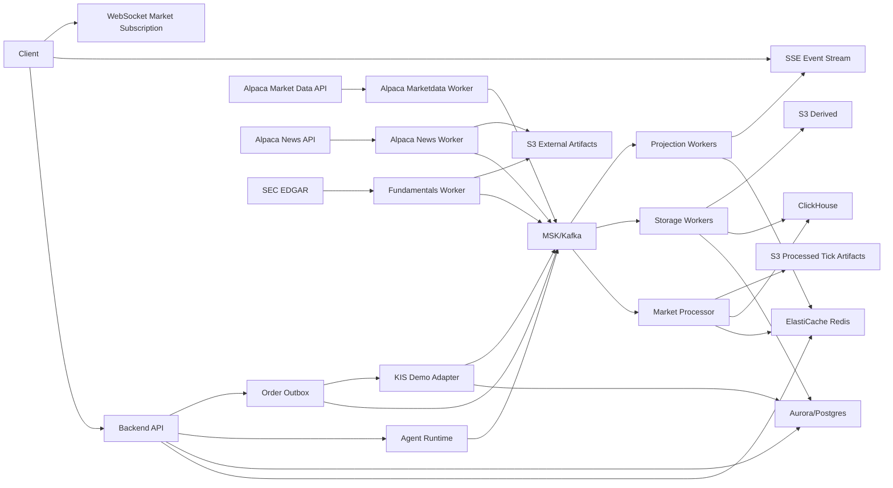

# GOPS v2 Architecture

## 1. Summary

GOPS v2는 Google OAuth2 로그인, SEC EDGAR 펀더멘탈, Alpaca 뉴스/시장 데이터, 한투 모의투자, 멀티 Agent 분석을 AWS EKS 기반 서비스로 제공한다.

핵심 제품 경험은 두 가지다.

- 차트 데이터/지표: Level 2 데이터가 없어도 가능한 캔들, 거래량, 이동평균, RSI, Bollinger Bands, MACD, Stochastic, 펀더멘탈 이벤트를 제공한다.
- 근거 기반 멀티 Agent 분석: Agent가 결론만 던지지 않고, 역할별로 근거를 제시하고 반박하고 합의한다.

차트 그리는 방식은 아직 미정이다. 이 문서의 목표는 GOPS v2를 구현할 때 필요한 아키텍처, 서비스 책임, 데이터 흐름, 저장소 역할, AWS 시작 사양, 차트 데이터/Agent 동작 방식을 한 곳에 정리하는 것이다.

## 2. Terms

처음 보는 기술을 기준으로 간단히 정리한다.

- AWS EKS: AWS가 운영해주는 Kubernetes 서비스다. Kubernetes는 컨테이너로 실행되는 여러 서비스를 배포, 재시작, 확장, 롤링 업데이트하는 플랫폼이다.
- Redis/ElastiCache: Redis는 메모리 기반 key-value 저장소다. 아주 빠른 조회가 필요할 때 쓴다. ElastiCache는 AWS가 관리해주는 Redis/Valkey 서비스다.
- Postgres/Aurora: Postgres는 관계형 데이터베이스다. 주문, 사용자, 권한처럼 정합성이 중요한 데이터를 저장한다. Aurora는 AWS가 제공하는 관리형 관계형 데이터베이스다.
- Kafka/MSK: Kafka는 이벤트 스트리밍 플랫폼이다. `가격 데이터가 들어왔다`, `주문 상태가 바뀌었다`, `Agent finding이 생겼다` 같은 이벤트를 여러 서비스가 나눠 처리하게 해준다. MSK는 AWS 관리형 Kafka다.
- ClickHouse: 대량의 시계열/분석 데이터를 빠르게 조회하기 위한 컬럼형 데이터베이스다. 캔들, 체결, 호가, 지표 snapshot처럼 양이 많은 데이터를 저장한다.
- S3: AWS 객체 저장소다. 파일처럼 큰 데이터를 `bucket/key` 형태로 저장한다. GOPS v2에서 S3에 저장되는 tick 데이터는 원본 tick 데이터가 아니라 가공된 tick 데이터이며, 아직 형식은 정해져 있지 않다.
- SSE: Server-Sent Events의 약자다. 서버가 클라이언트로 이벤트를 계속 보내는 단방향 스트림이다.
- WebSocket: 브라우저와 서버가 양방향으로 계속 연결되는 통신 방식이다. 실시간 구독 변경처럼 클라이언트도 자주 메시지를 보내야 할 때 사용한다.

## 3. Architecture Principles

- Cache first: 조회는 Redis를 먼저 본다. Redis에 없으면 ClickHouse/Postgres에서 읽고 다시 Redis를 채운다.
- Event driven: 시장 데이터, 뉴스, 주문, Agent 진행 상태는 Kafka 이벤트로 흘린다.
- Processed tick storage: S3에 저장되는 tick 데이터는 원본 Alpaca tick payload가 아니라 가공된 tick 데이터다. 저장 형식, partition, schema는 미정이다.
- Projection first: 조회 API는 S3 객체를 직접 serving source로 쓰지 않고 Redis/ClickHouse/Postgres projection을 우선 사용한다.
- Billing surface: repository 전체에서 결제/과금 API, billing table, Stripe/Toss/PortOne 같은 결제 provider 연동은 없다. Alpaca SIP 유료 구독은 운영 credential/market-data 비용으로 취급하고 사용자 결제 기능으로 보지 않는다.
- Reliability model: 주문은 Postgres idempotency/outbox/event log/DLQ/reconciliation으로 보장하고, 시장 데이터는 Kafka topic, Redis cache, ClickHouse projection, S3 processed artifact/materialization으로 복구 가능하게 만든다.
- Security model: Google OAuth2, Redis session, Secrets Manager/Kubernetes Secret, forbidden field validation, recursive redaction, KIS demo-only guardrail을 적용한다.
- User-confirmed order: Agent는 주문을 제출하지 않는다. 주문은 사용자가 직접 버튼을 눌렀을 때만 생성된다.
- Evidence only Agent: Agent finding은 실제 `EvidenceItem`과 연결되어야 한다.

## 4. System Overview



## 5. Service Responsibilities

### 5.1 Frontend

### 5.2 Backend API

Backend API는 브라우저와 내부 서비스 사이의 진입점이다.

책임:

- Google OAuth2 state 생성, callback 검증, session 생성.
- Redis session cache 조회와 Postgres user identity 연결.
- REST API 제공: 차트, 지표, 뉴스, 펀더멘탈, 포트폴리오, 주문, Agent run.
- SSE endpoint 제공: Agent/workspace event stream.
- WebSocket endpoint 제공: symbol/timeframe 구독 변경.
- 주문 요청 검증: user ownership, idempotency key, 현금/보유 상태, KIS demo 제한.
- Agent run 시작 요청을 받고 Agent runtime에 작업 생성.
- API 응답에 `asOf`, `cacheStatus`, `stalenessMs`, `artifactUri` 같은 신선도/근거 정보를 포함.

### 5.3 Alpaca Marketdata Worker

Alpaca Marketdata Worker는 Alpaca에서 주식 trades, quotes, bars 데이터를 수집한다.

책임:

- 관심 종목 목록과 수집 범위를 기준으로 Alpaca REST API 또는 streaming API 호출.
- 내부 정규화 이벤트를 Kafka로 발행한다. S3 tick 저장은 원본 payload 저장이 아니라 downstream에서 만든 가공 tick artifact 저장으로 처리하며, 형식은 아직 정하지 않는다.
- `next_page_token` 기반 pagination 처리.
- Alpaca 401/403/429/500 오류를 분류하고 retry/backoff 수행.
- exchange code, condition code reference data를 주기적으로 갱신.

### 5.4 Alpaca News Worker

Alpaca News Worker는 Alpaca News API에서 뉴스 데이터를 가져온다.

책임:

- 관심 종목별 뉴스 수집.
- 뉴스 원문 payload를 S3 raw bucket에 저장.
- 내부 `NewsEvent`와 `EvidenceItem`으로 정규화.
- Kafka `news.alpaca` topic으로 발행.
- Redis에 최신 뉴스 summary warm cache 갱신.
- rate limit 발생 시 Agent/API가 사용할 `news.delayed` health 상태를 갱신.

### 5.5 Fundamentals Worker

Fundamentals Worker는 SEC EDGAR 기반 펀더멘탈 데이터를 처리한다.

책임:

- SEC filing 원문 수집.
- XBRL/재무제표 데이터 정규화.
- 매출, 영업이익, 순이익, EPS, 부채비율, valuation 지표 계산.
- 원문 filing과 파싱 artifact를 S3 raw/derived에 저장.
- ClickHouse fundamentals time series 갱신.
- Redis fundamental summary warm cache 갱신.
- 펀더멘탈 Agent가 사용할 `EvidenceItem` 생성.

### 5.6 Market Processor

Market Processor는 시장 데이터 이벤트를 받아 차트용 projection을 만든다.

책임:

- `market.alpaca.trades`, `market.alpaca.quotes`, `market.alpaca.bars` 이벤트 소비.
- Redis latest quote/live candle/indicator summary 갱신.
- ClickHouse trades/quotes/candles 테이블 적재.
- 캔들 aggregation, volume spike, bid/ask imbalance, spread widening 같은 derived signal 계산.
- indicator engine을 호출해 SMA/EMA/WMA/Bollinger/RSI/MACD/Stochastic/VWAP 계산.
- 실패 시 event id 기준으로 재처리 가능하게 offset과 checkpoint 관리.

### 5.7 Agent Runtime

Agent Runtime은 멀티 Agent 분석을 실행한다.

역할:

- 차트 Agent: 가격, 거래량, quote, 지표를 분석한다. 분석 결과를 차트에 어떻게 그릴지는 아직 정하지 않는다.
- 뉴스 Agent: Alpaca 뉴스만 근거로 이벤트/이슈를 요약한다.
- 펀더멘탈 Agent: SEC filing과 valuation 지표를 근거로 분석한다.
- 포트폴리오 Agent: 보유 종목, 현금, 집중도, 리스크를 분석한다.
- 검증 Agent: 다른 Agent의 근거 부족, 과장, 충돌, 데이터 지연을 검토한다.

제약:

- Agent Runtime에는 KIS credential을 주지 않는다.
- Agent Runtime은 주문 API를 호출할 수 없다.
- Kubernetes NetworkPolicy로 `agent-runtime -> kis-adapter` 직접 접근을 차단한다.
- Agent는 `proposal.created`까지 만들 수 있지만 주문 제출은 사용자가 직접 한다.

### 5.8 Order Outbox

Order Outbox는 주문 요청을 안전하게 외부 KIS adapter로 넘기는 중간 계층이다.

책임:

- 사용자 주문 요청을 Postgres에 `pending`으로 기록.
- idempotency key 중복을 차단.
- order event log를 기록.
- KIS adapter로 전송할 outbox event 생성.
- 전송 실패 시 retry/backoff.
- 최종 상태를 `accepted`, `rejected`, `filled`, `partially_filled`, `cancelled`, `expired`, `failed`로 정리.

### 5.9 KIS Demo Adapter

KIS Demo Adapter는 한국투자증권 모의투자 API만 호출한다.

책임:

- `KIS_ENV=demo`가 아니면 startup에서 실패.
- 주문 가능 현금 조회.
- 지정가 매수/매도 제출.
- 주문 상태 조회.
- 보유 종목 조회.
- KIS 응답을 내부 `OrderStateEvent`로 정규화.

## 6. AWS Initial Sizing

아래 사양은 운영 시작점이다. 실제 동시 접속자 수, 구독 symbol 수, Alpaca 데이터 유입량, Agent run 수에 따라 HPA와 Karpenter로 조정한다.

| 영역 | 개발/스테이징 | 운영 시작 사양 | 용도 |
| --- | --- | --- | --- |
| EKS general node group | 2 x `m7i.large` | 3~6 x `m7i.xlarge` | frontend, backend, SSE, 일반 worker |
| EKS compute node group | 1~2 x `c7g.xlarge` | 3~8 x `c7g.2xlarge` | indicator 계산, market processor |
| EKS network-heavy node group | 선택 | 2~4 x `c7gn.xlarge` | Alpaca stream/quote ingest |
| EKS agent node group | 1 x `c7i.2xlarge` | 2~4 x `c7i.2xlarge` | Agent orchestration, 검증 worker |
| EKS batch/backfill | on demand | `c7i.4xlarge` job node | 과거 데이터 백필, 지표 재계산 |
| Aurora/Postgres | `db.r7g.large` | writer `db.r7g.large` + reader 1개 | 주문/사용자 원장 |
| Redis/ElastiCache | `cache.r7g.large` | 2 shards + replica | auth/session/live cache |
| MSK | 3 x `kafka.m7g.large` | 3 x `kafka.m7g.large` 이상 | market/news/order/agent event |
| ClickHouse | in-cluster `r7i.2xlarge` | 관리형 우선, self-host면 3 x `r7i.4xlarge` | candles, trades, quotes, indicators |
| S3 | Standard | Standard | processed tick, derived, audit, replay |

운영 확장 기준:

- Backend CPU 평균 60% 이상 또는 p95 latency 300ms 초과가 15분 지속되면 general node와 backend replica를 증설.
- Market Processor lag가 1분 이상 지속되면 compute node와 consumer replica를 증설.
- Redis memory 사용률 70% 이상이면 shard 증설 또는 TTL 조정.
- Kafka consumer lag가 topic별 SLO를 넘으면 partition/consumer replica를 늘린다.
- ClickHouse query p95가 1초를 넘으면 partitioning, materialized view, cluster scale-out을 검토한다.
- S3 PUT 실패율이 증가하면 worker retry queue와 DLQ를 확인한다.

## 7. Kubernetes Deployment

Namespace:

- `gops-app`: frontend, backend, workers, agent-runtime, order-outbox, kis-adapter.
- `gops-platform`: in-cluster Redis/Kafka/Postgres/ClickHouse를 개발/스테이징에서만 운영할 때 사용.
- `gops-observability`: metrics, logs, tracing.

배포 기본값:

- 모든 Deployment는 `readinessProbe`, `livenessProbe`, `startupProbe`를 가진다.
- rolling update는 `maxUnavailable=0`, `maxSurge=1`을 기본으로 한다.
- resource request/limit을 명시한다.
- service account는 IRSA를 사용해 필요한 AWS 권한만 가진다.
- secret은 AWS Secrets Manager 또는 Kubernetes Secret으로 주입한다.
- KIS/Alpaca/Google OAuth credential은 이미지나 ConfigMap에 넣지 않는다.

NetworkPolicy:

- `frontend -> backend` 허용.
- `backend -> redis/postgres/kafka/agent-runtime/order-outbox` 허용.
- `order-outbox -> kis-adapter` 허용.
- `agent-runtime -> kis-adapter` 차단.
- worker별 외부 API egress는 필요한 도메인만 허용한다.

## 8. Backend API Design

API contract는 현재 구현된 route를 기준으로 한다. v2 문서에서 신규 `/api/v1` namespace를 만들지 않는다.

공통 응답:

```json
{
  "data": {},
  "meta": {
    "asOf": "2026-07-02T00:00:00.000Z",
    "source": "redis",
    "cacheStatus": "hit",
    "stalenessMs": 120,
    "isStale": false
  }
}
```

공통 오류:

```json
{
  "error": {
    "code": "validation_error",
    "message": "Request validation failed",
    "details": []
  }
}
```

Auth API:

- `GET /api/auth/google/login`
- `GET /api/auth/google/callback`
- `GET /api/auth/me`
- `POST /api/auth/logout`

Chart API:

- `GET /api/charts/candles`
- `POST /api/charts/backfill`
- `GET /api/charts/backfill/status`
- `GET /api/charts/symbols`
- `WS /ws/charts`

Agent API:

- `POST /api/agents/analyze`
- `GET /api/agents/reports/{analysis_id}`
- `WS /ws/agent-alerts`

Order API:

- `GET /api/order-contract`
- `GET /api/orders/balance`
- `POST /api/orders`
- `GET /api/orders/{order_id}`
- `GET /api/orders/{order_id}/events`
- `WS /ws/orders/{order_id}`

Order rule:

- `POST /api/orders`는 `Idempotency-Key` header가 필요하다.

## 9. Authentication Flow

1. Client가 Google login 시작 endpoint를 호출한다.
2. Backend가 OAuth `state`를 생성해 Redis에 TTL과 함께 저장한다.
3. 사용자를 Google OAuth consent로 보낸다.
4. Google callback에서 `state`를 검증한다.
5. 검증 성공 시 Google identity를 Postgres user와 연결한다.
6. session id를 생성하고 Redis에 TTL로 저장한다.
7. Client는 session cookie 기반으로 API를 호출한다.

Redis key 예시:

- `auth:oauth-state:{state}`: Google OAuth state, TTL 5~10분.
- `auth:session:{sessionId}`: user id, role, expiresAt, TTL.
- `auth:user-session-index:{userId}`: 활성 session 목록.

Auth 규칙:

- OAuth state는 1회만 사용한다.
- callback 실패 사유는 일반화된 메시지로만 반환한다.
- session cookie는 `HttpOnly`, `Secure`, `SameSite=Lax` 또는 `Strict`를 사용한다.

## 10. Chart Data And Indicator Scope

Level 2 데이터가 필요 없는 범위부터 구현한다.

지원 대상:

- 캔들스틱 OHLC.
- 라인 차트.
- 영역 차트.
- OHLC bar 차트.

기본 시간 단위:

- `1Min`
- `5Min`
- `15Min`
- `1Hour`
- `1Day`
- `1Week`
- `1Month`

보조 지표:

- 거래량 histogram.
- 매수/매도량 추정.
- RSI.
- MACD.
- Stochastic.

가격 차트 지표:

- SMA.
- EMA.
- WMA.
- Bollinger Bands.
- VWAP.

펀더멘탈/이벤트 데이터:

- Alpaca 뉴스.
- SEC filing.
- 실적 발표.
- 주문 체결/거부/대기.
- 포트폴리오 리스크 이벤트.

미정:

- 차트 그리는 방식.
- chart engine의 runtime 위치와 API.
- 사용자 정의 지표/전략 표현 방식.
- PineScript처럼 전용 언어가 필요한지 여부. 차트 표현이나 지표 조합의 한계가 실제로 생기면 별도 DSL 도입을 검토한다.

## 11. Chart Calculation And Rendering Decision

차트 계산과 차트 렌더링은 분리해서 판단한다.

### 11.1 Indicator Calculation

역할:

- candles/trades/quotes를 입력으로 받아 지표를 계산한다.
- 계산 결과를 `IndicatorSeries`로 반환한다.
- backend worker와 client runtime 중 어디에서 재사용할지는 아직 정하지 않는다.

지원 지표:

- SMA: 일정 기간 평균 가격.
- EMA: 최근 가격에 더 큰 가중치를 둔 평균.
- WMA: 가중 이동평균.
- Bollinger Bands: 이동평균 주변 변동성 밴드.
- RSI: 과매수/과매도 성격을 보는 momentum 지표.
- MACD: 추세 전환과 momentum을 보는 지표.
- Stochastic: 현재 가격이 최근 범위에서 어디에 있는지 보는 지표.
- VWAP: 거래량 가중 평균 가격.

### 11.2 Rendering

차트 그리는 방식은 아직 미정이다.

현 시점에서는 특정 렌더링 방식, 라이브러리, runtime, DSL 여부를 확정하지 않는다.

## 12. Chart Agent Output

차트 Agent의 분석 결과를 차트에 어떻게 연결할지는 아직 미정이다.

최소 검증 규칙:

- 모든 차트 관련 Agent finding은 하나 이상의 evidence를 가져야 한다.
- 가격대/지표 관련 finding은 계산 규칙 또는 근거 데이터 범위를 가져야 한다.
- Agent는 주문 버튼을 생성할 수 없다.
- 검증 Agent는 finding에 `unsupported`, `conflicting`, `stale`, `overstated` 같은 경고를 붙일 수 있다.

## 13. Alpaca Market Data

Alpaca는 GOPS v2에서 뉴스와 미국 주식 시장 데이터 공급자로 사용한다. 주문은 한투 모의투자만 사용하므로 Alpaca 주문 기능은 사용하지 않는다.

Level 2 데이터가 필요한 차트는 v2 초기 범위에서 제외한다.

S3에 저장되는 tick 데이터는 Alpaca 원본 tick payload가 아니다. 수집, 검증, session/feed 정규화, 중복 제거, 보정 여부 판단 같은 처리를 거친 가공 tick 데이터로 저장한다. 단, 가공 tick 데이터의 정확한 형식, 파일 포맷, partition, schemaVersion 전략은 아직 정하지 않는다.

Kafka event와 ClickHouse projection은 `docs/ENVIRONMENT.md`와 `platform/kafka/topics.txt`의 market-data contract를 기준으로 한다.

입력 범위:

- trades.
- quotes.
- bars.
- news.

미정:

- processed tick artifact schema.
- processed tick artifact file format.
- processed tick artifact S3 key layout.
- 외부 API 원문 보존이 필요한 경우 processed tick artifact와 별도 계층으로 둘지 여부.

## 14. News and Fundamentals

### 14.1 Alpaca News

Alpaca News API는 주식/크립토 관련 최신 뉴스를 제공한다. GOPS에서는 뉴스 Agent의 근거와 차트 이벤트 마커에 사용한다.

정규화된 `NewsEvent`:

```json
{
  "id": "news_01HY...",
  "source": "alpaca",
  "symbols": ["TSLA"],
  "headline": "Tesla ...",
  "summary": "...",
  "url": "https://...",
  "publishedAt": "2026-07-02T13:00:00Z",
  "updatedAt": "2026-07-02T13:05:00Z",
  "ingestedAt": "2026-07-02T13:05:10Z",
  "artifactUri": "s3://gops-raw/alpaca/news/dt=2026-07-02/symbol=TSLA/file.jsonl.gz"
}
```

### 14.2 SEC Fundamentals

SEC EDGAR 데이터는 펀더멘탈 Agent와 펀더멘탈 API에 사용한다.

제공 지표:

- 매출.
- 매출 성장률.
- 영업이익.
- 순이익.
- EPS.
- 자산/부채/자본.
- 부채비율.
- gross margin.
- operating margin.
- PER/PBR/PSR 같은 valuation 지표.

펀더멘탈 summary는 Redis에 warm cache로 저장하고, 원문과 정규화된 time series는 S3/ClickHouse에 저장한다.

## 15. S3 Storage

S3 객체는 `platform/s3/README.md`와 `docs/ENVIRONMENT.md`의 platform contract를 기준으로 한다.

현재 AWS bucket:

```text
gops-market-data-<aws-account-id>-ap-northeast-2-an
```

tick 데이터 원칙:

- S3에 저장되는 tick 데이터는 원본 tick 데이터가 아니라 가공된 tick 데이터다.
- 가공 tick 데이터 형식은 아직 정하지 않는다.
- S3는 durable replay/rematerialization storage로 사용하고, 조회 serving은 Redis와 ClickHouse projection을 우선 사용한다.

Prefix contract:

- `S3_RAW_PREFIX`
- `S3_FINAL_PREFIX`
- `S3_LIVE_PREFIX`
- `S3_MANIFEST_PREFIX`

S3 object metadata 후보:

- `source`
- `endpoint`
- `feed`
- `symbol`
- `start`
- `end`
- `ingestedAt`
- `schemaVersion`
- `checksum`
- `requestId`

## 16. Redis Cache Design

Redis key 예시:

- `auth:oauth-state:{state}`: OAuth state.
- `auth:session:{sessionId}`: 로그인 session.
- `market:latest-quote:{symbol}`: 최신 bid/ask/last quote.
- `market:live-candle:{symbol}:{timeframe}`: 현재 진행 중인 candle.
- `chart:indicator-summary:{symbol}:{timeframe}`: 주요 지표 요약.
- `fundamentals:summary:{symbol}`: 펀더멘탈 요약.
- `news:summary:{symbol}`: 최신 뉴스 요약.
- `agent:run:{runId}`: Agent run 현재 상태.
- `agent:run-events:{runId}`: Agent run 최근 이벤트.
- `health:component:{componentName}`: 컴포넌트 상태.

TTL 기본값:

- OAuth state: 5~10분.
- session: 정책에 따라 1~24시간.
- latest quote/live candle: 수 초~수 분.
- indicator summary: timeframe에 따라 1분~1시간.
- fundamentals summary: 수 시간~1일.
- news summary: 수 분~수십 분.
- Agent run state: run 종료 후 1~7일.

## 17. Postgres Data Model

Postgres는 정합성이 중요한 사용자 범위 데이터를 저장한다.

주요 테이블:

- `users`: 사용자 기본 정보.
- `auth_identities`: Google OAuth identity 연결.
- `sessions`: session 감사/관리용 metadata.
- `orders`: 사용자 주문 원장.
- `order_events`: 주문 상태 변화 log.
- `idempotency_keys`: 중복 주문 방지.
- `portfolio_snapshots`: 포트폴리오 snapshot metadata.
- `agent_runs`: Agent run metadata.
- `agent_proposals`: Agent가 만든 제안.

주문 상태:

- `draft`
- `pending`
- `submitted`
- `accepted`
- `rejected`
- `partially_filled`
- `filled`
- `cancelled`
- `expired`
- `failed`

주문 규칙:

- 모든 주문 생성 요청은 idempotency key가 필요하다.
- user id와 order owner가 반드시 일치해야 한다.
- Agent proposal id가 있어도 주문 생성은 별도 사용자 클릭으로만 가능하다.
- KIS adapter가 실패해도 주문 event log는 남아야 한다.

## 18. ClickHouse Data Model

ClickHouse는 읽기 많은 시계열/분석 데이터를 저장한다.

주요 테이블:

- `market_trades`
- `market_quotes`
- `market_bars`
- `candles`
- `indicator_snapshots`
- `news_events`
- `fundamentals_timeseries`
- `agent_run_audit_summary`

권장 partition:

- 날짜 기준 partition: `toYYYYMMDD(timestamp)`.
- symbol 기준 order key 포함.
- timeframe이 있는 데이터는 `symbol`, `timeframe`, `timestamp` 순으로 조회 최적화.

예시 `candles` 컬럼:

- `symbol`
- `timeframe`
- `timestamp`
- `open`
- `high`
- `low`
- `close`
- `volume`
- `trade_count`
- `vwap`
- `source`
- `asOf`
- `artifactUri`

## 19. Kafka Topics

Topic:

- `market.alpaca.trades`
- `market.alpaca.quotes`
- `market.alpaca.bars`
- `news.alpaca`
- `fundamentals.sec`
- `orders.requested`
- `orders.state-changed`
- `agent-runs.events`
- `projection.workspace`
- `health.components`

Event envelope:

```json
{
  "eventId": "evt_01HY...",
  "eventType": "market.alpaca.trade",
  "schemaVersion": 1,
  "occurredAt": "2026-07-02T13:30:00Z",
  "ingestedAt": "2026-07-02T13:30:01Z",
  "source": "alpaca",
  "partitionKey": "TSLA",
  "payload": {}
}
```

처리 규칙:

- consumer는 at-least-once 처리를 전제로 한다.
- 중복은 `eventId` 또는 natural key로 제거한다.
- schemaVersion을 올릴 때는 backward-compatible 변경을 우선한다.
- 처리 실패 이벤트는 DLQ로 보낸다.

## 20. Agent Event Model

Agent event type:

- `run.started`
- `agent.started`
- `agent.finding.proposed`
- `agent.challenge.raised`
- `agent.response`
- `agent.consensus.updated`
- `agent.finalized`
- `proposal.created`

`EvidenceItem`:

```json
{
  "id": "ev_01HY...",
  "type": "alpaca-trade-window",
  "source": "alpaca",
  "symbol": "TSLA",
  "asOf": "2026-07-02T14:00:00Z",
  "stalenessMs": 500,
  "artifactUri": "s3://.../processed-ticks/...",
  "summary": "5분 구간 거래량이 20일 평균 대비 2.1배"
}
```

상태 표현:

- `검토 중`
- `근거 대기`
- `반박 중`
- `충돌 있음`
- `데이터 지연`
- `합의 완료`

## 21. Order and KIS Guardrails

한투 연동은 `KIS_ENV=demo`만 허용한다.

Startup guard:

- `KIS_ENV`가 `demo`가 아니면 adapter process는 즉시 종료한다.
- 실전투자 URL 또는 credential이 주입되면 배포 실패로 처리한다.
- production namespace에서도 demo endpoint만 허용한다.

주문 생성 흐름:

1. 사용자가 주문 티켓에서 지정가 매수/매도를 입력한다.
2. Backend가 session, ownership, idempotency key를 검증한다.
3. Backend가 주문 가능 현금/보유 수량을 확인한다.
4. Postgres `orders`에 `pending`으로 기록한다.
5. Order Outbox가 KIS Demo Adapter 전송 event를 만든다.
6. KIS Demo Adapter가 KIS 모의투자 API를 호출한다.
7. 응답을 `OrderStateEvent`로 정규화한다.
8. Postgres order event log와 Kafka `orders.state-changed`를 갱신한다.

Agent guardrail:

- Agent는 order endpoint 호출 권한이 없다.
- Agent proposal은 주문 티켓을 prefill할 수는 있지만 submit할 수 없다.
- 사용자가 submit 버튼을 눌러야만 order가 생성된다.

## 22. UI Workspace Design

## 23. Payment, Reliability, And Security

### 23.1 Billing And Payment

현재 repository에는 사용자 결제/과금 기능이 없다.

확인된 상태:

- 결제 API route가 없다.
- billing/subscription/invoice 관련 DB migration이 없다.
- Stripe, Toss, PortOne, iamport 같은 결제 provider 연동 코드가 없다.
- `systems/market-data/pods/market-ingestor/market_stream.py`의 "실제 결제 후 sip feed" 주석은 Alpaca SIP feed 운영 구독을 의미한다. 사용자 결제 기능이 아니다.

v2 범위:

- 사용자에게 과금하거나 결제수단을 등록하는 기능은 포함하지 않는다.
- Alpaca, KIS, OpenAI, AWS 비용은 운영 비용으로 분리한다.
- 나중에 유료 플랜을 붙이면 `systems/billing` 같은 별도 system을 만들고, 사용자 권한/주문/market-data contract와 분리해서 설계한다.

### 23.2 Order Reliability

주문 신뢰성은 Postgres 중심 원장과 Kafka outbox로 구성되어 있다.

Order implementation:

- `POST /api/orders`는 `Idempotency-Key` header를 반드시 요구한다.
- 인증이 켜져 있으면 idempotency key는 `user.sub`과 합쳐 사용자별 scope로 해시한다.
- idempotency key는 `IDEMPOTENCY_HASH_SECRET`이 있으면 HMAC-SHA256으로, 없으면 SHA-256으로 저장한다.
- 같은 idempotency key와 같은 body hash는 저장된 주문 응답을 재사용하고 `X-Idempotent-Replay: true`를 반환한다.
- 같은 idempotency key에 다른 body hash가 오면 409 conflict로 막는다.
- 주문 생성은 `orders`, `order_events`, `idempotency_requests`, `outbox_events`를 같은 Postgres transaction에서 기록한다.
- `outbox_events`는 Kafka publish 성공 후 `published_at`을 기록한다. publish 실패 시 row가 남아 재시도 가능하다.
- 주문 Kafka producer는 `acks=all`, `enable.idempotence=true`, `message.timeout.ms=10000`으로 설정한다.
- KIS adapter consumer는 `enable.auto.commit=false`이고, message 처리 후 synchronous commit을 수행한다.
- adapter는 `broker_submissions`에 durable submission intent를 먼저 기록해 중복 KIS POST를 줄인다.
- KIS token 만료는 token refresh 후 1회 재시도한다.
- KIS 429처럼 `safe_to_retry=true`인 HTTP 오류는 1회 재시도한다.
- timeout, connection reset, 불명확한 5xx는 `SUBMIT_FAILED_UNKNOWN`으로 분류하고 reconciliation 대상에 둔다.
- command validation 실패, status transition 오류, 금지 필드 포함 payload는 `dlq_events`와 `orders.dlq.v1` 경로로 격리한다.
- reconciler는 broker order id, client order id, 계좌 alias, symbol, side, qty, price, 시간 window로 KIS row와 내부 주문을 대조한다.
- 운영 metric snapshot은 `orders_total`, `outbox_unpublished`, `dlq_count`, `submit_failed_unknown_count`, `reconciliation_required_count`, `audit_log_count`를 제공한다.

### 23.3 Market Data Reliability And Cache

시장 데이터는 Kafka event-driven pipeline과 Redis/ClickHouse/S3 계층으로 구성되어 있다.

Kafka topic contract:

- Raw topics: `market.raw.bars`, `market.raw.updated-bars`, `market.raw.trades`, `market.raw.daily-bars`, `market.raw.statuses`, `market.raw.quotes`, `market.raw.corrections`, `market.raw.cancel-errors`.
- Processed topics: `market.ticks.v1`, `market.candles.live.1m.v1`, `market.candles.closed.v1`, `market.status.v1`, `market.volume-profile-bins.1m.v1`.
- Agent/order topics: `orders.commands.v1`, `broker.submit-results.v1`, `broker.order-events.v1`, `orders.dlq.v1`, `agents.*`.

Redis serving/cache:

- 최신 체결은 `price:{symbol}:latest` hash로 저장하고 TTL은 1일이다.
- 진행 중 candle은 `candle:{symbol}:{interval}:live`에 저장하고 TTL은 1일이다.
- 닫힌 candle은 `candle:{symbol}:{interval}:latest`와 `candles:{symbol}:{interval}` sorted set에 저장한다. latest TTL은 1일, series TTL은 7일이다.
- market status는 `market:status:latest`, `market:status:{symbol}:latest`에 저장하고 TTL은 1일이다.
- chart event는 `market.events`와 `market.events:{symbol}` Redis pub/sub channel로 발행한다.
- component health는 `pipeline:health:{component}`에 저장하고 기본 TTL은 300초다.

S3/ClickHouse 복구 흐름:

- processed S3 sink는 `market.ticks.v1`, live/closed candle, status, volume profile topic을 소비한다.
- 오늘/live 성격 데이터는 `S3_LIVE_PREFIX`, 확정 historical/canonical 데이터는 `S3_FINAL_PREFIX` 아래에 쓴다.
- processed output 기본 format은 `S3_PROCESSED_FORMAT=parquet`이다.
- candle partition은 `S3_MANIFEST_PREFIX` 아래 manifest를 쓴다.
- canonical historical candle은 `priceAdjustment=split`, `canonicalVersion=v2` metadata를 요구한다.
- deterministic canonical key가 이미 있으면 중복 업로드를 skip하고 manifest만 보강한다.
- S3 PUT은 `S3_PUT_MAX_ATTEMPTS`와 `S3_PUT_RETRY_SLEEP_SECONDS`로 재시도한다.
- ClickHouse serving은 raw/live S3를 직접 보지 않고 processed artifact materialization 후 canonical row를 조회한다.
- `/health/config`는 S3 prefix, canonical config, Alpaca credential source, feed profile, pipeline component health를 노출하되 secret 값은 `SET`/`EMPTY`로만 표시한다.

Backfill reliability:

- backfill request는 Redis status key와 Redis Streams에 저장한다.
- request id는 symbol/interval/range digest 기반이라 같은 범위 요청은 dedupe된다.
- `force=true`는 별도 force suffix를 붙여 의도적 재실행으로 분리한다.
- queue group은 기본 `backfill-workers`다.
- stale running status는 `BACKFILL_ACTIVE_STALE_SECONDS` 기준으로 실패 처리되어 새 bounded repair를 막지 않는다.
- exhausted job은 dead-letter stream으로 이동한다.
- gapfill `1m` 요청은 `BACKFILL_MAX_GAPFILL_1M_RANGE_HOURS`로 상한을 둔다.
- broad preload는 `initial_load` chunk job으로 처리하고, backlog/max enqueue로 throttle한다.

### 23.4 Operational Alerts

주문 쪽 alert 조건:

- `SUBMIT_FAILED_UNKNOWN present`
- `RECONCILIATION_REQUIRED present`
- `DLQ present`
- `outbox unpublished events present`
- `circuit breaker open`

시장 데이터 쪽 health 판단:

- `pipeline:health:market-ingestor-sip`
- `pipeline:health:market-ingestor-boats`
- `pipeline:health:market-processor`
- `/health/config`의 `warnings`: stale request config, missing feed profile, noncanonical historical adjustment, S3 processed format mismatch, disabled canonical filters.

## 24. Observability

로그:

- JSON structured log.
- `requestId`, `userId`, `runId`, `symbol`, `eventId`, `orderId`를 context로 포함.
- OAuth code, access token, refresh token, KIS secret, 계좌 식별자는 로그 금지.

Metrics:

- API request count/latency/error rate.
- Redis hit ratio.
- Kafka consumer lag.
- ClickHouse query latency.
- S3 PUT/GET error rate.
- Alpaca request latency/rate limit count.
- KIS request latency/error count.
- Agent run duration, finding count, challenge count.

Tracing:

- API request에서 Kafka event, worker 처리, Redis/ClickHouse/S3 write까지 trace id를 이어간다.
- Agent run은 run id 중심으로 replay 가능해야 한다.

## 25. Testing Strategy

Unit tests:

- indicator 계산.
- candle aggregation.
- order idempotency.
- Agent event reducer.

Integration tests:

- Alpaca pagination.
- S3 artifact 저장 checksum.
- Kafka event consume/produce.
- Redis cache hit/miss.
- ClickHouse projection 복구.
- Google OAuth state 검증.
- KIS demo adapter mock.

Failure tests:

- Alpaca 429.
- Redis timeout.
- Kafka consumer lag.
- ClickHouse unavailable.
- S3 PUT 실패.
- Agent 근거 없는 finding 생성 시도.
- `KIS_ENV`가 demo가 아닌 경우 startup 실패.

## 26. Security

### 26.1 Auth And Session

Google OAuth2 login은 `systems/api-server/pods/api-server/gops-backend/app/routes/auth.py`와 `app/auth/*`에 구현되어 있다.

규칙:

- `AUTH_ENABLED=false`이면 API는 dev user를 사용한다. 운영에서는 `AUTH_ENABLED=true`가 필요하다.
- `/api/orders`, `/ws/orders/{order_id}`, `/api/llm/*`는 login session을 요구한다.
- OAuth state는 `secrets.token_urlsafe(32)`로 만들고 Redis에 TTL과 함께 저장한다.
- OAuth state cookie 이름 기본값은 `gops_oauth_state`이고, `HttpOnly`가 켜진다.
- session id는 `secrets.token_urlsafe(48)`로 만들고 Redis에 TTL과 함께 저장한다.
- Redis session key와 OAuth state key는 raw token을 그대로 쓰지 않고 `AUTH_SESSION_SECRET` 기반 HMAC-SHA256 digest를 사용한다.
- session cookie 이름 기본값은 `gops_session`이다.
- cookie `Secure`는 `AUTH_COOKIE_SECURE` 또는 HTTPS public base URL에 맞춰 결정한다.
- cookie `SameSite` 기본값은 `lax`다.
- OAuth callback은 cookie의 state와 callback query의 state가 일치해야 통과한다.
- OAuth state는 callback에서 pop/delete되어 1회 사용된다.

### 26.2 Secret Handling

Secret 이름:

- Alpaca: `dev/alpaca`
- KIS demo: `tead/gops/kis`
- Google OAuth/session: `oauth/google`
- OpenAI: `/gops/prod/agent-orchestrator/openai/api-key`

규칙:

- Google OAuth env 값이 비어 있고 `AUTH_ENABLED=true`이면 `GOOGLE_OAUTH_SECRET_NAME` 또는 `AUTH_SECRET_NAME`으로 AWS Secrets Manager에서 읽는다.
- KIS credential source 기본값은 `aws-secrets-manager`이고, 기본 secret name은 `tead/gops/kis`다.
- Alpaca credential source는 AWS contract/local explicit smoke를 구분한다. local compose와 k8s market-data service는 stale local key가 Secrets Manager 값을 덮어쓰지 않도록 `aws-secrets-manager`를 사용한다.
- `/health/config`는 secret 값을 출력하지 않고 `SET`/`EMPTY` presence만 반환한다.
- `.env`, access key CSV, KIS token cache, OAuth client secret, session secret, OpenAI API key는 commit 대상이 아니다.

### 26.3 Order Security

주문 보호 규칙:

- `KIS_ENV`가 `demo`가 아니면 API repository 생성, KIS config load, broker adapter startup이 실패한다.
- 주문 request body와 Kafka envelope에는 `account_no`, `app_key`, `app_secret`, `access_token`, `authorization`, raw idempotency key 같은 forbidden field가 들어갈 수 없다.
- forbidden field 검사는 중첩 dict/list까지 재귀적으로 수행한다.
- DB JSON, Kafka payload, API response, log 후보 payload는 `redact_sensitive`로 recursive redaction을 적용한다.
- 주문 idempotency key는 raw value를 DB에 저장하지 않고 hash/HMAC digest만 저장한다.
- 인증이 켜진 경우 idempotency key hash 입력에 user id를 포함해 사용자 간 key 충돌을 막는다.
- Agent Runtime에는 KIS credential을 주지 않고, Agent는 order endpoint 호출 권한을 갖지 않는다.
- Kubernetes NetworkPolicy는 `agent-runtime -> kis-adapter` 직접 접근을 차단한다.

### 26.4 Infrastructure Security

EKS/AWS 규칙:

- pod는 IRSA service account로 필요한 AWS 권한만 받는다.
- KIS/Alpaca/Google OAuth/OpenAI credential은 이미지와 ConfigMap에 넣지 않는다.
- frontend/backend/worker/agent/order/kis adapter는 역할별 image boundary를 나눈다.
- `gops-kis-adapter`는 KIS, broker submission, secret risk 때문에 별도 image/pod로 둔다.
- production namespace에서도 KIS demo endpoint만 허용한다.

## 27. Assumptions

- 실전투자는 범위 밖이며 한투 모의투자만 지원한다.
- 뉴스와 시장 데이터 공급자는 v2에서 Alpaca를 기본값으로 둔다.
- S3 tick 데이터는 원본 tick 데이터가 아니라 가공 tick 데이터다.
- 가공 tick 데이터 형식은 아직 정하지 않는다.
- 차트 그리는 방식은 아직 정하지 않는다.
- 사용자 결제/과금 기능은 현재 repository에 없으므로 v2 범위에 포함하지 않는다.
- 주문 신뢰성은 Postgres idempotency/outbox/event log/DLQ/reconciliation으로 구성한다.
- 인증/보안은 Google OAuth2, Redis session, Secrets Manager, forbidden field validation, redaction, KIS demo-only guardrail로 구성한다.

## 28. Open Decisions

- 차트 그리는 방식을 결정해야 한다.
- 가공 tick 데이터의 schema, 파일 포맷, S3 key layout을 결정해야 한다.
- 차트 표현/지표 조합 한계가 생길 경우 PineScript 같은 전용 언어가 필요한지 결정해야 한다.
- ClickHouse를 관리형으로 갈지 self-host로 시작할지 비용 기준이 필요하다.
- Alpaca 실시간 stream과 REST backfill의 정확한 조합을 ingestion 설계에서 확정해야 한다.
- Agent Runtime의 LLM provider와 tool permission model은 OpenAI secret 주입, Agent order 권한 차단, NetworkPolicy 차단 범위까지 구체화해야 한다.

## 29. Scaffold Structure

이 구조는 현재 GOPS repository의 모양을 유지하는 v2 목표 스캐폴드다. 빈 폴더를 먼저 만들지 않는다. 구현이 시작되는 system, pod, job, platform contract만 생성한다.

### 29.1 Repository Shape

```text
apps/
  gops-frontend/
  chart-engine/

shared/
  chart-contract/

systems/
  api-server/
    pods/
      api-server/
        gops-backend/
          app/
            auth/
            contracts/
            core/
            market_data/
              backfill/
              query/
              realtime/
            routes/
            services/
    tests/
    README.md

  market-data/
    config/
      market-data-request.json
      sp500-universe.json
    pods/
      market-ingestor/
      news-ingestor/
      market-processor/
      s3-sink/
      clickhouse-loader/
      backfill-worker/
    jobs/
      symbol-registry-sync/
      coverage-repair/
      initial-load/
    shared/
      alfaka/
        alpaca/
        backfill/
        common/
        serving/
        storage/
        streaming/
        tools/
    tests/
    README.md

  fundamentals/
    pods/
      fundamentals-worker/
    jobs/
      sec-backfill/
      fundamentals-recompute/
    shared/
      gops_fundamentals/
        edgar/
        xbrl/
        normalization/
        valuation/
        evidence/
    tests/
    README.md

  agent-orchestration/
    pods/
      agent-orchestrator/
      event-detector/
      notification-publisher/
    shared/
      gops_agents/
        agents.py
        contracts.py
        event_detector.py
        orchestrator.py
        providers.py
        publisher.py
        router.py
        synthesizer.py
    tests/
    README.md

  order/
    pods/
      order-outbox/
      kis-adapter/
    jobs/
      migrations/
      reconciler/
    shared/
      kis_trader/
        broker_adapter/
        domain/
        kis/
        migrations/
        operations/
        outbox/
        persistence/
        reconciliation/
        security/
    tests/
    README.md

platform/
  kafka/
  flink/
  redis/
  postgres/
  clickhouse/
  s3/
  secrets/
  sec-edgar/

infra/
  docker/
  k8s/
    base/
    overlays/
      aws/
      aws-incluster-app/
      aws-incluster-platform/
  aws/
    terraform/
  clickhouse/
```

### 29.2 Ownership Rules

- `apps/gops-frontend`는 사용자-facing app boundary다. UI 상세 명세는 이 문서에서 비워둔다.
- `apps/chart-engine`는 차트 데이터/지표/상태 계약을 담는 app-side engine boundary다. 차트 그리는 방식은 아직 정하지 않는다.
- `shared/chart-contract`는 chart-agent, chart capability, command schema처럼 여러 system이 동시에 읽는 안정된 계약만 둔다.
- `systems/api-server`는 FastAPI gateway다. Auth, chart/order route, WebSocket, agent gateway, market-data query facade를 둔다.
- `systems/market-data`는 Alpaca market/news ingest, stream processing, Redis/ClickHouse/S3 storage, backfill, symbol registry를 둔다.
- `systems/fundamentals`는 SEC EDGAR, XBRL normalization, valuation 계산, fundamentals evidence 생성을 맡는 신규 v2 system 후보다.
- `systems/agent-orchestration`은 role agent 실행, event detection, notification publishing, evidence-based synthesis를 둔다.
- `systems/order`는 KIS demo order, idempotency, outbox, adapter, reconciliation, order security를 둔다.
- `platform/*`는 코드가 아니라 dependency contract를 둔다. Kafka topic, S3 prefix, secret name, DB endpoint, ClickHouse schema 같은 런타임 약속을 문서화한다.
- `infra/*`는 Docker image, Kubernetes manifest, Terraform, ClickHouse init SQL만 둔다.

### 29.3 New System Criteria

새 system은 다음 조건 중 하나 이상이 있을 때만 만든다.

- 독립적인 pod/job runtime이 필요하다.
- Kafka topic, S3 prefix, DB schema, external API contract가 기존 system과 분리된다.
- 배포 image, secret, scaling, 장애 대응 방식이 기존 system과 다르다.
- 팀이 소유권을 분리해서 README와 테스트를 유지해야 한다.

이 기준으로 SEC EDGAR 펀더멘탈은 `systems/fundamentals` 후보가 된다. Alpaca news는 현재 market-data ingest와 Kafka 흐름을 공유하므로 `systems/market-data/pods/news-ingestor`에 둔다.

### 29.4 Pod And Job Map

| Runtime | Type | Path | Image | Primary dependency |
| --- | --- | --- | --- | --- |
| gops-frontend | pod | `apps/gops-frontend` | `gops-frontend` | Backend API |
| api-server | pod | `systems/api-server/pods/api-server` | `gops-api-server` | Redis, Postgres, ClickHouse, Agent, order shared |
| market-ingestor | pod | `systems/market-data/pods/market-ingestor` | `gops-market-ingestor` | Alpaca, Kafka, Secrets |
| news-ingestor | pod | `systems/market-data/pods/news-ingestor` | `gops-market-ingestor` | Alpaca News, Kafka, Secrets |
| market-processor | pod | `systems/market-data/pods/market-processor` | `gops-market-processor` | Kafka, Redis, ClickHouse |
| processed-s3-sink | pod | `systems/market-data/pods/s3-sink/processed_sink.py` | `gops-market-storage` | Kafka, S3 |
| raw-s3-archive | pod | `systems/market-data/pods/s3-sink/raw_archive_sink.py` | `gops-market-storage` | Kafka, S3 |
| clickhouse-loader | pod | `systems/market-data/pods/clickhouse-loader` | `gops-market-storage` | Kafka/S3, ClickHouse |
| backfill-worker | pod | `systems/market-data/pods/backfill-worker` | `gops-backfill-worker` | Redis, Alpaca, S3, ClickHouse |
| symbol-registry-sync | job | `systems/market-data/jobs/symbol-registry-sync` | `gops-market-processor` | Redis, ClickHouse |
| coverage-repair | job | `systems/market-data/jobs/coverage-repair` | `gops-market-processor` | API, Redis |
| initial-load | job | `systems/market-data/jobs/initial-load` | `gops-market-processor` | Redis, S3 |
| fundamentals-worker | pod | `systems/fundamentals/pods/fundamentals-worker` | `gops-fundamentals-worker` | SEC EDGAR, Kafka, Redis, S3, ClickHouse |
| sec-backfill | job | `systems/fundamentals/jobs/sec-backfill` | `gops-fundamentals-worker` | SEC EDGAR, S3, ClickHouse |
| fundamentals-recompute | job | `systems/fundamentals/jobs/fundamentals-recompute` | `gops-fundamentals-worker` | S3, ClickHouse |
| agent-orchestrator | pod | `systems/agent-orchestration/pods/agent-orchestrator` | `gops-agent-orchestrator` | Agent shared, OpenAI secret |
| agent-event-detector | pod | `systems/agent-orchestration/pods/event-detector` | `gops-agent-orchestrator` | Kafka |
| agent-notification-publisher | pod | `systems/agent-orchestration/pods/notification-publisher` | `gops-agent-orchestrator` | Kafka, Redis |
| order-outbox | pod | `systems/order/pods/order-outbox` | `gops-order-worker` | Postgres, Kafka |
| order-migrations | job | `systems/order/jobs/migrations` | `gops-order-worker` | Postgres |
| order-reconciler | job | `systems/order/jobs/reconciler` | `gops-order-worker` | Postgres, KIS demo |
| kis-adapter | pod | `systems/order/pods/kis-adapter` | `gops-kis-adapter` | Kafka, KIS demo, Secrets |

### 29.5 Platform Contracts To Add Or Keep Current

- Kafka topic 목록은 `platform/kafka/topics.txt`와 `infra/k8s/base/platform/kafka/topics.txt`를 같이 갱신한다.
- S3 prefix는 `platform/s3/README.md`, `docs/ENVIRONMENT.md`, k8s ConfigMap을 같이 갱신한다.
- Secret name은 `platform/secrets/README.md`, `infra/aws/values/README.md`, Terraform variable, ExternalSecret manifest를 같이 갱신한다.
- ClickHouse schema는 `infra/clickhouse/initdb`와 `infra/k8s/base/platform/clickhouse-initdb`를 같이 갱신한다.
- Docker image가 늘어나면 `docs/IMAGE_STRATEGY.md`, `infra/docker/*`, k8s deployment/job manifest를 같이 갱신한다.
- EKS overlay 값이 바뀌면 `infra/k8s/overlays/aws*`와 `infra/aws/terraform` handoff 문서를 같이 갱신한다.

### 29.6 Import Namespace Rules

- market-data shared package는 `alfaka.*` namespace를 유지한다.
- order shared package는 `kis_trader.*` namespace를 유지한다.
- agent shared package는 `gops_agents.*` namespace를 유지한다.
- fundamentals shared package를 만들면 `gops_fundamentals.*` namespace를 사용한다.
- cross-system stable contract가 아니면 root `shared/`로 올리지 않는다.

### 29.7 Implementation Order

1. `platform` contract를 먼저 쓴다: Kafka topic, S3 prefix, ClickHouse table, secret name.
2. system README에 ownership, pod/job, env, smoke check를 적는다.
3. `shared/` domain contract를 만든다.
4. pod/job wrapper entrypoint를 만든다.
5. Docker image mapping을 정한다.
6. compose/k8s manifest를 붙인다.
7. API route와 frontend 연결은 마지막에 붙인다.
8. smoke check와 failure test를 추가한다.
