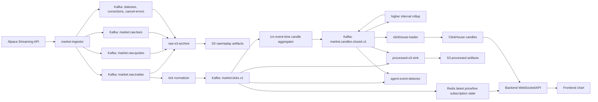

# Market Data Tick-To-Candle Architecture

이 문서는 GOPS v2 tick -> candle Kafka contract와 market-processor 구현 기준이다.

`platform/kafka/topics.txt`, `infra/k8s/base/platform/kafka/topics.txt`, `.env.example`, `docker-compose.yml`, `docs/ENVIRONMENT.md`도 같은 contract를 따른다.

## Goal

- tick 이벤트를 정규화된 Kafka 이벤트로 만든다.
- tick 이벤트를 event-time 기준 1분 window에 모아 하나의 closed `1m` candle 이벤트로 발행한다.
- `5m`, `10m`, `1D`, `1W`, `1M` 상위 interval candle은 closed lower interval candle에서 계산한다.
- 전역 `market.candles.live.1m.v1` Kafka topic은 v2 contract에서 제거한다.
- 실시간 화면은 현재가 tick, Redis live state, WebSocket 구독 상태로 처리한다.

## Terms

- Tick: 개별 체결을 정규화한 이벤트다. GOPS에서 말하는 tick은 Alpaca 원본 payload 그대로가 아니라 symbol, price, size, event time, source 같은 필드를 검증하고 맞춘 데이터다.
- Payload: Kafka 메시지 value에 담기는 실제 업무 데이터 본문이다. 현재 processed topic은 별도 envelope 없이 `eventType`, `symbol`, `timestamp` 같은 필드를 최상위에 둔다.
- Interval: candle 하나가 대표하는 시간 길이다. 현재 공개 API interval은 `1m`, `5m`, `10m`, `1D`, `1W`, `1M`이다.
- Window: aggregation을 위해 event time을 일정 interval로 자른 버킷이다. 예를 들어 `10:15:00` 이상 `10:16:00` 미만 tick은 같은 `1m` window에 들어간다.
- Watermark: 늦게 도착하는 tick을 어느 정도까지 기다릴지 정하는 기준이다. watermark가 지난 window는 닫고 closed candle을 발행한다.

## Decisions

1. Raw feed와 processed event를 분리한다.
2. `market.ticks.v1`은 정규화된 tick의 canonical stream이다.
3. `market.candles.closed.v1`은 모든 interval의 closed candle을 담는 단일 topic이다. interval은 topic 이름이 아니라 payload 필드로 구분한다.
4. `market.candles.live.1m.v1` producer/consumer/default config는 제거한다. 필요한 live candle은 Redis/WebSocket에서 구독 단위로 만든다.
5. `1m` candle은 tick을 event-time window로 집계해서 만든다. 단순히 처리 시각 기준으로 1분마다 끊지 않는다.
6. 상위 interval은 closed candle을 입력으로 만든다. `1m -> 5m/10m`, `1m -> 1D`, `1D -> 1W/1M` 순서로 rollup한다.
7. 늦게 온 tick이나 correction은 이미 발행한 closed candle을 조용히 덮어쓰지 않는다. revision 이벤트를 발행하거나, 초기 구현에서는 late/correction 경로로 격리한다.

## Kafka Flow



## Topic Contract

### Raw Topics

| Topic | Meaning |
| --- | --- |
| `market.raw.trades` | Alpaca trade stream 원문 envelope. |
| `market.raw.quotes` | Alpaca quote stream 원문 envelope. |
| `market.raw.bars` | Alpaca bar stream 원문 envelope. v2 tick aggregation의 주 입력은 아니다. |
| `market.raw.updated-bars` | Alpaca updated bar 원문 envelope. |
| `market.raw.daily-bars` | Alpaca daily bar 원문 envelope. backfill/reconciliation 참고 데이터로 쓸 수 있다. |
| `market.raw.statuses` | market status 원문 envelope. |
| `market.raw.corrections` | trade correction 원문 envelope. |
| `market.raw.cancel-errors` | cancel/error 원문 envelope. |

### Processed Topics

| Topic | v2 Role |
| --- | --- |
| `market.ticks.v1` | 정규화된 tick stream. candle 집계와 current price의 입력이다. |
| `market.candles.closed.v1` | 확정 candle stream. `interval`로 `1m`, `5m`, `10m`, `1D`, `1W`, `1M`을 구분한다. |
| `market.status.v1` | 정규화된 market/session status. |
| `market.volume-profile-bins.1m.v1` | 1분 기준 volume profile이 필요할 때 유지한다. 필요성이 낮으면 closed candle 이후 파생 계산으로 미룬다. |
| `market.news.alpaca.v1` | 정규화된 Alpaca news event. tick/candle 흐름과는 별도다. |

Retired topic:

- `market.candles.live.1m.v1`: v1 legacy topic이다. v2 code/config contract에서는 제거하고, MSK에 남아 있으면 lag/consumer가 0인 것을 확인한 뒤 운영에서 수동 삭제한다.

## Event Shapes

`market.ticks.v1` 예시:

```json
{
  "eventType": "TRADE",
  "symbol": "AAPL",
  "tradeId": 123456,
  "price": 191.23,
  "size": 100,
  "exchange": "V",
  "conditions": ["@"],
  "tape": "C",
  "timestamp": "2026-07-02T13:30:01.234Z",
  "source": "alpaca",
  "feed": "iex",
  "feedProfile": "iex",
  "marketSession": "regular",
  "sourceEventId": "alpaca-trades-AAPL-123456",
  "receivedAt": "2026-07-02T13:30:01.500Z"
}
```

`market.candles.closed.v1` 예시:

```json
{
  "eventType": "CANDLE",
  "symbol": "AAPL",
  "interval": "1m",
  "timestamp": "2026-07-02T13:30:00.000Z",
  "open": 191.10,
  "high": 191.30,
  "low": 191.05,
  "close": 191.23,
  "volume": 2400,
  "tradeCount": 18,
  "vwap": 191.18,
  "ma": {},
  "isClosed": true,
  "correctionType": "NONE",
  "source": "stream-processor",
  "sourceInterval": "trades",
  "feed": "iex",
  "feedProfile": "iex",
  "marketSession": "regular",
  "sourceEventId": "alpaca-trades-AAPL-123474",
  "createdAt": "2026-07-02T13:31:02.000Z",
  "priceAdjustment": "split",
  "canonicalVersion": "v2"
}
```

## Processing Rules

1. Kafka key는 기본적으로 symbol을 사용한다. 같은 symbol의 tick 순서를 한 partition 안에서 최대한 보존하기 위해서다.
2. Consumer group은 symbol partition 단위로 병렬 처리한다. 병목은 `market.ticks.v1`과 `1m` 집계에 먼저 생긴다.
3. `1D`, `1W`, `1M`처럼 데이터량이 적은 interval은 별도 hot path로 두지 않는다. closed candle rollup에서 가볍게 만든다.
4. `market.candles.closed.v1`의 natural key는 `symbol + interval + timestamp + feed + canonicalVersion + revision`이다.
5. critical consumer는 Kafka auto commit을 끄고, downstream produce 또는 storage write가 성공한 뒤 offset을 commit한다.
6. 재처리는 at-least-once를 전제로 한다. downstream은 natural key 기준 idempotent하게 덮어쓰기 또는 skip할 수 있어야 한다.
7. aggregator state는 watermark와 TTL로 정리한다. 기본 watermark grace는 `CANDLE_WATERMARK_GRACE_SECONDS=5`다.
8. 닫힌 window를 무기한 메모리에 들고 있지 않는다.
9. 현재 public interval contract는 `1m`, `5m`, `10m`, `1D`, `1W`, `1M`이다. 이번 구현에서 `1h`는 추가하지 않는다.

## Live Chart Rule

실시간 차트에서 필요한 것은 보통 두 가지다.

- 현재가: 최신 tick의 price.
- 현재 interval의 임시 candle 모양: 사용자가 보고 있는 interval에 대해서만 계산한 미확정 상태.

따라서 v2 초기 구조에서는 live candle을 Kafka 전체 topic으로 계속 발행하지 않는다. Backend WebSocket은 사용자의 symbol/interval 구독을 보고 Redis latest tick과 짧은 live state를 보내준다. 확정 데이터는 `market.candles.closed.v1`과 ClickHouse projection을 기준으로 제공한다.

## Late Event And Correction Policy

- Watermark 안에 들어온 늦은 tick은 해당 window에 포함한다.
- Watermark 이후 도착한 tick은 closed candle을 즉시 재발행하지 않는다.
- correction/cancel event를 정확히 반영하려면 revision contract가 필요하다.
- revision을 도입하면 같은 natural key에 `revision > 0`인 `CANDLE_CORRECTED` 이벤트를 발행한다.
- revision이 준비되기 전에는 late/correction event를 별도 metric과 DLQ 후보 경로로 격리하고, candle 정확도 문서에 한계를 표시한다.

## Storage And Serving

- S3 processed tick artifact는 `market.ticks.v1` 기준 데이터다. Alpaca 원문 payload가 아니다.
- S3 closed candle artifact는 `market.candles.closed.v1` 기준 데이터다.
- ClickHouse serving table은 closed candle natural key 기준으로 중복 재처리에 견딘다.
- API 조회는 S3를 직접 읽지 않고 Redis/ClickHouse projection을 우선 사용한다.
- historical backfill은 같은 closed candle contract로 들어와야 한다. 실시간과 백필이 서로 다른 candle shape을 만들면 안 된다.

## Migration Notes

- 기존 `market.candles.live.1m.v1` producer/consumer/default config는 v2 구현에서 제거했다.
- Agent event detector 입력은 `market.ticks.v1`, `market.candles.closed.v1` 중심으로 줄인다.
- processed S3 sink는 live candle topic 없이 tick과 closed candle을 저장할 수 있어야 한다.
- ClickHouse loader는 tick query가 제품상 필요하면 `market.ticks.v1` 적재를 명시적으로 켠다. 기본 chart serving은 closed candle 우선이다.
- raw `bars`, `updatedBars`, `dailyBars`는 canonical candle publish 입력이 아니라 reconciliation/backfill 참고 입력으로 둔다.

## Open Decisions

- late tick/correction을 revision으로 처리할지, 별도 DLQ로 운영할지.
- processed tick S3 file format과 partition layout.
- quote를 candle 계산에 포함하지 않고 별도 quote projection으로 둘지.
- volume profile topic을 유지할지, closed candle 이후 batch/online projection으로 바꿀지.
