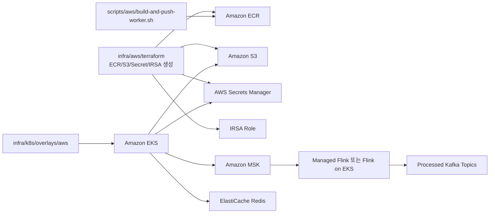

# AWS에 딱 붙이는 파일들

## 목적

로컬 Docker에서 확인한 코드를 AWS/EKS에 붙일 때 필요한 값을 한곳에 모았습니다.

## 폴더 역할

```text
infra/aws/terraform/        ECR, S3, Secrets Manager, IRSA 생성
infra/aws/values/           런타임 값이 붙는 위치 설명
infra/k8s/overlays/aws/     EKS에 적용할 Kustomize overlay
scripts/aws/                ECR push, MSK topic 생성, kubectl apply 스크립트
infra/aws/msk/topics.txt    MSK에 만들어야 하는 topic 목록
flink-jobs/.../aws/         실제 Flink 서버에 넘길 계약 파일
```

## AWS 적용 흐름



## 내가 바꿔야 하는 값

```text
YOUR_ACCOUNT_ID
YOUR_MSK_BOOTSTRAP_SERVERS
YOUR_REDIS_ENDPOINT
YOUR_S3_BUCKET
YOUR_IRSA_ROLE_ARN
YOUR_ECR_REPOSITORY 또는 ECR output 값
```

## 중요한 구분

`docker-compose.yml`은 로컬 실험용입니다. AWS 운영에서는 Kafka는 MSK, Flink는 Managed Flink/Flink on EKS, Redis는 ElastiCache, S3는 Amazon S3로 분리합니다.


## MSK Topic 생성

```sh
KAFKA_BOOTSTRAP_SERVERS="YOUR_MSK_BOOTSTRAP_SERVERS"   scripts/aws/create-msk-topics.sh
```

MSK IAM 인증을 쓰는 경우에는 `KAFKA_CLIENT_CONFIG`에 client.properties 경로를 추가합니다.
